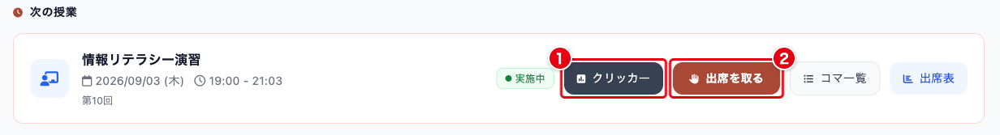
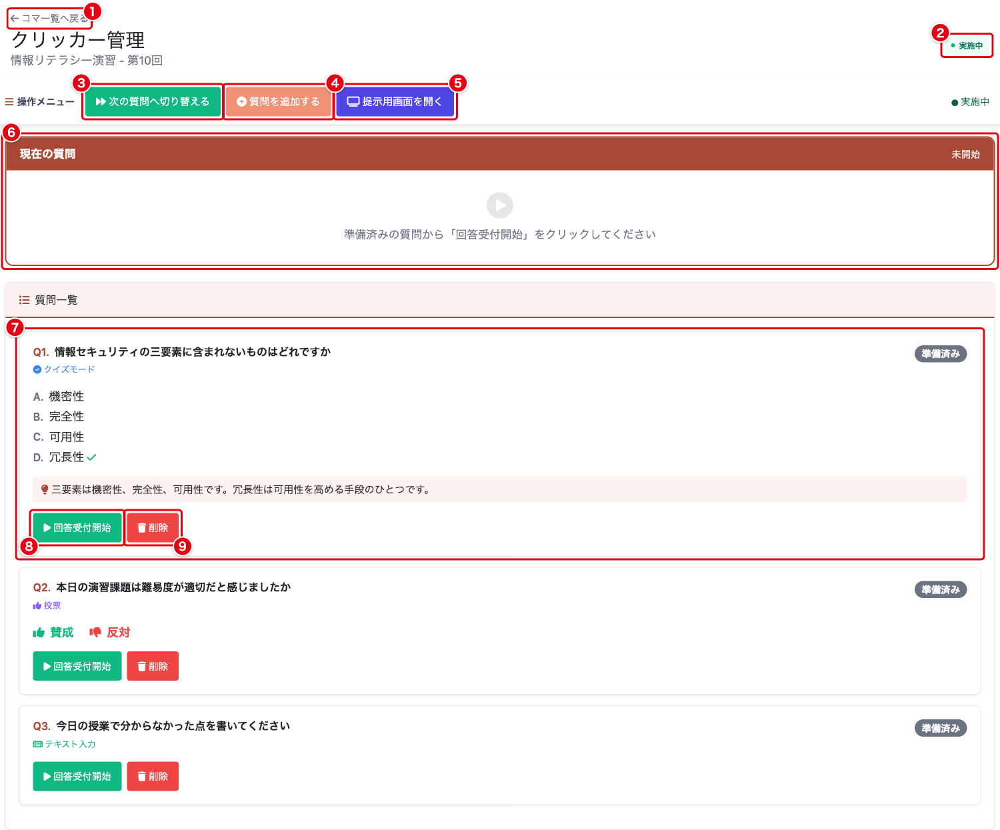
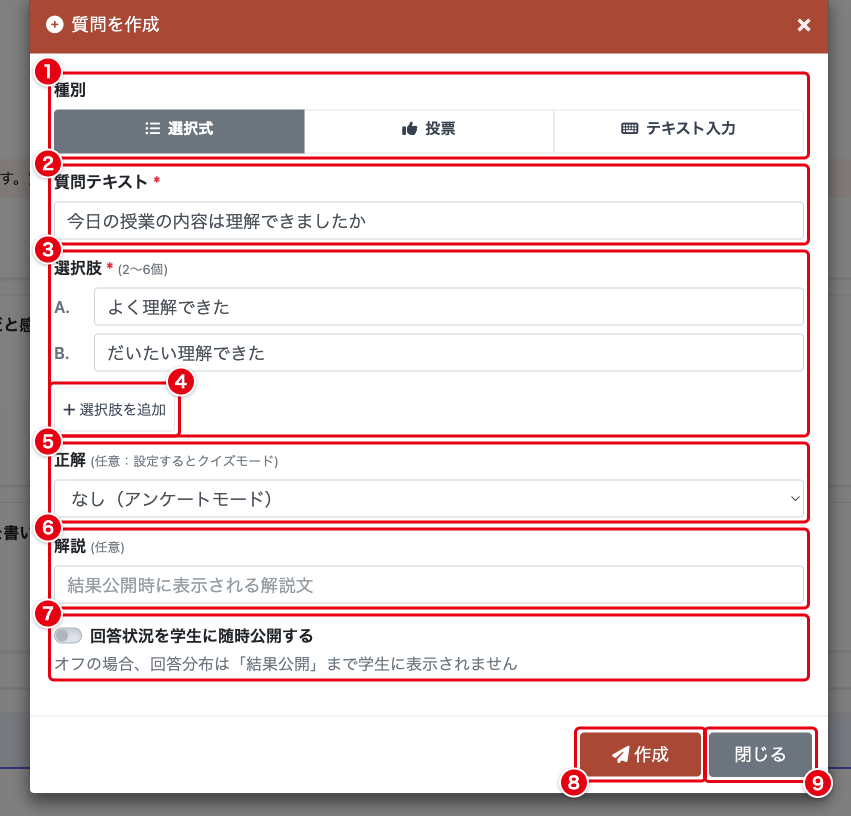
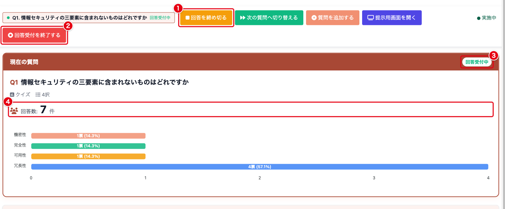
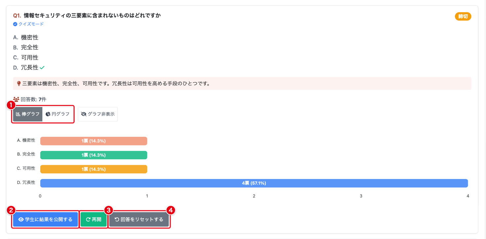
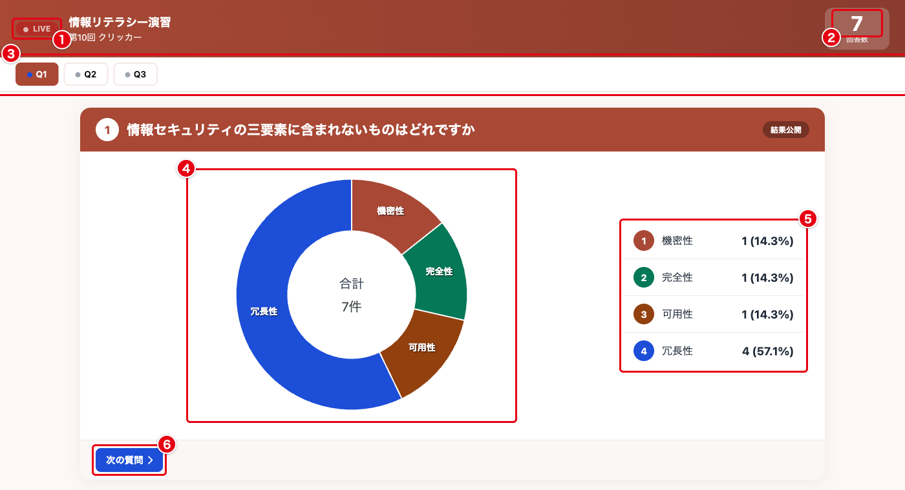
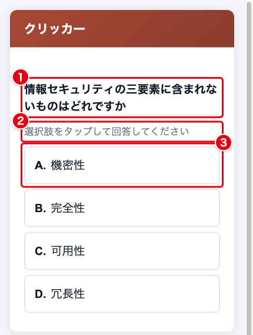
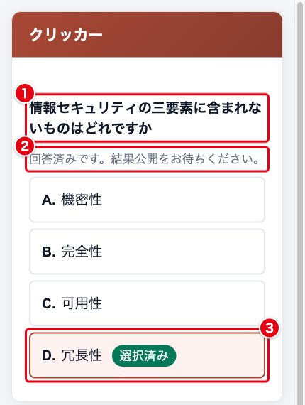
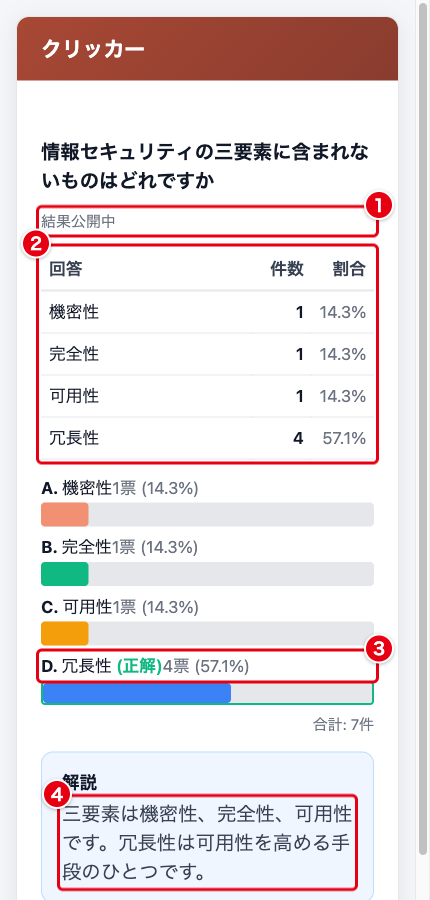

# かんたんクリッカー

このページは、授業中に学生へ質問を出し、その場で回答を集める「かんたんクリッカー」の操作手順を説明します。
かんたん出欠管理の機能のひとつで、[かんたん出欠管理 for スクール](attendance/attendance-school-v2.md) と
[かんたん出欠管理 for パーソナル](attendance/attendance-personal-v2.md) のどちらでもお使いいただけます。

> 画面図の赤い枠と丸数字は、そのすぐ下にある表の番号に対応しています。
> 番号の順に読むと、その画面で何を入力し、どのボタンを押すのかが分かります。

## かんたんクリッカーとは

先生が質問を出すと、出席登録を済ませた学生の手元に同じ質問が表示され、
学生が選んだ回答がその場で集計されてグラフになります。

質問には3つの種別があります。

- **選択式**：2〜6個の選択肢から1つを選びます。正解を設定するとクイズになります
- **投票**：「賛成」「反対」の2択に固定された質問です
- **テキスト入力**：選択肢ではなく、学生が自由に文章を書いて送ります

**テキスト入力の回答は、本文の横に学籍番号が並んで表示されます。**
先生の画面だけでなく提示用画面にも表示されるため、教室のスクリーンへ投影すると学籍番号が全員に見えます。

回答は学生の端末から直接集計サーバーへ届き、先生の画面に数秒で反映されます。
教室のスクリーンへ投影するための提示用画面も用意しています。

## ご利用の前に

**クリッカーは、授業またはコマの設定で「クリッカーを有効にする」をオンにしないと学生に届きません。**
この設定の初期値はオフです。
授業の作成画面でオンにすると、その授業で作るコマにも引き継がれます。
すでに作ったコマは、コマの編集画面で個別にオンにできます。

オフのままでも先生はクリッカーの管理画面を開いて質問を作れますが、
学生の出席登録が終わったあとの画面にクリッカーへの案内が表示されません。

**質問は、学生が出席登録を始める前に用意してください。**
学生をクリッカーへ案内するのは出席登録の完了画面で、
その時点でコマに質問が1つもないと案内が表示されません。
あとから質問を追加しても、すでに出席登録を終えた学生には届きません。

学生はスマートフォンで回答します。
先生の操作はパソコンを推奨します。

## 1. クリッカーの管理画面を開く

ホーム画面の「次の授業」から開きます。

| 番号 | 項目 | 説明 |
| --- | --- | --- |
| ① | クリッカー | クリッカーの管理画面を開きます |
| ② | 出席を取る | 出席の受付を開始します。学生は出席登録を終えるとクリッカーへ進めるようになるため、先にこちらを押します |

コマ一覧の各コマの行にも「クリッカー」ボタンがあります。
過去のコマを開くときはこちらを使います。

## 2. 管理画面の見かた

| 番号 | 項目 | 説明 |
| --- | --- | --- |
| ① | コマ一覧へ戻る | この授業のコマ一覧に戻ります |
| ② | 授業の状態 | 「授業前」「実施中」「授業終了」のいずれかです。授業終了になると、質問の追加と削除、回答受付開始のボタンが消えます |
| ③ | 次の質問へ切り替える | 受付中の質問を締め切り、次の準備済みの質問の受付を始めます。1回の操作で切り替えられます |
| ④ | 質問を追加する | 質問の作成画面を開きます |
| ⑤ | 提示用画面を開く | 教室のスクリーンへ投影する画面を別ウィンドウで開きます |
| ⑥ | 現在の質問 | いま受付中の質問と、回答の集計が表示されます。受付を始めるまでは空欄です |
| ⑦ | 質問一覧 | 作成済みの質問が上から順に並びます。右上に各質問の状態が表示されます |
| ⑧ | 回答受付開始 | その質問の受付を開始します。コマの開始時刻を過ぎるまで表示されません |
| ⑨ | 削除 | その質問を削除します |

質問の状態は次の順に進みます。

| 状態 | 意味 | 次にできること |
| --- | --- | --- |
| 準備済み | まだ学生に出していない | 回答受付開始 |
| 回答受付中 | 学生が回答できる | 回答を締め切る |
| 締切 | 回答を締め切った。学生にはまだ結果が見えない | 学生に結果を公開する／再開 |
| 結果公開 | 学生に集計と正解が見えている | （ここで終わりです。準備済みには戻せません） |

## 3. 質問を作る

「質問を追加する」を押すと、作成画面が開きます。

| 番号 | 入力項目 | 必須 | 説明 |
| --- | --- | :---: | --- |
| ① | 種別 | ✓ | 「選択式」「投票」「テキスト入力」から選びます。初期値は選択式です。投票を選ぶと選択肢が「賛成」「反対」に固定され、テキスト入力を選ぶと選択肢の入力欄がなくなります |
| ② | 質問テキスト | ✓ | 学生に表示する質問文です。500文字まで入力できます |
| ③ | 選択肢 | ✓ | 2個から6個まで登録できます。1つあたり200文字までです |
| ④ | 選択肢を追加 | | 選択肢の入力欄を1つ増やします。7個目を追加しようとすると「選択肢は最大6個までです」と表示されます |
| ⑤ | 正解 | | 正解の選択肢を1つ選ぶとクイズになります。初期値は「なし（アンケートモード）」です |
| ⑥ | 解説 | | 結果を公開したときに学生の画面に表示される文章です。500文字までです |
| ⑦ | 回答状況を学生に随時公開する | | オンにすると、回答を受け付けている間も学生の画面に集計が表示されます。初期値はオフで、その場合は「学生に結果を公開する」を押すまで学生には見えません |
| ⑧ | 作成 | | 入力した内容で質問を作ります。作った質問は「準備済み」の状態で質問一覧に追加されます |
| ⑨ | 閉じる | | 作成をやめて画面を閉じます |

**⑤の正解と⑥の解説は、結果を公開するまで学生には送られません。**
受付中に学生が正解を先に見てしまうことはありません。

## 4. 質問を出して回答を集める

質問一覧で「回答受付開始」を押すと、学生の画面に質問が表示されます。

| 番号 | 項目 | 説明 |
| --- | --- | --- |
| ① | 回答を締め切る | この質問の受付を終了します。学生はこれ以上回答できなくなります |
| ② | 回答受付を終了する | 受付中のすべての質問を締め切ります。質問が1つも受付中でないときは表示されません |
| ③ | 質問の状態 | 現在の質問の状態です |
| ④ | 回答数 | 集まった回答の件数です。学生が回答するたびに増えます |

集計のグラフは回答が届くたびに更新されます。
画面を開き直す必要はありません。

## 5. 結果を公開する

「回答を締め切る」を押したあと、質問一覧のその質問に次のボタンが表示されます。

| 番号 | 項目 | 説明 |
| --- | --- | --- |
| ① | グラフの表示 | 「棒グラフ」「円グラフ」「グラフ非表示」を切り替えます。先生の画面の見た目だけが変わります |
| ② | 学生に結果を公開する | 学生の画面に集計と正解、解説を表示します |
| ③ | 再開 | 締め切った質問の受付を再開します。結果を公開したあとは表示されません |
| ④ | 回答をリセットする | この質問に集まった回答をすべて削除します。取り消せません |

## 6. 提示用画面を教室のスクリーンに映す

「提示用画面を開く」を押すと、別ウィンドウで投影用の画面が開きます。

| 番号 | 項目 | 説明 |
| --- | --- | --- |
| ① | LIVE | 集計サーバーと接続できている印です。接続が切れると「再接続中...」に変わり、自動でつなぎ直します |
| ② | 回答数 | 現在の質問に集まった回答の件数です |
| ③ | 質問の切り替え | 質問を選んで表示を切り替えます。左の丸印の色が各質問の状態を表します |
| ④ | 集計グラフ | 回答の分布です。受付中に表示されるのは「回答状況を学生に随時公開する」をオンにした質問と、結果を公開した質問だけです |
| ⑤ | 内訳 | 選択肢ごとの件数と割合です |
| ⑥ | 次の質問 | 次の質問の表示に切り替えます |

この画面は表示専用ではなく、下部のボタンから締め切りや切り替えも操作できます。
管理画面と提示用画面は同時に開いたままで構いません。
どちらで操作しても両方に反映されます。

## 7. 学生の画面

学生は出席登録を終えると、完了画面に表示される「クリッカーに回答する」から進みます。

### 回答する

| 番号 | 項目 | 説明 |
| --- | --- | --- |
| ① | 質問文 | 先生が受付を開始した質問です |
| ② | 案内 | いま何をすればよいかが表示されます |
| ③ | 選択肢 | タップするとその場で回答が送信されます。確定ボタンはありません |

### 回答したあと

| 番号 | 項目 | 説明 |
| --- | --- | --- |
| ① | 質問文 | 回答した質問です |
| ② | 案内 | 結果が公開されるまでこの表示のままです |
| ③ | 選択済み | 自分が選んだ選択肢に印が付きます |

**回答をやり直すことはできません。**
選択肢をタップした時点で確定します。

### 結果が公開されたあと

| 番号 | 項目 | 説明 |
| --- | --- | --- |
| ① | 結果公開中 | 先生が結果を公開した状態です |
| ② | 集計表 | 選択肢ごとの件数と割合です |
| ③ | 正解 | クイズとして正解を設定した質問では、正解の選択肢に印が付きます |
| ④ | 解説 | 質問に解説を登録していると、ここに表示されます |

## よくある質問

### Q. 学生の画面に「クリッカーに回答する」が出ません

次の2点をご確認ください。

- 授業またはコマの設定で「クリッカーを有効にする」がオンになっているか
- 学生が出席登録をした時点で、そのコマに質問が1つ以上あったか

質問は出席登録が始まる前に用意する必要があります。
詳しくは「ご利用の前に」をご覧ください。

### Q. 出席登録をしていない学生も回答できますか

できません。
クリッカーへの案内は出席登録の完了画面にだけ表示されます。

### Q. 同じ質問をもう一度使えますか

「回答をリセットする」で回答を消してから「再開」で受付をやり直せます。
ただし結果を公開したあとは再開できません。

### Q. 誰がどの選択肢を選んだかは分かりますか

選択式と投票では、先生の画面に表示されるのは選択肢ごとの件数と割合だけです。
誰がどれを選んだかは表示されません。

テキスト入力は例外で、回答の本文といっしょに学籍番号が表示されます。
提示用画面にも同じように表示されるため、投影する際はご注意ください。

### Q. 授業が終わったあとにクリッカーを操作できますか

コマの終了時刻を過ぎると、質問の追加、削除、受付開始などのボタンが表示されなくなります。
集計の結果は引き続き確認できます。

### Q. 学生の画面が「再接続中」のままになります

通信が不安定な場所では接続が切れることがあります。自動でつなぎ直しますので、
しばらく待つか、画面を開き直してください。
回答済みの内容は失われません。
