# かんたん出欠管理 for パーソナル

このページは、個人でご契約いただいた「かんたん出欠管理 for パーソナル」の操作手順を説明します。
学校や大学などの組織でご契約の場合は [かんたん出欠管理 for スクール](attendance/attendance-school-v2.md) をご覧ください。
旧画面の手順は [かんたん出欠管理（旧画面）](attendance/attendance.md) に残しています。

> 画面図の赤い枠と丸数字は、そのすぐ下にある表の番号に対応しています。
> 番号の順に読むと、その画面で何を入力し、どのボタンを押すのかが分かります。

## for パーソナルとは

「かんたん出欠管理」は、授業の出欠をQRコードとアクセスコードで記録するサービスです。
受講者は掲示されたQRコードをスマートフォンで読み取り、その場で出席を登録します。

ご契約が個人単位で、どの組織にも所属していない場合、サービスは「かんたん出欠管理 for パーソナル」として動作します。
画面上でモードを切り替える操作はありません。

for パーソナルは、塾や教室、単発の講座など、受講者アカウントを配らずに運用する場面を想定しています。
受講者は名簿への事前登録もログインもなしに、自分の学籍番号（受講番号）を入力するだけで出席できます。

for スクールとの違いは次のとおりです。

| | for パーソナル | for スクール |
| --- | --- | --- |
| 受講者の識別 | 受講者が学籍番号を自分で入力する | 受講者アカウントでログインして名簿と照合する |
| 受講者名簿 | なし | あり（CSV一括登録に対応） |
| 氏名の記録 | 有料オプション契約が必要 | 追加契約なしで利用できる |
| 共同教員 | なし。授業を作成した本人だけが操作する | あり |
| 学校の登録 | 自分で登録する | 組織の学校が自動で使われる |

## はじめて開いたとき

はじめて「かんたん出欠管理」を開くと、これから行う3つのステップが表示されます。

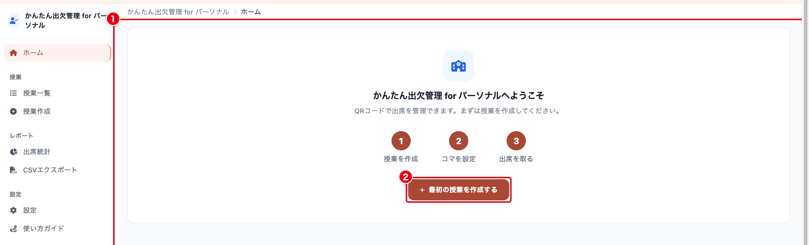

| 番号 | 項目 | 説明 |
| --- | --- | --- |
| ① | ようこそカード | 授業を作成し、コマを設定し、出席を取る、という3つのステップを示します |
| ② | 最初の授業を作成する | 授業の作成に進みます。学校をまだ登録していない場合は、先に学校の登録画面が開きます |

## 画面の構成

左側のメニューから各機能に移動します。

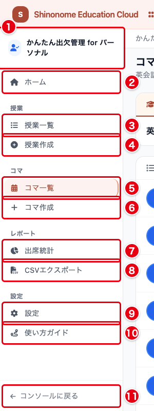

| 番号 | 項目 | 説明 |
| --- | --- | --- |
| ① | サービス名 | 「かんたん出欠管理 for パーソナル」と表示されていれば、個人モードで動作しています |
| ② | ホーム | 次の授業、今期の授業、授業カレンダーをまとめて表示します |
| ③ | 授業一覧 | 登録済みの授業と、その各回（コマ）を一覧します |
| ④ | 授業作成 | 新しい授業を作成します |
| ⑤ | コマ一覧 | 開いている授業のコマを一覧します。授業を開いているときだけ表示されます |
| ⑥ | コマ作成 | 開いている授業にコマを追加します。授業を開いているときだけ表示されます |
| ⑦ | 出席統計 | 自分の授業の出席状況をグラフと表で確認します |
| ⑧ | CSVエクスポート | 出席データをCSVまたはExcel形式でダウンロードします |
| ⑨ | 設定 | 遅刻の判定時間など、出欠管理全体の既定値を変更します |
| ⑩ | 使い方ガイド | 操作の流れを画面に沿って案内します |
| ⑪ | コンソールに戻る | Shinonome Education Cloud のダッシュボードに戻ります |

「コマ」のグループは、特定の授業を開いているあいだだけ表示されます。

管理作業はパソコンでのご利用を推奨します。
画面の横幅が狭い端末では、左側のメニューが折りたたまれます。

## ホーム画面

サイドバーの「ホーム」を開くと、直近の授業と今期の授業がまとまって表示されます。

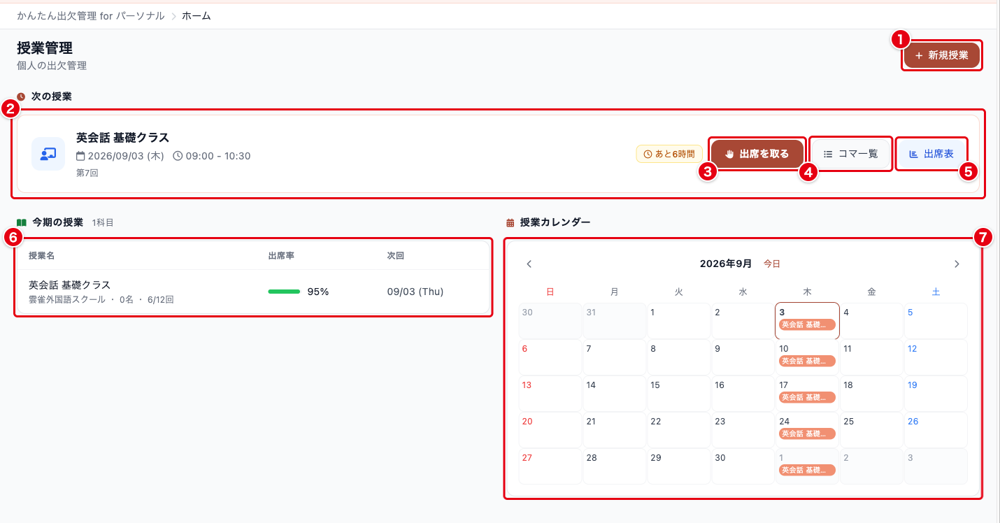

| 番号 | 項目 | 説明 |
| --- | --- | --- |
| ① | 新規授業 | 授業作成画面に移動します |
| ② | 次の授業 | 直近の実施予定または実施中のコマを1件表示します。開始までの残り時間と、その場で使う操作ボタンが並びます |
| ③ | 出席を取る | QRコードの見せ方を選ぶ「フォーム情報」を開きます。授業中はこのボタンから始めます |
| ④ | コマ一覧 | その授業のコマ一覧に移動します |
| ⑤ | 出席表 | その授業の出席表に移動します |
| ⑥ | 今期の授業 | 進行中の授業を、出席率と進捗（実施済みコマ数 ÷ 総コマ数）とともに一覧します |
| ⑦ | 授業カレンダー | その月のコマを日付ごとに表示します |

クリッカーを有効にした授業では、②のカードに「クリッカー」ボタンも並びます。

## 1. 学校を登録する

for パーソナルでは、授業を作る前に、その授業を行う場所を「学校」として1件登録します。
学校は塾や教室、公民館など、授業を行う施設であればなんでもかまいません。
まだ学校を登録していない状態で授業作成を開くと、この画面に切り替わります。

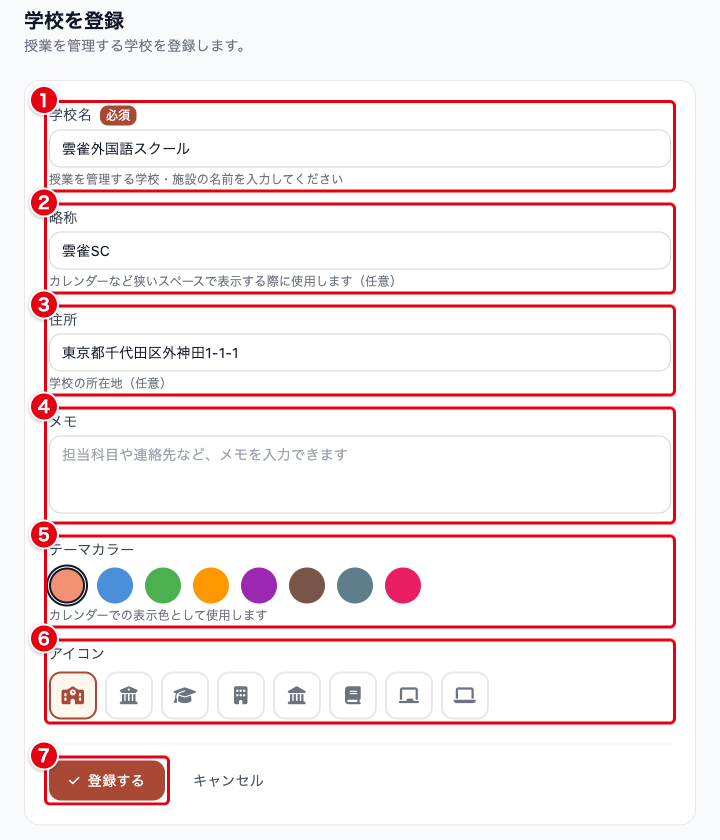

| 番号 | 入力項目 | 必須 | 説明 |
| --- | --- | :---: | --- |
| ① | 学校名 | ✓ | 授業を管理する学校や施設の名前です |
| ② | 略称 | | カレンダーなど、幅の狭い場所での表示に使います |
| ③ | 住所 | | 学校の所在地です |
| ④ | メモ | | 担当科目や連絡先など、自由に書き残せます |
| ⑤ | テーマカラー | | 授業カレンダーでの表示色です |
| ⑥ | アイコン | | 一覧で学校を見分けるためのアイコンです |
| ⑦ | 登録する | | 学校を保存してホーム画面に戻ります |

登録が終わったら、サイドバーの「授業作成」から授業を作成します。

この画面が開くのは、学校を1件も登録していない状態で授業作成を開いたときだけです。
2件目以降の学校を追加する入口は、現在の画面には用意していません。

## 2. 授業を作成する

サイドバーの「授業作成」、またはホームの「新規授業」から始めます。

### 基本情報とスケジュール

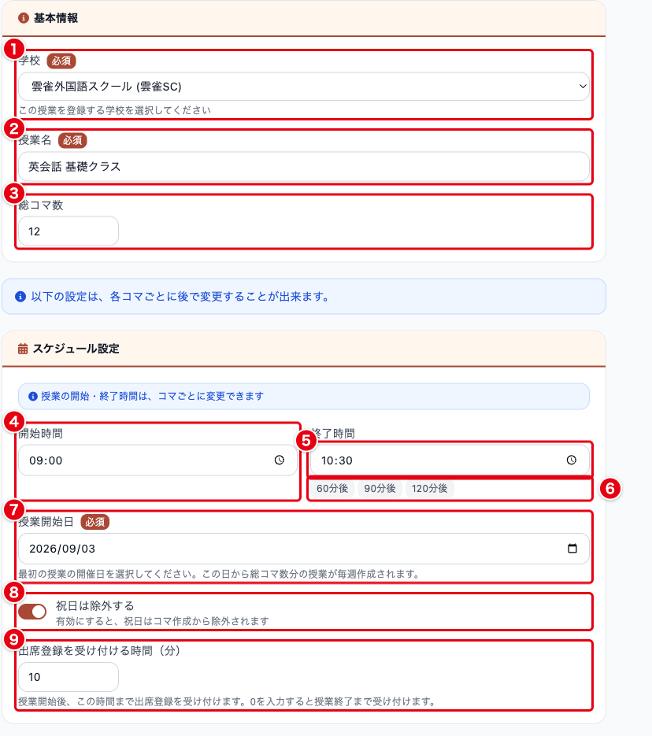

| 番号 | 入力項目 | 必須 | 説明 |
| --- | --- | :---: | --- |
| ① | 学校 | ✓ | この授業を行う学校を選びます。登録済みの学校が並びます |
| ② | 授業名 | ✓ | 出欠を取る授業の名前です（例：英会話 基礎クラス） |
| ③ | 総コマ数 | | 授業を全部で何回行うかを入力します。初期値は15です |
| ④ | 開始時間 | | 各コマの既定の開始時刻です。初期値は 09:00 です |
| ⑤ | 終了時間 | | 各コマの既定の終了時刻です。初期値は 10:30 です |
| ⑥ | 60分後 / 90分後 / 120分後 | | 開始時間からの経過時間で終了時間を自動入力します |
| ⑦ | 授業開始日 | ✓ | 第1回の開催日です。**今日以降の日付しか選べません** |
| ⑧ | 祝日は除外する | | 有効にすると、祝日にあたる日をコマの自動作成から除きます。初期状態で有効です |
| ⑨ | 出席登録を受け付ける時間（分） | | 授業開始後、何分まで出席として受け付けるかを指定します。初期値は10分です。0を入力すると授業終了まで出席として受け付けます |

授業を保存すると、授業開始日から毎週1回ずつ、総コマ数の分だけコマが自動で作られます。
個別の日程は、あとからコマごとに変更できます。

### 代返防止と制限設定

出席の受け付け方を決めます。

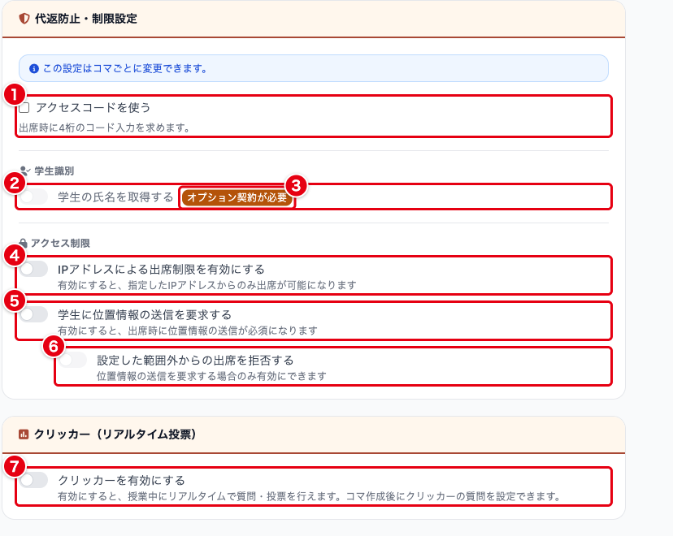

| 番号 | 入力項目 | 説明 |
| --- | --- | --- |
| ① | アクセスコードを使う | 出席時に4桁のコードの入力を求めます。コードはコマごとに自動生成されます。初期状態では無効です |
| ② | 学生の氏名を取得する | 出席記録に氏名を残します |
| ③ | オプション契約が必要 | このバッジが付いているあいだ、②のトグルは操作できません。氏名の記録には有料オプションのご契約が必要です |
| ④ | IPアドレスによる出席制限を有効にする | 指定したIPアドレスからの出席だけを許可します |
| ⑤ | 学生に位置情報の送信を要求する | 出席時に位置情報の送信を必須にします |
| ⑥ | 設定した範囲外からの出席を拒否する | ⑤を有効にしたときだけ設定できます。基準地点から離れた場所からの出席を拒否します |
| ⑦ | クリッカーを有効にする | 授業中にリアルタイムで質問と投票を行えるようにします。設問はコマを作成したあとに登録します |

操作手順は [かんたんクリッカー](attendance/attendance-clicker.md) をご覧ください。

⑤を有効にすると、許可範囲（10〜1000メートル）と基準地点を指定する地図が現れます。

同じ端末から複数人が代理で出席する行為（代返）の検知は常に有効です。
オンとオフを切り替える設定項目はありません。

位置情報による判定の精度は環境に左右されます。
屋外でおよそ10〜50メートル、屋内ではそれ以上の誤差が出るため、許可範囲は100メートル以上を目安に設定してください。

入力が終わったら「授業を作成する」を押します。

> **授業の設定は、コマが1つでも作られると変更できなくなります。**
> 作成と同時に総コマ数の分のコマが作られるため、通常の手順で作った授業では出席表の「授業を編集する」がグレーで表示され、押せません。
> 授業名やアクセス制限の設定は、最初のコマを使う前に確定させてください。
> 各コマ個別の設定は、そのコマに出席が1件も登録されていないあいだは変更できます。1人でも出席を登録すると、そのコマの編集画面は読み取り専用になります。

## 3. 授業とコマを一覧する

サイドバーの「授業一覧」を開くと、授業とその各回がまとめて表示されます。

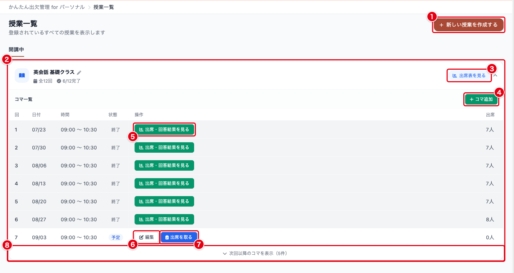

| 番号 | 項目 | 説明 |
| --- | --- | --- |
| ① | 新しい授業を作成する | 授業作成画面に移動します |
| ② | 授業カード | 授業ごとのまとまりです。授業名の横の鉛筆アイコンを押すと、この場で授業名を変更できます |
| ③ | 出席表を見る | 授業全体の出席表に移動します |
| ④ | コマ追加 | 総コマ数を超えて回を追加します |
| ⑤ | 出席・回答結果を見る | 終了したコマの出席結果を開きます |
| ⑥ | 編集 | これから行うコマの設定を変更します |
| ⑦ | 出席を取る | QRコードの見せ方を選ぶ「フォーム情報」を開きます |
| ⑧ | 次回以降のコマを表示 | 折りたたまれている今後のコマを展開します |

for パーソナルでは共同教員の機能を使えないため、for スクールにある「共同教員」ボタンは表示されません。

### コマを調整する

自動で作られたコマは、日程や受け付け方をコマごとに変更できます。
授業一覧またはコマ一覧の「編集」から開きます。

そのコマに出席が1件でも登録されると、編集画面は読み取り専用になり「この出席フォームは既に出席が提出されているため、編集できません」と表示されます。

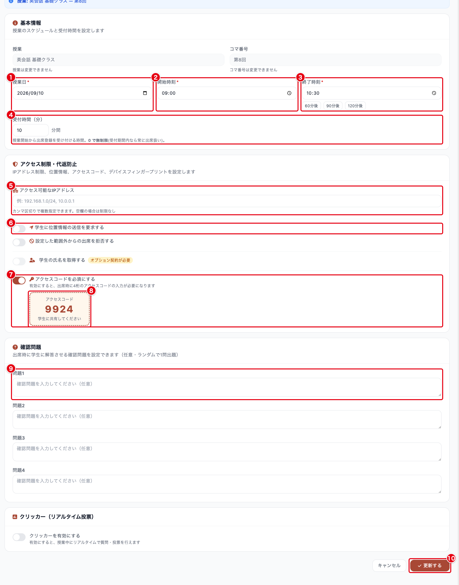

| 番号 | 入力項目 | 説明 |
| --- | --- | --- |
| ① | 授業日 | この回の開催日です |
| ② | 開始時刻 | この回の開始時刻です |
| ③ | 終了時刻 | この回の終了時刻です |
| ④ | 受付時間（分） | 授業開始から何分まで出席として受け付けるかを指定します。0を入力すると、授業終了まで常に出席として扱います |
| ⑤ | アクセス可能なIPアドレス | この回だけIPアドレスを制限したい場合に入力します。複数指定するときはカンマで区切ります。空欄なら制限しません |
| ⑥ | 学生に位置情報の送信を要求する | この回だけ位置情報を求める場合に有効にします |
| ⑦ | アクセスコードを必須にする | この回だけアクセスコードの要否を切り替えます |
| ⑧ | アクセスコード | 自動生成された4桁のコードです。受講者に見せる番号がここに表示されます |
| ⑨ | 問題1 | 出席登録時に受講者へ表示する確認問題です。下に問題2〜問題4が続き、最大4問まで登録できます。そのうち1問がランダムに出題されます |
| ⑩ | 更新する | 変更を保存します |

アクセスコードは4桁の数字で自動生成されます。
セキュリティ上の理由から、任意の番号を指定することはできません。

## 4. 授業当日に出席を取る

ホームまたは授業一覧の「出席を取る」を押すと、「フォーム情報」が開きます。
QRコードの見せ方をここで選びます。

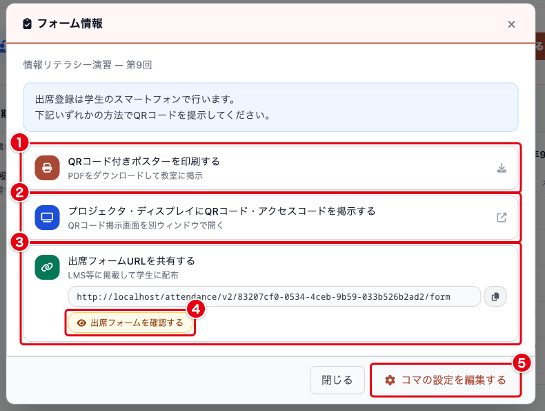

| 番号 | 項目 | 説明 |
| --- | --- | --- |
| ① | QRコード付きポスターを印刷する | QRコードとアクセスコードを載せたPDFをダウンロードします。印刷して教室に掲示します |
| ② | プロジェクタ・ディスプレイにQRコード・アクセスコードを掲示する | 掲示用の画面を別ウィンドウで開きます |
| ③ | 出席フォームURLを共有する | 出席フォームのURLをコピーします。LMSなどに掲載して配る場合に使います |
| ④ | 出席フォームを確認する | 受講者に見える画面を確認します。この画面から送信しても出席は記録されません |
| ⑤ | コマの設定を編集する | この回のコマ編集画面に移動します |

②を選ぶと、掲示用の画面が別ウィンドウで開きます。
この画面をプロジェクターやディスプレイに映して、受講者に読み取ってもらいます。

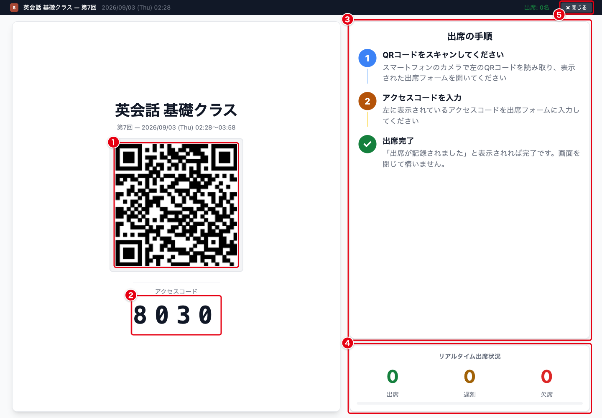

| 番号 | 項目 | 説明 |
| --- | --- | --- |
| ① | QRコード | 受講者がスマートフォンのカメラで読み取ります |
| ② | アクセスコード | アクセスコードを有効にしている場合に表示される4桁の数字です |
| ③ | 出席の手順 | 受講者向けの案内です。そのまま読み上げても使えます |
| ④ | リアルタイム出席状況 | 出席、遅刻、欠席の人数が登録に応じて更新されます |
| ⑤ | 閉じる | 掲示用画面を閉じて元の画面に戻ります |

紙に印刷して掲示する場合は、「フォーム情報」の①「QRコード付きポスターを印刷する」からPDFを出力してください。

## 5. 受講者が出席を登録する

for パーソナルでは、受講者はログインせずに出席できます。
QRコードを読み取り、アクセスコードを有効にしている場合はコードを入力すると、次の画面が開きます。

| 番号 | 入力項目 | 説明 |
| --- | --- | --- |
| ① | 学籍番号 | 受講者が自分で入力します。入力は必須です |
| ② | 出席を登録する | 出席を記録します。確認問題を設定している場合は、ここで1問が表示されます |

学籍番号は受講者の自己申告です。
出席表では入力された文字列をそのまま並べるため、**受講者に伝える書き方を統一しておいてください。**
「A-101」と「a101」のように書き方が揺れると、同じ受講者が別人として集計されます。

氏名を記録する有料オプションをご契約の場合は、氏名の入力欄も表示されます。

### 出席、遅刻、欠席の判定

判定は、受講者がフォームを送信した時刻で決まります。

| 送信した時刻 | 判定 |
| --- | --- |
| 授業開始から受付時間までのあいだ | 出席 |
| 受付時間を過ぎてから授業終了までのあいだ | 遅刻 |
| 授業開始前（フォームが開いてから開始時刻まで） | 欠席 |
| 授業終了後、または一度も送信しなかった場合 | 欠席 |

フォームは授業開始より前に開きますが、判定は授業開始時刻を基準にします。
開始前に送信すると欠席として記録されるため、授業が始まってから読み取るよう案内してください。

受付時間に0を指定したコマでは、授業開始から終了までのあいだに送信すればすべて出席になります。

出席フォームは授業開始の5分前から開きます。

## 6. 出欠を確認する

### 授業全体の出席表

授業一覧の「出席表を見る」、またはホームの「出席表」から開きます。

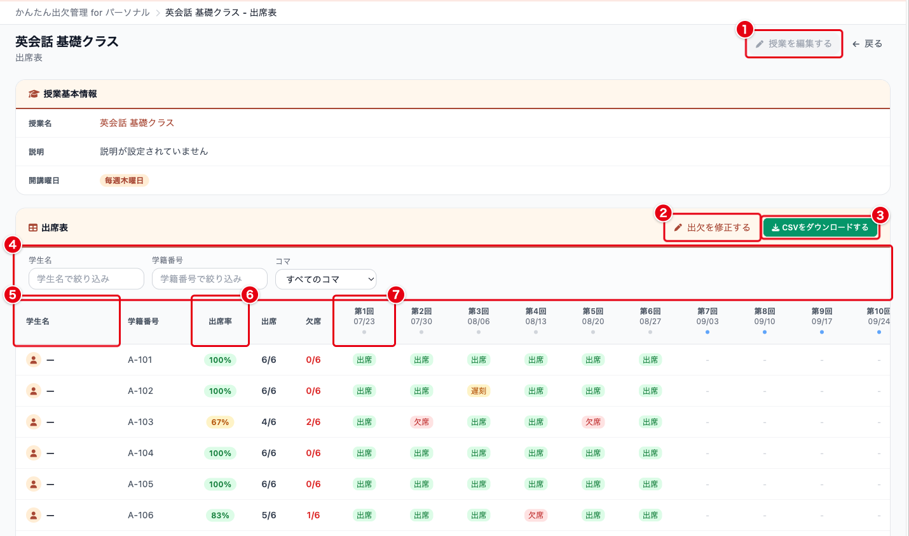

| 番号 | 項目 | 説明 |
| --- | --- | --- |
| ① | 授業を編集する | コマが1つでもあるとグレーで表示され、押せません |
| ② | 出欠を修正する | 各受講者の出欠を手で修正する画面に移動します |
| ③ | CSVをダウンロードする | この授業の出席データをCSVで書き出します |
| ④ | 絞り込み | 学生名、学籍番号、コマで表示を絞ります |
| ⑤ | 学生名 | 氏名を記録するオプションをご契約でない場合、この列は「—」になります |
| ⑥ | 出席率 | 実施済みのコマに対する割合です。遅刻と早退も出席として数えます。右隣に出席とみなした回数と欠席回数が並びます |
| ⑦ | 各回の判定 | 回ごとに「出席」「遅刻」「欠席」を表示します。未実施の回は「-」です |

for パーソナルには受講者名簿がないため、出席表に並ぶのは**実際に出席を登録した学籍番号だけ**です。
一度も出席しなかった受講者は行として現れません。

氏名を記録するオプションをご契約の場合、氏名を含むCSVのダウンロードではワンタイムコードによる追加認証を求められます。
ログインしているメールアドレス宛に10桁のコードが届くので、それを入力してください。
この追加認証は、回ごとの結果とCSVエクスポートからのダウンロードでも同じように入ります。

### 回ごとの出席結果

授業一覧の「出席・回答結果を見る」から開きます。

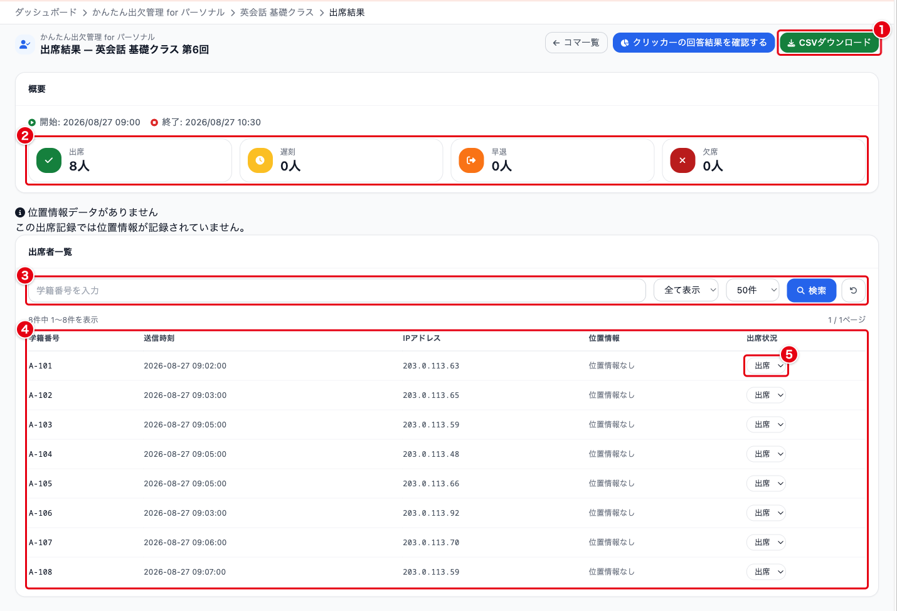

| 番号 | 項目 | 説明 |
| --- | --- | --- |
| ① | CSVダウンロード | この回の出席データを書き出します |
| ② | 概要 | 出席、遅刻、早退、欠席の人数です。受講者名簿がないため「未提出」は表示されません |
| ③ | 絞り込み | 学籍番号での検索、判定での絞り込み、表示件数の変更を行います |
| ④ | 出席者一覧 | 学籍番号、送信時刻、IPアドレス、位置情報、出席状況を並べます |
| ⑤ | 出席状況 | この場で判定を変更できます。遅刻を出席に直すといった修正に使います |

位置情報を求めるように設定した回では、受講者が送信した位置が地図に表示されます。

### 出席統計

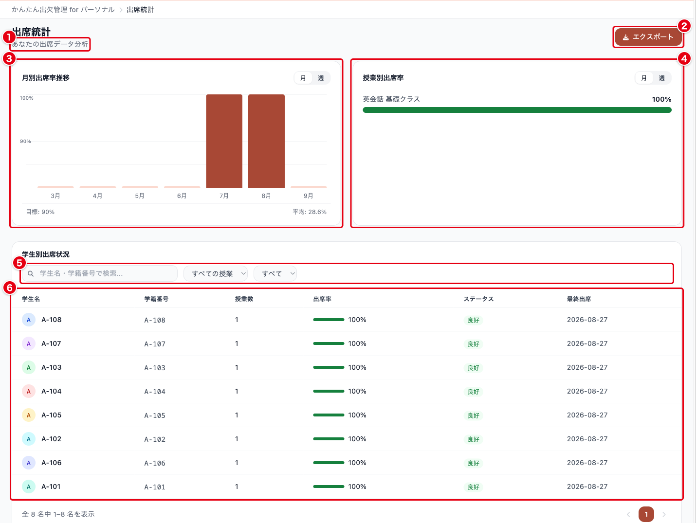

| 番号 | 項目 | 説明 |
| --- | --- | --- |
| ① | 見出しの説明 | for パーソナルでは「あなたの出席データ分析」と表示されます |
| ② | エクスポート | CSVエクスポートの画面に移動します |
| ③ | 月別出席率推移 | 直近7か月の推移です。「月」と「週」で表示を切り替えます |
| ④ | 授業別出席率 | 授業ごとの出席率を高い順に並べます |
| ⑤ | 絞り込み | 学籍番号での検索、授業と出席状況での絞り込みを行います |
| ⑥ | 学生別出席状況 | 受講者ごとの出席率、ステータス、最終出席日を並べます |

統計画面の出席率は、**提出された出席記録のうち、出席、遅刻、早退が占める割合**です。
フォームを一度も提出しなかった受講者は分母に入りません。
個々の受講者が何回欠席したかは、出席表で確認してください。

## 7. CSVで書き出す

サイドバーの「CSVエクスポート」から、条件を指定して書き出します。

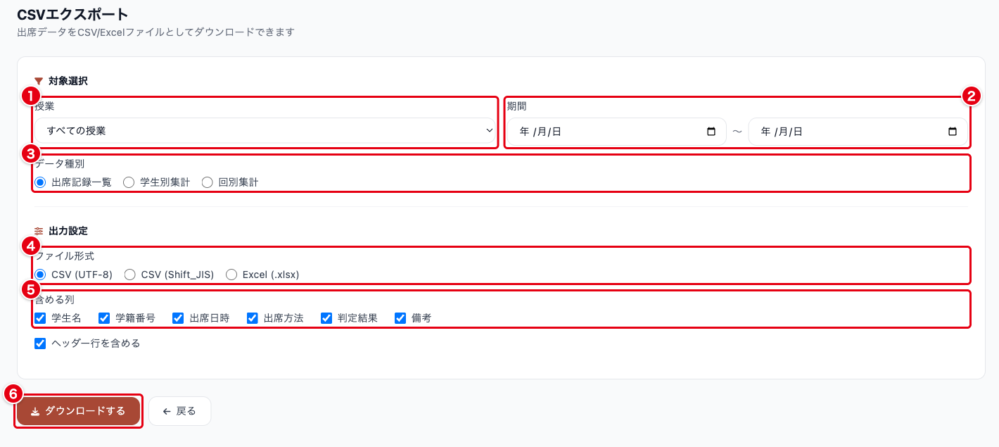

| 番号 | 入力項目 | 説明 |
| --- | --- | --- |
| ① | 授業 | 対象の授業を選びます。「すべての授業」も選べます |
| ② | 期間 | 開始日と終了日で対象を絞ります |
| ③ | データ種別 | 出席記録一覧、学生別集計、回別集計から選びます |
| ④ | ファイル形式 | CSV (UTF-8)、CSV (Shift_JIS)、Excel (.xlsx) から選びます |
| ⑤ | 含める列 | 学生名、学籍番号、出席日時、出席方法、判定結果、備考の要否と、ヘッダー行の要否を指定します |
| ⑥ | ダウンロードする | 指定した条件でファイルを生成します |

Excel でそのまま開く場合は CSV (Shift_JIS) か Excel (.xlsx) を、他のシステムに取り込む場合は CSV (UTF-8) を選んでください。

## 8. 既定値を変更する

サイドバーの「設定」で、出欠管理全体の既定値を変更します。

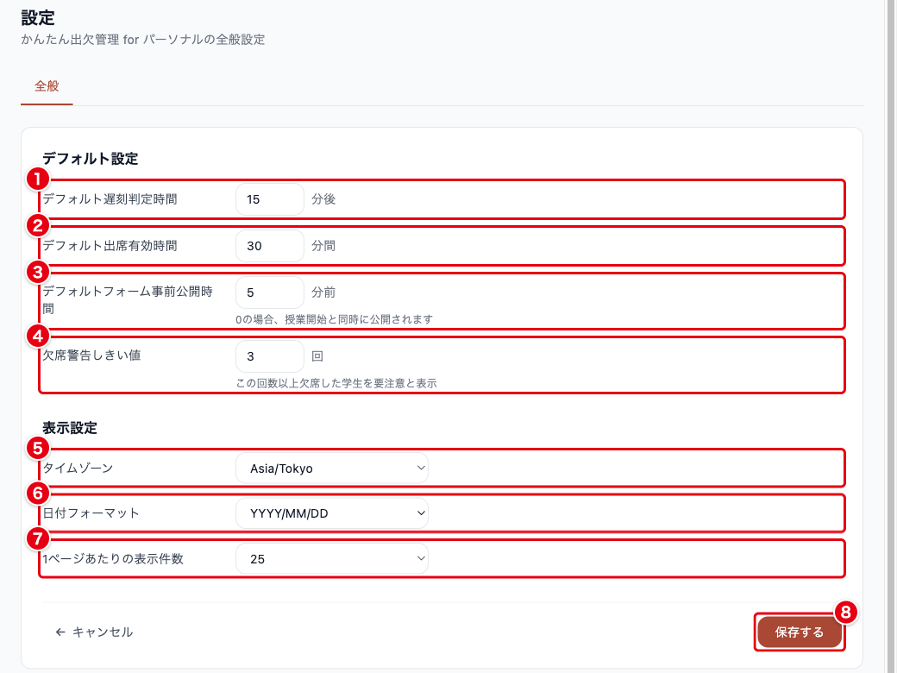

| 番号 | 入力項目 | 初期値 | 説明 |
| --- | --- | --- | --- |
| ① | デフォルト遅刻判定時間 | 15分後 | 授業側で受付時間を指定していないコマに使う、既定の受付時間です |
| ② | デフォルト出席有効時間 | 30分間 | 出席の有効時間として画面に用意されている項目です |
| ③ | デフォルトフォーム事前公開時間 | 5分前 | 出席の受け付けを授業開始の何分前から始めるかです。0〜60分の範囲で指定します。QRコードから開くフォームが表示される時刻は、この設定にかかわらず5分前です |
| ④ | 欠席警告しきい値 | 3回 | 出席表で「要注意」を付ける欠席回数です |
| ⑤ | タイムゾーン | Asia/Tokyo | 日時の表示に使うタイムゾーンです |
| ⑥ | 日付フォーマット | YYYY/MM/DD | 日付の表示形式です |
| ⑦ | 1ページあたりの表示件数 | 25 | 一覧画面で1ページに表示する件数です |
| ⑧ | 保存する | | 変更を保存します |

## よくある質問

### Q. for パーソナルと for スクールはどう違いますか

for パーソナルは個人でご契約いただいた場合の動作で、受講者は学籍番号を自分で入力して出席します。
受講者名簿や共同教員の機能はなく、氏名の記録には有料オプションのご契約が必要です。
for スクールは組織でご契約いただいた場合の動作で、受講者アカウントによる認証と名簿照合が使えます。
どちらで動くかはご契約と所属組織で決まるため、画面上で切り替えることはできません。

### Q. 授業を作れません。「まず学校を登録してください」と表示されます

for パーソナルでは、授業を作る前に学校を1件登録する必要があります。
授業作成を開くと学校の登録画面に切り替わるので、学校名を入力して「登録する」を押してください。
登録が終わるとホーム画面に戻るので、サイドバーの「授業作成」から授業を作成してください。

### Q. 受講者の氏名を記録したいのですが

氏名の記録には有料オプションのご契約が必要です。
ご契約前は、授業作成画面の「学生の氏名を取得する」に「オプション契約が必要」と表示され、操作できません。
ご契約については [お問い合わせフォーム](https://form.run/@shinonome-dxFyHrQfuKX98iw6sjf0) からご相談ください。

### Q. 同じ受講者が別人として集計されます

学籍番号の書き方が揺れていることが原因です。
掲示用の画面やプリントに記入例を添えて、書き方を統一してください。
すでに分かれてしまった記録は、出席表の「出欠を修正する」から手で直せます。

### Q. 代返は防げますか

同じ端末から複数人が代理で出席する行為は、端末の特徴を照合して自動的に検知します。
あわせて、アクセスコード、確認問題、IPアドレス制限、位置情報制限を組み合わせると精度が上がります。
それぞれの設定は「2. 授業を作成する」の代返防止と制限設定にあります。

受講者アカウントによる本人確認が必要な場合は、組織でのご契約（for スクール）をご検討ください。

### Q. 授業の設定を変更できません

コマが1つでも存在する授業は、設定を変更できません。
出席表の「授業を編集する」もグレーで表示されます。
授業名だけは、授業一覧の授業名の横にある鉛筆アイコンから変更できます。
アクセス制限などを変えたい場合は、コマごとの編集画面から個別に変更してください。

### Q. 確認問題はどこで設定しますか

コマの編集画面にあります。
設定のしかたは「3. 授業とコマを一覧する」のコマを調整するに書いています。

### Q. 位置情報の制限はどのくらい正確ですか

屋外でおよそ10〜50メートル、屋内ではそれ以上の誤差が出ます。
許可範囲の目安は「2. 授業を作成する」の代返防止と制限設定に書いています。

### Q. 受講者が出席を登録できないと言っています

次の順に確認してください。

1. 出席フォームは授業開始の5分前から開きます。それより前は開けません
2. アクセスコードを有効にしている場合、掲示している4桁の数字と一致しているか
3. IPアドレス制限を有効にしている場合、受講者が指定のネットワークに接続しているか
4. 位置情報を求めている場合、ブラウザの位置情報の許可が有効になっているか

### Q. コマを削除するとどうなりますか

その回の出席記録も一緒に削除され、元に戻せません。
位置情報や確認問題の回答も失われます。
削除の前に、必要なデータをCSVで書き出しておいてください。

コマの削除はサイドバーの「コマ一覧」から行います。
授業そのものを削除する入口は、現在の画面には用意していません。
