# かんたん出欠管理 for スクール

このページは、学校や大学などの組織でご契約いただいた「かんたん出欠管理 for スクール」の操作手順を説明します。
個人でご契約の場合は [かんたん出欠管理 for パーソナル](attendance/attendance-personal-v2.md) をご覧ください。
旧画面の手順は [かんたん出欠管理（旧画面）](attendance/attendance.md) に残しています。

> 画面図の赤い枠と丸数字は、そのすぐ下にある表の番号に対応しています。
> 番号の順に読むと、その画面で何を入力し、どのボタンを押すのかが分かります。

## for スクールとは

「かんたん出欠管理」は、授業の出欠をQRコードとアクセスコードで記録するサービスです。
学生は掲示されたQRコードをスマートフォンで読み取り、その場で出席を登録します。

ご契約が組織単位の場合、サービスは自動的に「かんたん出欠管理 for スクール」として動作します。
所属組織が判定の基準になるため、どの組織にも所属していないアカウントでログインすると for パーソナルの画面になります。
個人アカウントもお持ちの場合にかぎり、画面右上の「利用モード」から個人アカウントに切り替えられます。

for スクールでは、次の機能が使えます。

- 受講者名簿：授業ごとに受講者の学籍番号と氏名を登録し、出席時に照合する
- 受講者アカウント認証：学生が自分のアカウントでログインしてから出席する
- 氏名の記録：追加のオプション契約なしで、出席者の氏名を記録する
- 共同教員：ひとつの授業を複数の教員で担当する
- 組織全体の出席統計：組織の授業をまとめて集計する

## ご利用の前に

**出欠管理の権限を持つ組織管理者かどうかで、見える範囲が変わります。**
組織のすべての授業をホーム画面や出席統計で見られるのは、組織管理者として「出欠管理」の権限を与えられている方だけです。
権限のない教員には、自分が作成した授業と、共同教員として招待された授業だけが表示されます。
受講者名簿を管理するボタンも、組織管理者にのみ表示されます。

受講者アカウントによる学生の認証を使うには、組織で「受講者アカウント管理」を有効にしておく必要があります。
有効になっていない組織では、授業作成画面に「受講者アカウントでのログインを必須にする」の項目そのものが表示されません。
大学アカウントでのログイン（SAML）を設定している組織では、代わりに「大学アカウント(SAML)で認証する」が表示されます。

管理作業はパソコンでのご利用を推奨します。
画面の横幅が狭い端末では、左側のメニューが折りたたまれます。

## 画面の構成

左側のメニューから各機能に移動します。

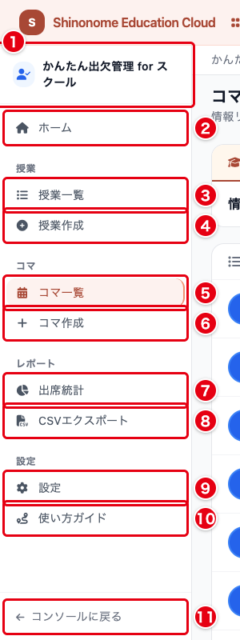

| 番号 | 項目 | 説明 |
| --- | --- | --- |
| ① | サービス名 | 「かんたん出欠管理 for スクール」と表示されていれば、組織モードで動作しています |
| ② | ホーム | 次の授業、今期の授業、授業カレンダーをまとめて表示します |
| ③ | 授業一覧 | 登録済みの授業と、その各回（コマ）を一覧します |
| ④ | 授業作成 | 新しい授業を作成します |
| ⑤ | コマ一覧 | 開いている授業のコマを一覧します。授業を開いているときだけ表示されます |
| ⑥ | コマ作成 | 開いている授業にコマを追加します。授業を開いているときだけ表示されます |
| ⑦ | 出席統計 | 組織全体の出席状況をグラフと表で確認します |
| ⑧ | CSVエクスポート | 出席データをCSVまたはExcel形式でダウンロードします |
| ⑨ | 設定 | 遅刻の判定時間など、出欠管理全体の既定値を変更します |
| ⑩ | 使い方ガイド | 操作の流れを画面に沿って案内します |
| ⑪ | コンソールに戻る | Shinonome Education Cloud のダッシュボードに戻ります |

「コマ」のグループは、特定の授業を開いているあいだだけ表示されます。
ホーム画面や出席統計を開いているときは表示されません。

## ホーム画面

サイドバーの「ホーム」を開くと、直近の授業と今期の授業がまとまって表示されます。

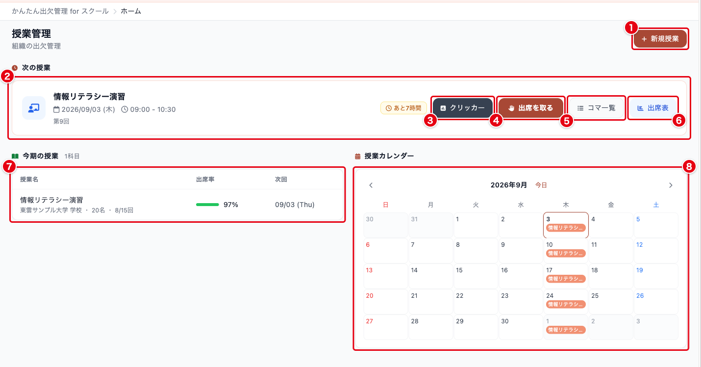

| 番号 | 項目 | 説明 |
| --- | --- | --- |
| ① | 新規授業 | 授業作成画面に移動します |
| ② | 次の授業 | 直近の実施予定または実施中のコマを1件表示します。開始までの残り時間と、その場で使う操作ボタンが並びます |
| ③ | クリッカー | その回のリアルタイム投票を開きます。授業でクリッカーを有効にしている場合だけ表示されます |
| ④ | 出席を取る | 掲示用のQRコード画面を開きます。授業中はこのボタンから始めます |
| ⑤ | コマ一覧 | その授業のコマ一覧に移動します |
| ⑥ | 出席表 | その授業の出席表に移動します |
| ⑦ | 今期の授業 | 進行中の授業を、出席率と進捗（実施済みコマ数 ÷ 総コマ数）とともに一覧します |
| ⑧ | 授業カレンダー | その月のコマを日付ごとに表示します |

## 1. 授業を作成する

サイドバーの「授業作成」、またはホームの「新規授業」から始めます。

for スクールでは、授業は組織の学校に自動的に登録されます。
学校を選ぶ欄は表示されません。

### 基本情報とスケジュール

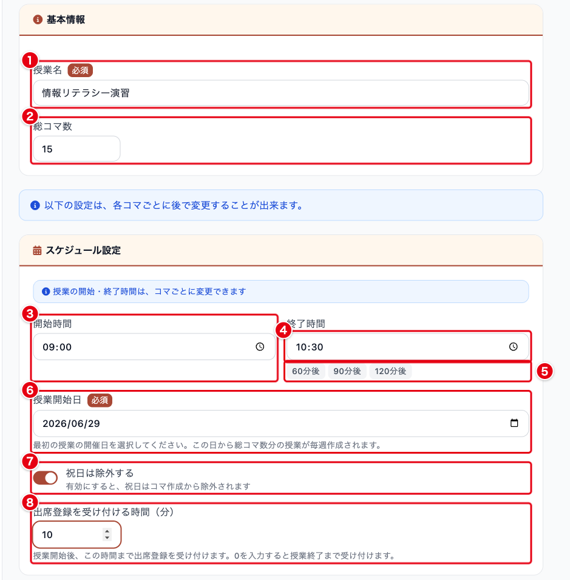

| 番号 | 入力項目 | 必須 | 説明 |
| --- | --- | :---: | --- |
| ① | 授業名 | ✓ | 出欠を取る授業の名前です（例：情報リテラシー演習） |
| ② | 総コマ数 | | 授業を全部で何回行うかを入力します。初期値は15です |
| ③ | 開始時間 | | 各コマの既定の開始時刻です。初期値は 09:00 です |
| ④ | 終了時間 | | 各コマの既定の終了時刻です。初期値は 10:30 です |
| ⑤ | 60分後 / 90分後 / 120分後 | | 開始時間からの経過時間で終了時間を自動入力します |
| ⑥ | 授業開始日 | ✓ | 第1回の開催日です。**今日以降の日付しか選べません** |
| ⑦ | 祝日は除外する | | 有効にすると、祝日にあたる日をコマの自動作成から除きます。初期状態で有効です |
| ⑧ | 出席登録を受け付ける時間（分） | | 授業開始後、何分まで出席として受け付けるかを指定します。初期値は10分です。0を入力すると授業終了まで出席として受け付けます |

授業を保存すると、授業開始日から毎週1回ずつ、総コマ数の分だけコマが自動で作られます。
個別の日程は、あとからコマごとに変更できます。

### 代返防止と制限設定

出席の受け付け方を決めます。
図では説明のためすべての項目を有効にしていますが、必要なものだけを有効にしてかまいません。

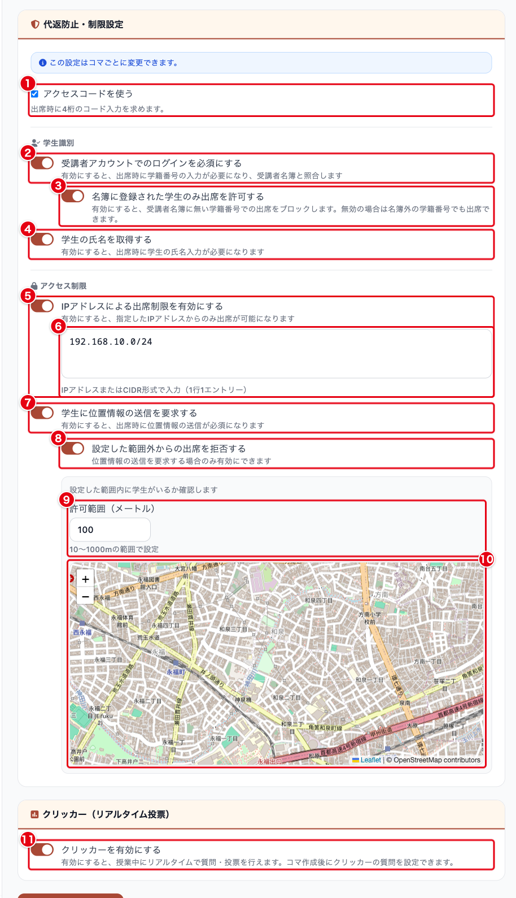

| 番号 | 入力項目 | 説明 |
| --- | --- | --- |
| ① | アクセスコードを使う | 出席時に4桁のコードの入力を求めます。コードはコマごとに自動生成されます。初期状態では無効です |
| ② | 受講者アカウントでのログインを必須にする | 学生が受講者アカウントでログインしてから出席するようになります。組織で受講者アカウント管理を有効にしている場合だけ表示されます |
| ③ | 名簿に登録された学生のみ出席を許可する | ②を有効にすると現れます。受講者名簿にない学籍番号での出席を拒否します。無効の場合、名簿にない学籍番号でも出席できます |
| ④ | 学生の氏名を取得する | 出席記録に氏名を残します。for スクールでは追加のオプション契約なしで利用できます |
| ⑤ | IPアドレスによる出席制限を有効にする | 指定したIPアドレスからの出席だけを許可します |
| ⑥ | IPアドレスの入力欄 | 学内Wi-FiのIPアドレスをCIDR形式で入力します（例：192.168.10.0/24）。1行に1件ずつ書きます |
| ⑦ | 学生に位置情報の送信を要求する | 出席時に位置情報の送信を必須にします |
| ⑧ | 設定した範囲外からの出席を拒否する | ⑦を有効にしたときだけ設定できます。基準地点から離れた場所からの出席を拒否します |
| ⑨ | 許可範囲（メートル） | 基準地点からの許容距離です。10〜1000メートルの範囲で指定します |
| ⑩ | 地図 | 基準地点を指定します。地図をクリックするか、現在地から設定します |
| ⑪ | クリッカーを有効にする | 授業中にリアルタイムで質問と投票を行えるようにします。設問はコマを作成したあとに登録します |

同じ端末から複数人が代理で出席する行為（代返）の検知は常に有効です。
オンとオフを切り替える設定項目はありません。

位置情報による判定の精度は環境に左右されます。
屋外でおよそ10〜50メートル、屋内ではそれ以上の誤差が出るため、許可範囲は100メートル以上を目安に設定してください。

入力が終わったら「授業を作成する」を押します。

> **授業の設定は、コマが1つでも作られると変更できなくなります。**
> 作成と同時に総コマ数の分のコマが作られるため、通常の手順で作った授業では出席表の「授業を編集する」がグレーで表示され、押せません。
> 授業名やアクセス制限の設定は、最初のコマを使う前に確定させてください。
> 各コマ個別の設定は、そのコマに出席が1件も登録されていないあいだは変更できます。誰か1人でも出席を登録すると、そのコマの編集画面は読み取り専用になります。

## 2. 授業とコマを一覧する

サイドバーの「授業一覧」を開くと、授業とその各回がまとめて表示されます。

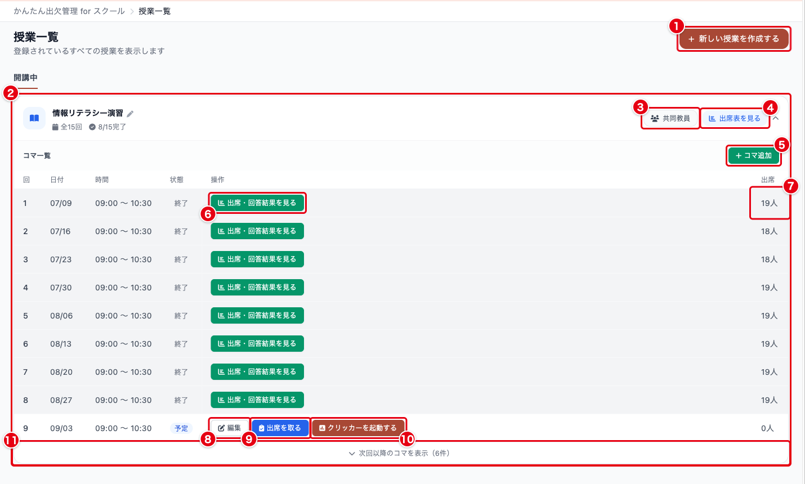

| 番号 | 項目 | 説明 |
| --- | --- | --- |
| ① | 新しい授業を作成する | 授業作成画面に移動します |
| ② | 授業カード | 授業ごとのまとまりです。授業名の横の鉛筆アイコンを押すと、この場で授業名を変更できます |
| ③ | 共同教員 | この授業を他の教員と共有する画面を開きます |
| ④ | 出席表を見る | 授業全体の出席表に移動します |
| ⑤ | コマ追加 | 16回目以降など、コマを追加します |
| ⑥ | 出席・回答結果を見る | 終了したコマの出席結果を開きます |
| ⑦ | 出席人数 | そのコマの出席者数です |
| ⑧ | 編集 | これから行うコマの設定を変更します |
| ⑨ | 出席を取る | 掲示用のQRコード画面を開きます |
| ⑩ | クリッカーを起動する | そのコマのリアルタイム投票を開きます |
| ⑪ | 次回以降のコマを表示 | 折りたたまれている今後のコマを展開します |

コマの状態は「終了」「実施中」「予定」で表示されます。
終了したコマには結果を見るボタンが、次に行う1コマには出席を取るボタンが並びます。
それより先のコマには編集ボタンだけが並びます。

### コマだけを一覧する

サイドバーの「コマ一覧」を開くと、その授業のコマだけが並びます。
回数が多い授業で、特定の回を探すときに使います。
この画面では、コマの状態を「開始前」「受付中」「終了」で表示します。

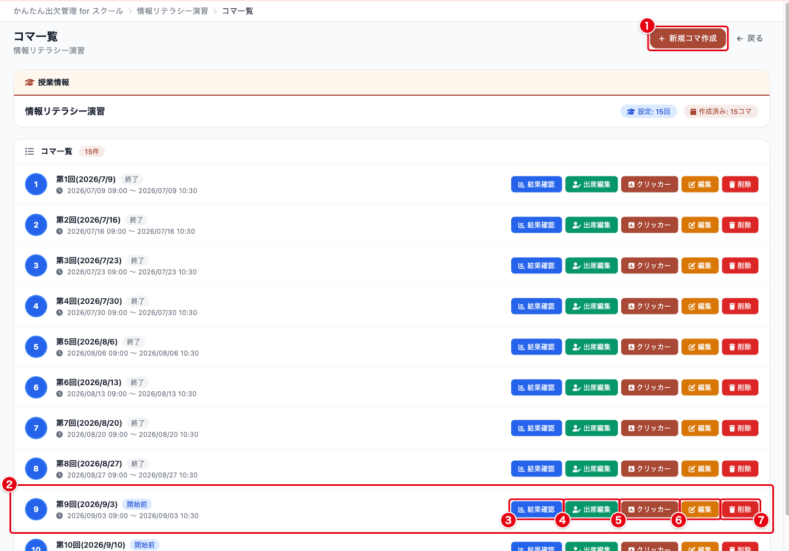

| 番号 | 項目 | 説明 |
| --- | --- | --- |
| ① | 新規コマ作成 | この授業にコマを追加します |
| ② | コマの行 | 回数、日付、時間、状態が並びます |
| ③ | 結果確認 | その回の出席結果を開きます |
| ④ | 出席編集 | その回の出欠を手で修正します |
| ⑤ | クリッカー | その回のリアルタイム投票を開きます |
| ⑥ | 編集 | その回の設定を変更します |
| ⑦ | 削除 | その回を削除します。その回の出席記録も一緒に消えます |

## 3. 受講者名簿を登録する

受講者名簿は、学籍番号から受講者を特定するための一覧です。
出席表に氏名を並べたい場合と、名簿にない受講者の出席を拒否したい場合に登録します。
この一覧は画面上では「履修者一覧」と表示されます。

出席表の右上にある「履修者を管理する」から開きます。
このボタンは組織管理者にだけ表示されます。

### CSVで一括登録する

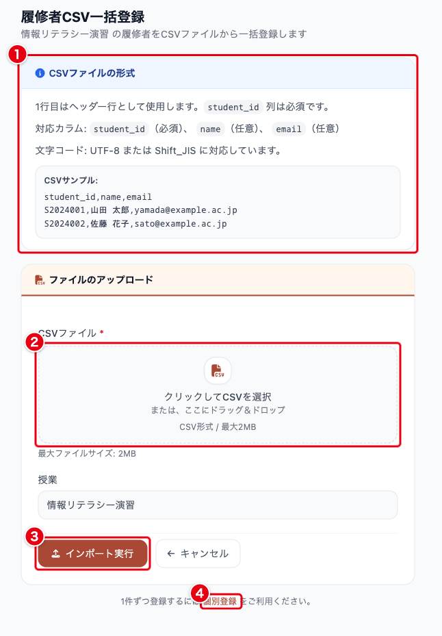

| 番号 | 項目 | 説明 |
| --- | --- | --- |
| ① | CSVファイルの形式 | 受け付けるファイルの仕様です。1行目をヘッダー行として扱い、`student_id` 列が必須です。`name` と `email` は任意です |
| ② | CSVファイル | ここをクリックしてファイルを選ぶか、ファイルをドラッグして置きます。上限は2MBです |
| ③ | インポート実行 | 選んだファイルを取り込みます |
| ④ | 個別登録 | 1件ずつ登録する画面に移動します |

文字コードは UTF-8 と Shift_JIS のどちらでもかまいません。
Excel で「CSV UTF-8」として保存したファイルもそのまま取り込めます。

**すでに登録されている学籍番号は上書きされず、スキップされます。**
氏名やメールアドレスを直したい場合は、その履修者を削除してから登録し直してください。
取り込みが終わると、「CSVインポート完了: ◯件登録、◯件スキップ」と表示されます。

### 1件ずつ登録する

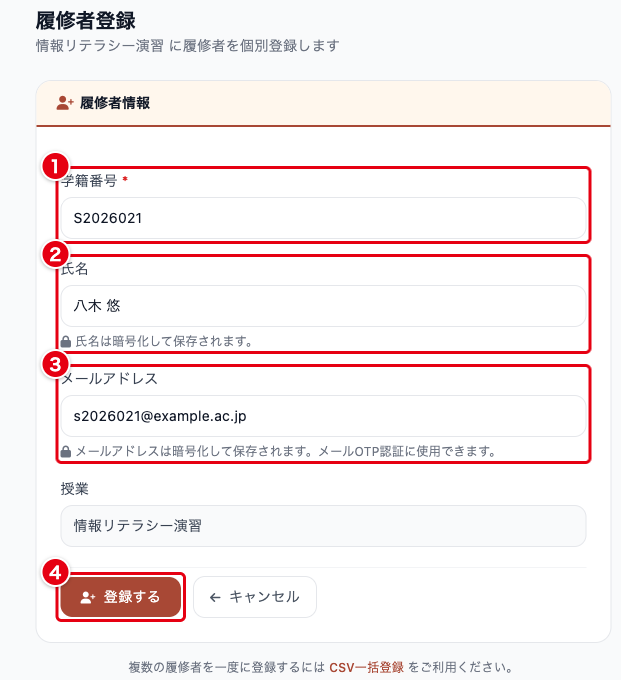

| 番号 | 入力項目 | 必須 | 説明 |
| --- | --- | :---: | --- |
| ① | 学籍番号 | ✓ | 出席時に照合する学籍番号です。あとから変更できません |
| ② | 氏名 | | 出席表と出席結果に表示されます |
| ③ | メールアドレス | | 受講者アカウントのログインIDと突き合わせるときに使います |
| ④ | 登録する | 履修者を1件追加します |

### 登録した履修者を確認する

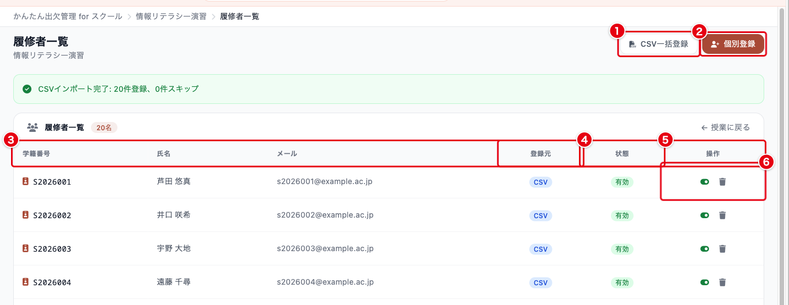

| 番号 | 項目 | 説明 |
| --- | --- | --- |
| ① | CSV一括登録 | CSVから一括で登録する画面に移動します |
| ② | 個別登録 | 1件ずつ登録する画面に移動します |
| ③ | 一覧の見出し | 学籍番号、氏名、メール、登録元、状態、操作の順に並びます |
| ④ | 登録元 | その履修者をどこから登録したかを表します（手動 / CSV / LTI / 名簿） |
| ⑤ | 状態 | 「有効」の履修者だけが出席の照合対象になります |
| ⑥ | 操作 | 左のボタンで有効と無効を切り替え、右のボタンで削除します |

## 4. コマを調整する

自動で作られたコマは、日程や受け付け方をコマごとに変更できます。
授業一覧またはコマ一覧の「編集」から開きます。

そのコマに出席が1件でも登録されると、編集画面は読み取り専用になり「この出席フォームは既に出席が提出されているため、編集できません」と表示されます。

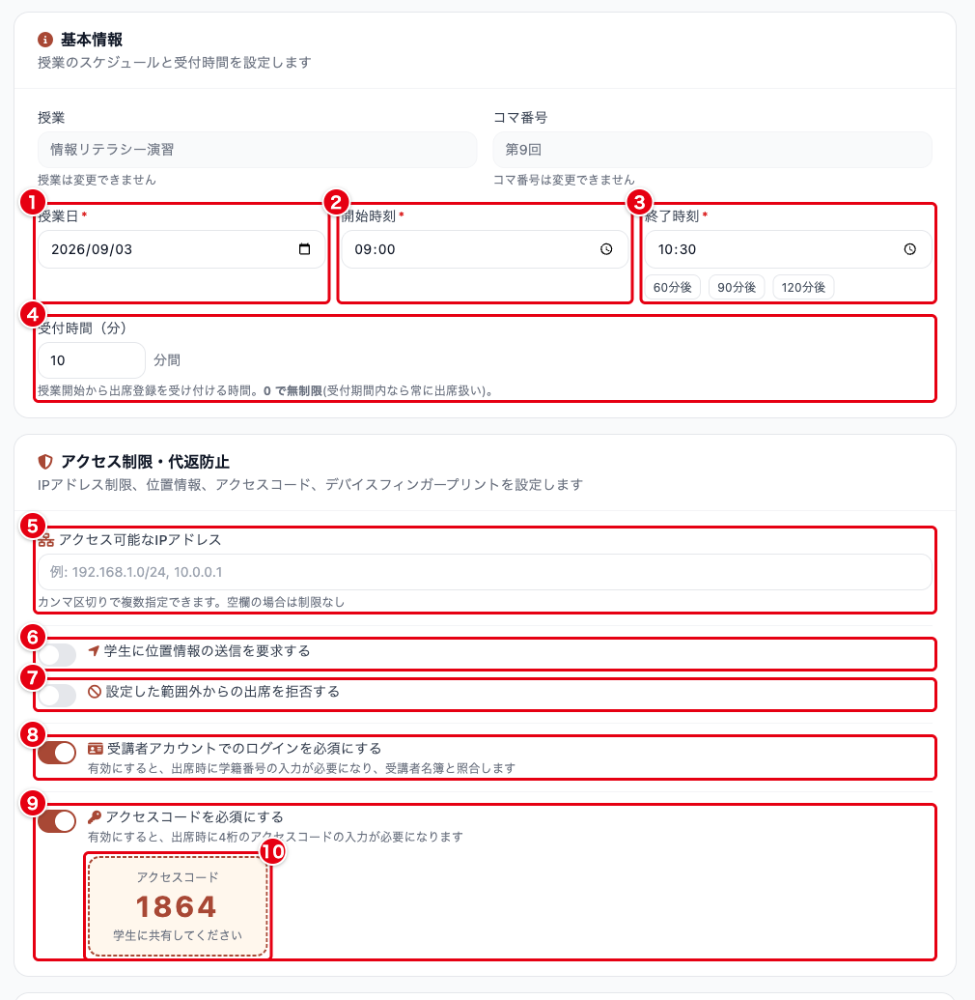

| 番号 | 入力項目 | 説明 |
| --- | --- | --- |
| ① | 授業日 | この回の開催日です |
| ② | 開始時刻 | この回の開始時刻です |
| ③ | 終了時刻 | この回の終了時刻です |
| ④ | 受付時間（分） | 授業開始から何分まで出席として受け付けるかを指定します。0を入力すると、授業終了まで常に出席として扱います |
| ⑤ | アクセス可能なIPアドレス | この回だけIPアドレスを制限したい場合に入力します。複数指定するときはカンマで区切ります。空欄なら制限しません |
| ⑥ | 学生に位置情報の送信を要求する | この回だけ位置情報を求める場合に有効にします |
| ⑦ | 設定した範囲外からの出席を拒否する | ⑥を有効にしたときだけ設定できます |
| ⑧ | 受講者アカウントでのログインを必須にする | 学生の認証を切り替えます。この項目だけは授業全体の設定のため、変更すると同じ授業のすべてのコマに反映されます |
| ⑨ | アクセスコードを必須にする | この回だけアクセスコードの要否を切り替えます |
| ⑩ | アクセスコード | 自動生成された4桁のコードです。学生に見せる番号がここに表示されます |

アクセスコードは4桁の数字で自動生成されます。
セキュリティ上の理由から、任意の番号を指定することはできません。

### 確認問題とクリッカー

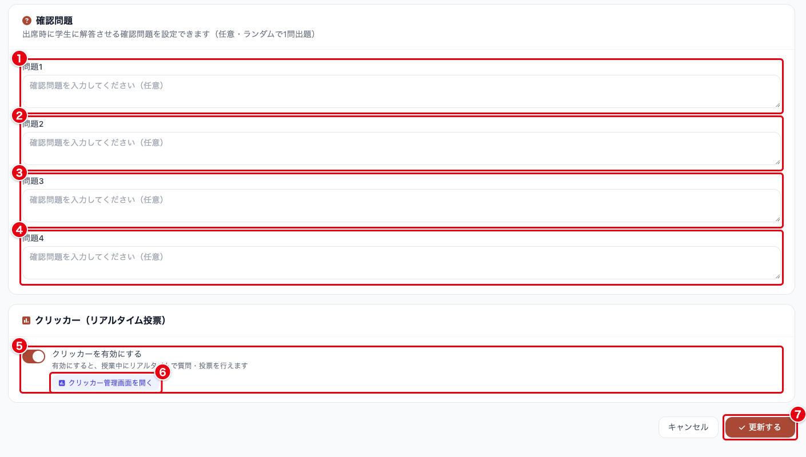

| 番号 | 入力項目 | 説明 |
| --- | --- | --- |
| ①〜④ | 問題1〜問題4 | 出席登録時に学生へ表示する確認問題です。最大4問まで登録できます |
| ⑤ | クリッカーを有効にする | この回でリアルタイム投票を使えるようにします |
| ⑥ | クリッカー管理画面を開く | 設問の作成と結果表示を行う画面に移動します |

操作手順は [かんたんクリッカー](attendance/attendance-clicker.md) をご覧ください。
| ⑦ | 更新する | 変更を保存します |

確認問題を登録すると、**4問のうち1問がランダムに選ばれて学生に表示されます。**
授業に出ていなければ答えられない内容にしておくと、代返の抑止に役立ちます。
確認問題の登録は任意です。

## 5. 授業当日に出席を取る

ホームまたは授業一覧の「出席を取る」を押すと、「フォーム情報」が開きます。
QRコードの見せ方をここで選びます。

| 番号 | 項目 | 説明 |
| --- | --- | --- |
| ① | QRコード付きポスターを印刷する | QRコードとアクセスコードを載せたPDFをダウンロードします。印刷して教室に掲示します |
| ② | プロジェクタ・ディスプレイにQRコード・アクセスコードを掲示する | 掲示用の画面を別ウィンドウで開きます |
| ③ | 出席フォームURLを共有する | 出席フォームのURLをコピーします。LMSなどに掲載して配る場合に使います |
| ④ | 出席フォームを確認する | 学生に見える画面を教員が確認します。この画面から送信しても出席は記録されません |
| ⑤ | コマの設定を編集する | この回のコマ編集画面に移動します |

②を選ぶと、掲示用の画面が別ウィンドウで開きます。
この画面をプロジェクターやディスプレイに映して、学生に読み取ってもらいます。

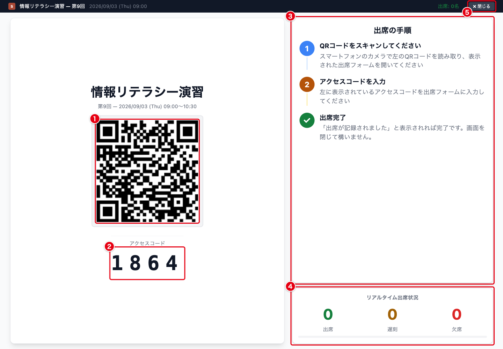

| 番号 | 項目 | 説明 |
| --- | --- | --- |
| ① | QRコード | 学生がスマートフォンのカメラで読み取ります |
| ② | アクセスコード | アクセスコードを有効にしている場合に表示される4桁の数字です |
| ③ | 出席の手順 | 学生向けの案内です。そのまま読み上げても使えます |
| ④ | リアルタイム出席状況 | 出席、遅刻、欠席の人数が登録に応じて更新されます |
| ⑤ | 閉じる | 掲示用画面を閉じて元の画面に戻ります |

紙に印刷して教室に貼り出す場合は、「フォーム情報」の①「QRコード付きポスターを印刷する」からPDFを出力してください。

## 6. 学生が出席を登録する

学生の出席のしかたは、授業作成で「受講者アカウントでのログインを必須にする」を有効にしたかどうかで変わります。
有効にした授業では、QRコードを読み取るとまずログイン画面が表示されます。
無効のままの授業では、ログイン画面は出ず、学生が自分で学籍番号を入力して出席します。

ここでは、受講者アカウントでのログインを必須にした場合の流れを説明します。
QRコードを読み取ると、まずログイン画面が表示されます。

| 番号 | 入力項目 | 説明 |
| --- | --- | --- |
| ① | メールアドレス | 受講者アカウントのログインIDです |
| ② | 次へ | パスキーまたはパスワードによる認証に進みます |

アクセスコードを有効にしている場合は、ログインのあとにコードの入力を求めます。

| 番号 | 入力項目 | 説明 |
| --- | --- | --- |
| ① | アクセスコード | 教室に掲示されている4桁の数字を入力します |
| ② | 送信 | 出席フォームに進みます |

出席フォームには、受講者名簿の氏名とメールアドレスが自動的に表示されます。
**学生が学籍番号を打ち込む欄が無いため、他人の学籍番号で出席することはできません。**
受講者アカウントでのログインを必須にしていない授業では学籍番号が自己申告になるため、他人の学籍番号を入力できます。

| 番号 | 項目 | 説明 |
| --- | --- | --- |
| ① | 学生情報 | 受講者名簿から取得した氏名とメールアドレスです。学生は変更できません |
| ② | 出席を登録する | 出席を記録します。確認問題を設定している場合は、ここで1問が表示されます |

### 出席、遅刻、欠席の判定

判定は、学生がフォームを送信した時刻で決まります。

| 送信した時刻 | 判定 |
| --- | --- |
| 授業開始から受付時間までのあいだ | 出席 |
| 受付時間を過ぎてから授業終了までのあいだ | 遅刻 |
| 授業開始前（フォームが開いてから開始時刻まで） | 欠席 |
| 授業終了後、または一度も送信しなかった場合 | 欠席 |

フォームは授業開始より前に開きますが、判定は授業開始時刻を基準にします。
開始前に送信すると欠席として記録されるため、授業が始まってから読み取るよう案内してください。

受付時間に0を指定したコマでは、授業開始から終了までのあいだに送信すればすべて出席になります。

出席フォームは授業開始の5分前から開きます。

## 7. 出欠を確認する

### 授業全体の出席表

授業一覧の「出席表を見る」、またはホームの「出席表」から開きます。

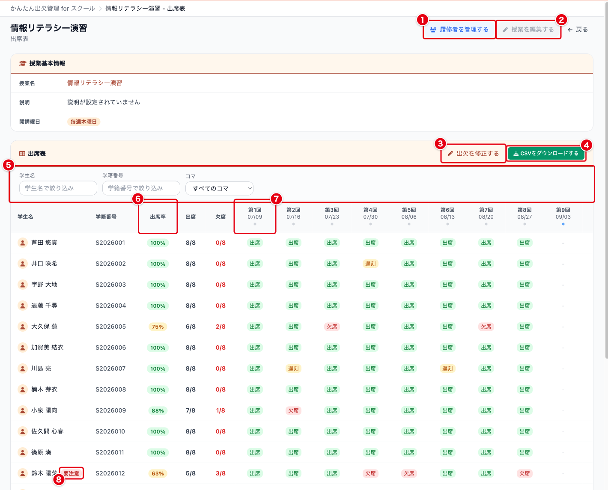

| 番号 | 項目 | 説明 |
| --- | --- | --- |
| ① | 履修者を管理する | 受講者名簿の画面に移動します。組織管理者にだけ表示されます |
| ② | 授業を編集する | コマが1つでもあるとグレーで表示され、押せません |
| ③ | 出欠を修正する | 各学生の出欠を手で修正する画面に移動します |
| ④ | CSVをダウンロードする | この授業の出席データをCSVで書き出します |
| ⑤ | 絞り込み | 学生名、学籍番号、コマで表示を絞ります |
| ⑥ | 出席率 | 実施済みのコマに対する割合です。遅刻と早退も出席として数えます。右隣に出席とみなした回数と欠席回数が並びます |
| ⑦ | 各回の判定 | 回ごとに「出席」「遅刻」「欠席」を表示します。未実施の回は「-」です。代返の疑いがある記録には「要確認」が付きます |
| ⑧ | 要注意 | 欠席が設定したしきい値に達した学生に付きます。しきい値は設定画面で変更します |

氏名を含むCSVをダウンロードするときは、ワンタイムコードによる追加認証を求められます。
ログインしているメールアドレス宛に10桁のコードが届くので、それを入力してください。

### 回ごとの出席結果

コマ一覧または授業一覧の「出席・回答結果を見る」から開きます。

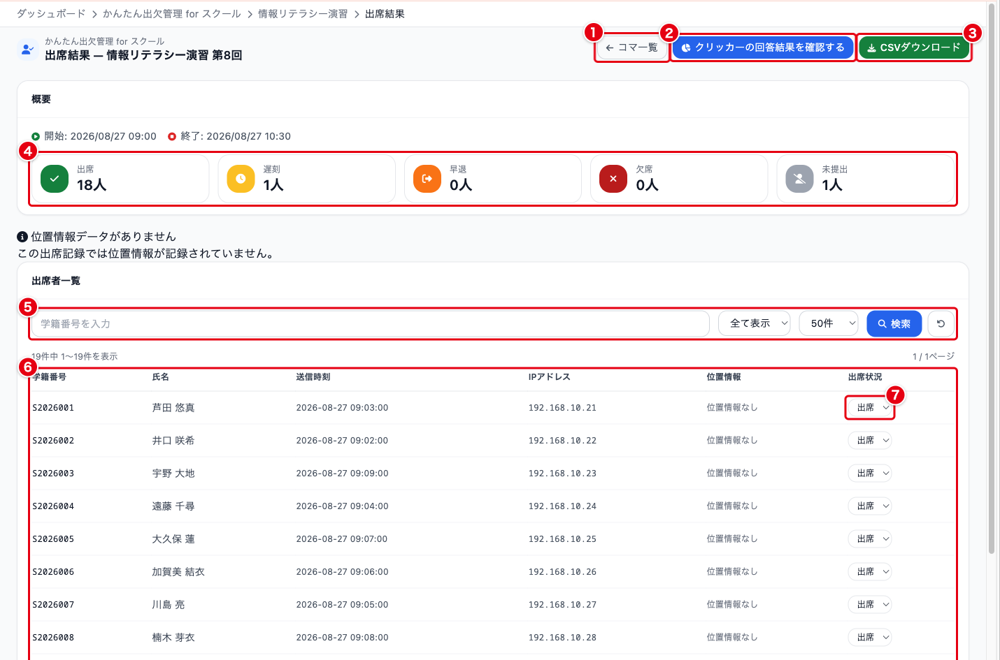

| 番号 | 項目 | 説明 |
| --- | --- | --- |
| ① | コマ一覧 | コマの一覧に戻ります |
| ② | クリッカーの回答結果を確認する | その回のリアルタイム投票の結果を開きます |
| ③ | CSVダウンロード | この回の出席データを書き出します |
| ④ | 概要 | 出席、遅刻、早退、欠席、未提出の人数です |
| ⑤ | 絞り込み | 学籍番号での検索、判定での絞り込み、表示件数の変更を行います |
| ⑥ | 出席者一覧 | 学籍番号、氏名、送信時刻、IPアドレス、位置情報、出席状況を並べます |
| ⑦ | 出席状況 | この場で判定を変更できます。遅刻を出席に直すといった修正に使います |

位置情報を求めるように設定した回では、学生が送信した位置が地図に表示されます。

### 組織全体の出席統計

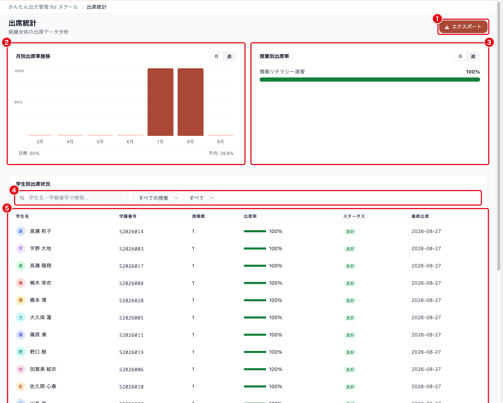

| 番号 | 項目 | 説明 |
| --- | --- | --- |
| ① | エクスポート | CSVエクスポートの画面に移動します |
| ② | 月別出席率推移 | 直近7か月の推移です。「月」と「週」で表示を切り替えます |
| ③ | 授業別出席率 | 授業ごとの出席率を高い順に並べます |
| ④ | 絞り込み | 学生名や学籍番号での検索、授業と出席状況での絞り込みを行います |
| ⑤ | 学生別出席状況 | 学生ごとの出席率、ステータス、最終出席日を並べます |

統計画面の出席率は、**提出された出席記録のうち、出席、遅刻、早退が占める割合**です。
フォームを一度も提出しなかった学生は分母に入りません。
個々の学生が何回欠席したかは、出席表で確認してください。

## 8. CSVで書き出す

サイドバーの「CSVエクスポート」から、条件を指定して書き出します。

| 番号 | 入力項目 | 説明 |
| --- | --- | --- |
| ① | 授業 | 対象の授業を選びます。「すべての授業」も選べます |
| ② | 期間 | 開始日と終了日で対象を絞ります |
| ③ | データ種別 | 出席記録一覧、学生別集計、回別集計から選びます |
| ④ | ファイル形式 | CSV (UTF-8)、CSV (Shift_JIS)、Excel (.xlsx) から選びます |
| ⑤ | 含める列 | 学生名、学籍番号、出席日時、出席方法、判定結果、備考の要否と、ヘッダー行の要否を指定します |
| ⑥ | ダウンロードする | 指定した条件でファイルを生成します |

Excel でそのまま開く場合は CSV (Shift_JIS) か Excel (.xlsx) を、他のシステムに取り込む場合は CSV (UTF-8) を選んでください。

学生名を含めて書き出すときは、ワンタイムコードによる追加認証を求められます。
ログインしているメールアドレス宛に10桁のコードが届くので、それを入力してください。

## 9. 既定値を変更する

サイドバーの「設定」で、出欠管理全体の既定値を変更します。

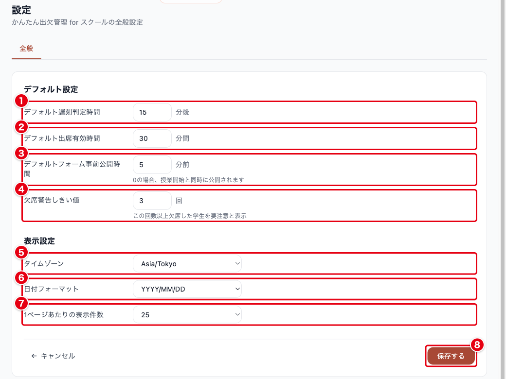

| 番号 | 入力項目 | 初期値 | 説明 |
| --- | --- | --- | --- |
| ① | デフォルト遅刻判定時間 | 15分後 | 授業側で受付時間を指定していないコマに使う、既定の受付時間です |
| ② | デフォルト出席有効時間 | 30分間 | 出席の有効時間として画面に用意されている項目です |
| ③ | デフォルトフォーム事前公開時間 | 5分前 | 出席の受け付けを授業開始の何分前から始めるかです。0〜60分の範囲で指定します。QRコードから開くフォームが表示される時刻は、この設定にかかわらず5分前です |
| ④ | 欠席警告しきい値 | 3回 | 出席表で「要注意」を付ける欠席回数です |
| ⑤ | タイムゾーン | Asia/Tokyo | 日時の表示に使うタイムゾーンです |
| ⑥ | 日付フォーマット | YYYY/MM/DD | 日付の表示形式です |
| ⑦ | 1ページあたりの表示件数 | 25 | 一覧画面で1ページに表示する件数です |
| ⑧ | 保存する | | 変更を保存します |

## 10. 授業を複数の教員で担当する

授業一覧の「共同教員」から、ひとつの授業を他の教員と共有します。

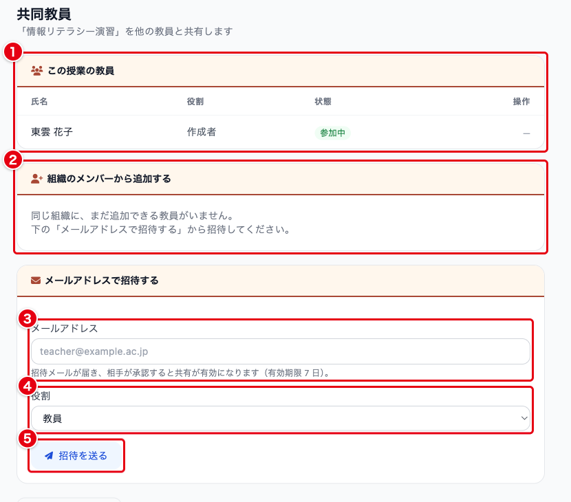

| 番号 | 項目 | 説明 |
| --- | --- | --- |
| ① | この授業の教員 | 現在この授業を担当している教員の一覧です。作成者は削除できません |
| ② | 組織のメンバーから追加する | 同じ組織に所属していて、まだ追加していない教員から選びます |
| ③ | メールアドレス | 招待する相手のメールアドレスです |
| ④ | 役割 | 招待する相手の役割を選びます |
| ⑤ | 招待を送る | 招待メールを送ります |

招待された教員がメールのリンクから承認すると、共有が有効になります。
招待の有効期限は7日間です。

共同教員は授業の出席表とコマを扱えますが、**受講者名簿の管理画面には入れません。**
名簿の登録と修正は、授業の作成者または組織管理者が行ってください。

## よくある質問

### Q. for スクールと for パーソナルはどう違いますか

for スクールは組織でご契約いただいた場合の動作で、受講者名簿、受講者アカウントによる認証、共同教員、組織全体の統計が使えます。
氏名の記録に追加のオプション契約は要りません。
for パーソナルは個人でご契約いただいた場合の動作で、学生は学籍番号を自分で入力して出席します。
どちらで動くかはご契約と所属組織で決まります。
個人アカウントもお持ちの場合にかぎり、画面右上の「利用モード」から切り替えられます。

### Q. 授業を作ると、各回のコマはどうやって作られますか

授業開始日から毎週1回ずつ、総コマ数の分だけ自動で作られます。
「祝日は除外する」を有効にしていると、祝日にあたる日は作成の対象から外れます。
できあがったコマの日程は、コマごとに個別に変更できます。

### Q. 授業の設定を変更できません

コマが1つでも存在する授業は、設定を変更できません。
出席表の「授業を編集する」もグレーで表示されます。
授業名だけは、授業一覧の授業名の横にある鉛筆アイコンから変更できます。
アクセス制限や学生識別の設定を変えたい場合は、コマごとの編集画面から個別に変更してください。

### Q. 代返は防げますか

同じ端末から複数人が代理で出席する行為は、端末の特徴を照合して自動的に検知します。
検知しても出席の登録は止まりません。
疑いのある記録には出席表と出席結果に「要確認」が付くので、担当の教員が確認してください。
あわせて、受講者アカウントによるログイン、アクセスコード、確認問題、IPアドレス制限、位置情報制限を組み合わせると精度が上がります。
それぞれの設定は「1. 授業を作成する」の代返防止と制限設定にあります。

### Q. 受講者名簿に登録していない学生が出席するとどうなりますか

「名簿に登録された学生のみ出席を許可する」を有効にしている場合は、出席が拒否されます。
無効にしている場合は、名簿にない学籍番号でも出席として記録されます。

### Q. アクセスコードは変更できますか

任意の番号を指定することはできません。
コマごとに自動生成された4桁の数字を、コマ編集画面で確認してください。

### Q. IPアドレス制限はどのように設定しますか

学内ネットワークのIPアドレス範囲をCIDR形式で指定します。

- 単一のIPアドレス：`192.168.1.10/32`
- クラスCネットワーク：`192.168.1.0/24`（192.168.1.0 から 192.168.1.255 まで）

複数のネットワークを指定する場合は、1行に1件ずつ書いてください。

### Q. 位置情報の制限はどのくらい正確ですか

屋外でおよそ10〜50メートル、屋内ではそれ以上の誤差が出ます。
許可範囲の目安は「1. 授業を作成する」の代返防止と制限設定に書いています。

### Q. 学生が出席を登録できないと言っています

次の順に確認してください。

1. 出席フォームは授業開始の5分前から開きます。それより前は開けません
2. アクセスコードを有効にしている場合、教室に掲示している4桁の数字と一致しているか
3. IPアドレス制限を有効にしている場合、学生が学内Wi-Fiに接続しているか
4. 「名簿に登録された学生のみ出席を許可する」を有効にしている場合、その学籍番号が受講者名簿にあるか
5. 位置情報を求めている場合、ブラウザの位置情報の許可が有効になっているか

### Q. 授業を削除するとどうなりますか

その授業に紐づくすべてのコマと出席記録が削除されます。
削除した出席記録は元に戻せません。
氏名、位置情報、確認問題の回答も一緒に失われます。
削除の前に、必要なデータをCSVで書き出しておいてください。
