# かんたん出欠管理 for スクール

このページは、学校や大学などの組織でご契約いただいた「かんたん出欠管理 for スクール」の操作手順を説明します。
個人でご契約の場合は [かんたん出欠管理 for パーソナル](attendance/attendance-personal-v2.md) をご覧ください。
旧画面の手順は [かんたん出欠管理（旧画面）](attendance/attendance.md) に残しています。

> 画面図の赤い枠と丸数字は、そのすぐ下にある表の番号に対応しています。
> 番号の順に読むと、その画面で何を入力し、どのボタンを押すのかが分かります。

## for スクールとは

「かんたん出欠管理」は、授業の出欠をQRコードとアクセスコードで記録するサービスです。
学生は掲示されたQRコードをスマートフォンで読み取り、その場で出席を登録します。

ご契約が組織単位の場合、サービスは自動的に「かんたん出欠管理 for スクール」として動作します。
所属組織が判定の基準になるため、どの組織にも所属していないアカウントでログインすると for パーソナルの画面になります。
個人アカウントもお持ちの場合にかぎり、画面右上の「利用モード」から個人アカウントに切り替えられます。

for スクールでは、次の機能が使えます。

- 受講者名簿：授業ごとに受講者の学籍番号と氏名を登録し、出席時に照合する。組織の受講者名簿のグループから、まとめて登録することもできる
- 受講者アカウント認証：学生が自分のアカウントでログインしてから出席する
- 氏名の記録：追加のオプション契約なしで、出席者の氏名を記録する
- 共同教員：ひとつの授業を複数の教員で担当する
- 組織全体の出席統計：組織の授業をまとめて集計する
- 連携用の Excel ファイル：教務システムなど他のシステムとの連携に使う Excel ファイル（.xls）で、出欠を書き出す（組織に登録されている場合）

## ご利用の前に

**出欠管理の権限を持つ組織管理者かどうかで、見える範囲が変わります。**
組織のすべての授業をホーム画面や出席統計で見られるのは、組織管理者として「出欠管理」の権限を与えられている方だけです。
権限のない教員には、自分が作成した授業と、共同教員として招待された授業だけが表示されます。
履修者一覧を開く「履修者を管理する」ボタンは、授業を作成した教員と、出欠管理の権限を持つ組織管理者に表示されます。
共同教員として招待されただけの教員には表示されません。
授業とコマを削除できるのは、その授業を作成した教員だけです（「12. 授業やコマを削除する」を参照）。

受講者アカウントによる学生の認証を使うには、組織で「受講者アカウント管理」を有効にしておく必要があります。
有効になっていない組織では、授業作成画面に「受講者アカウントでのログインを必須にする」の項目そのものが表示されません。
大学アカウントでのログイン（SAML）を設定している組織では、代わりに「大学アカウント(SAML)で認証する」が表示されます。

管理作業はパソコンでのご利用を推奨します。
画面の横幅が狭い端末では、左側のメニューが折りたたまれます。

## 画面の構成

左側のメニューから各機能に移動します。

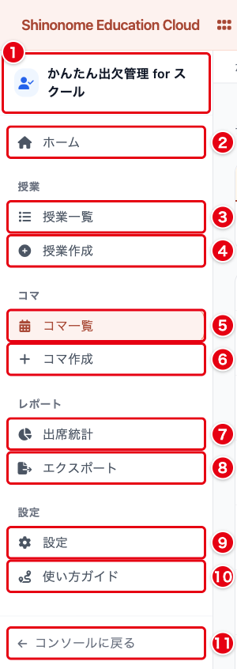

| 番号 | 項目 | 説明 |
| --- | --- | --- |
| ① | サービス名 | 「かんたん出欠管理 for スクール」と表示されていれば、組織モードで動作しています |
| ② | ホーム | 次の授業、今期の授業、授業カレンダーをまとめて表示します |
| ③ | 授業一覧 | 登録済みの授業と、その各回（コマ）を一覧します |
| ④ | 授業作成 | 新しい授業を作成します |
| ⑤ | コマ一覧 | 開いている授業のコマを一覧します。授業を開いているときだけ表示されます |
| ⑥ | コマ作成 | 開いている授業にコマを追加します。授業を開いているときだけ表示されます |
| ⑦ | 出席統計 | 組織全体の出席状況をグラフと表で確認します |
| ⑧ | エクスポート | 出席データを CSV または Excel のファイルでダウンロードします |
| ⑨ | 設定 | 遅刻の判定時間など、出欠管理全体の既定値を変更します |
| ⑩ | 使い方ガイド | 操作の流れを画面に沿って案内します |
| ⑪ | コンソールに戻る | Shinonome Education Cloud のダッシュボードに戻ります |

「コマ」のグループは、特定の授業を開いているあいだだけ表示されます。
ホーム画面や出席統計を開いているときは表示されません。

## ホーム画面

サイドバーの「ホーム」を開くと、直近の授業と今期の授業がまとまって表示されます。

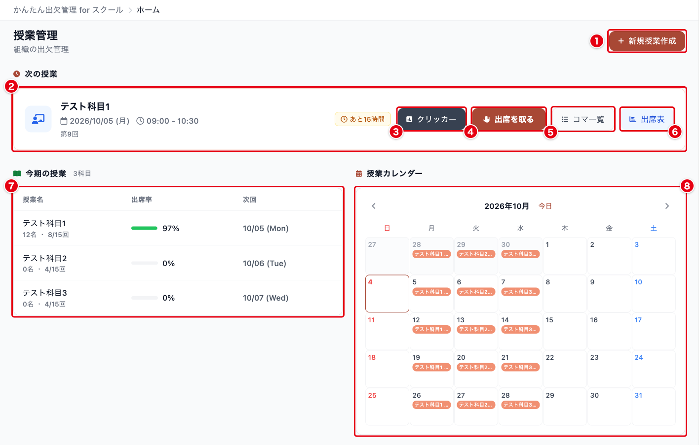

| 番号 | 項目 | 説明 |
| --- | --- | --- |
| ① | 新規授業作成 | 授業作成画面に移動します |
| ② | 次の授業 | 直近の実施予定または実施中のコマを1件表示します。開始までの残り時間と、その場で使う操作ボタンが並びます |
| ③ | クリッカー | その回のリアルタイム投票を開きます。授業でクリッカーを有効にしている場合だけ表示されます |
| ④ | 出席を取る | 掲示用のQRコード画面を開きます。授業中はこのボタンから始めます |
| ⑤ | コマ一覧 | その授業のコマ一覧に移動します |
| ⑥ | 出席表 | その授業の出席表に移動します |
| ⑦ | 今期の授業 | 進行中の授業を、出席率と進捗（実施済みコマ数 ÷ 総コマ数）とともに一覧します |
| ⑧ | 授業カレンダー | その月のコマを日付ごとに表示します |

## 1. 授業を作成する

サイドバーの「授業作成」、またはホームの「新規授業作成」から始めます。

for スクールでは、授業は組織の学校に自動的に登録されます。
学校を選ぶ欄は表示されません。

### 基本情報とスケジュール

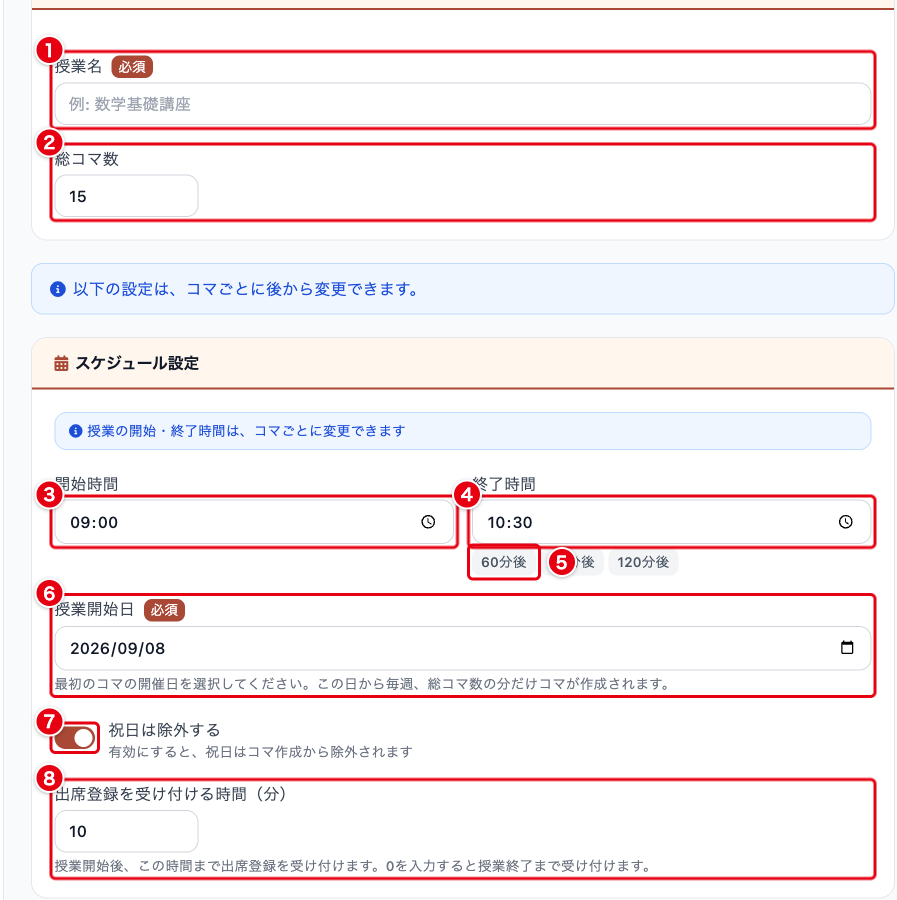

| 番号 | 入力項目 | 必須 | 説明 |
| --- | --- | :---: | --- |
| ① | 授業名 | ✓ | 出欠を取る授業の名前です（例：情報リテラシー演習） |
| ② | 総コマ数 | | 授業を全部で何回行うかを入力します。初期値は15です |
| ③ | 開始時間 | | 各コマの既定の開始時刻です。初期値は 09:00 です |
| ④ | 終了時間 | | 各コマの既定の終了時刻です。初期値は 10:30 です |
| ⑤ | 60分後 / 90分後 / 120分後 | | 開始時間からの経過時間で終了時間を自動入力します |
| ⑥ | 授業開始日 | ✓ | 第1回の開催日です。**今日以降の日付しか選べません** |
| ⑦ | 祝日は除外する | | 有効にすると、祝日にあたる日をコマの自動作成から除きます。初期状態で有効です。コマを自動で作るときだけ使う設定で、授業の編集画面にはありません |
| ⑧ | 出席登録を受け付ける時間（分） | | 授業開始後、何分まで出席として受け付けるかを指定します。初期値は10分です。0を入力すると授業終了まで出席として受け付けます |

授業を保存すると、授業開始日から毎週1回ずつ、総コマ数の分だけコマが自動で作られます。
個別の日程は、あとからコマごとに変更できます。

### 代返防止と制限設定

出席の受け付け方を決めます。
図では説明のためすべての項目を有効にしていますが、必要なものだけを有効にしてかまいません。

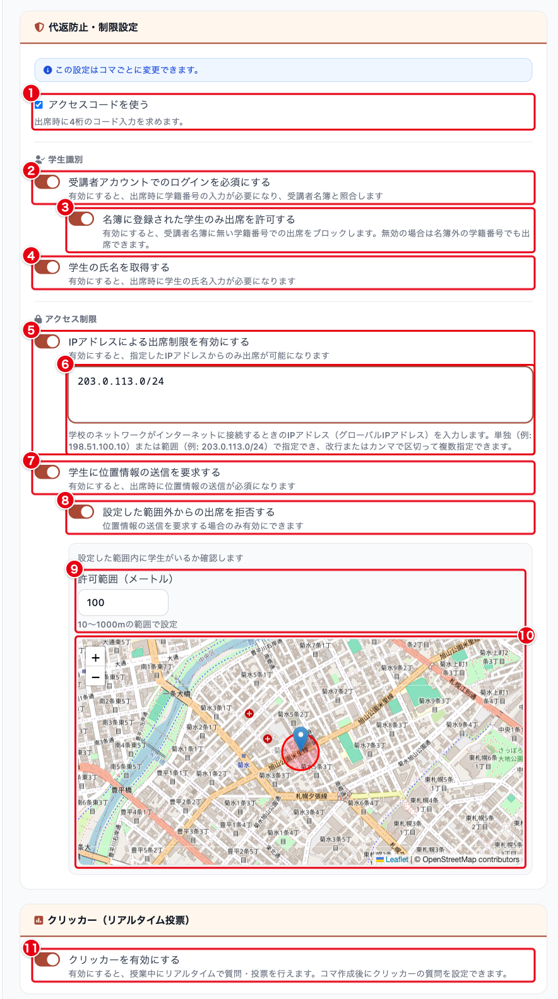

| 番号 | 入力項目 | 説明 |
| --- | --- | --- |
| ① | アクセスコードを使う | 出席時に4桁のコードの入力を求めます。コードはコマごとに自動生成されます。初期状態では無効です |
| ② | 受講者アカウントでのログインを必須にする | 学生が受講者アカウントでログインしてから出席するようになります。組織で受講者アカウント管理を有効にしている場合だけ表示されます |
| ③ | 名簿に登録された学生のみ出席を許可する | ②を有効にすると現れます。受講者名簿にない学籍番号での出席を拒否します。無効の場合、名簿にない学籍番号でも出席できます |
| ④ | 学生の氏名を取得する | 出席記録に氏名を残します。for スクールでは追加のオプション契約なしで利用できます |
| ⑤ | IPアドレスによる出席制限を有効にする | 指定したIPアドレスからの出席だけを許可します。⑥が空のままだと制限はかかりません |
| ⑥ | IPアドレスの入力欄 | ⑤を有効にすると表示されます。学校のネットワークがインターネットに接続するときのIPアドレス（グローバルIPアドレス）を、単独（例：198.51.100.10）または範囲（例：203.0.113.0/24）で入力します。複数あるときは改行またはカンマで区切ります。組織管理画面の「出席管理 組織デフォルト値」でIPアドレスを設定している場合は、その値が最初から入っています |
| ⑦ | 学生に位置情報の送信を要求する | 出席時に位置情報の送信を必須にします |
| ⑧ | 設定した範囲外からの出席を拒否する | ⑦を有効にしたときだけ設定できます。基準地点から離れた場所からの出席を拒否します |
| ⑨ | 許可範囲（メートル） | 基準地点からの許容距離です。10〜1000メートルの範囲で指定します |
| ⑩ | 地図 | 基準地点を指定します。地図をクリックするか、現在地から設定します |
| ⑪ | クリッカーを有効にする | 授業中にリアルタイムで質問と投票を行えるようにします。設問はコマを作成したあとに登録します |

同じ端末から複数人が代理で出席する行為（代返）の検知は常に有効です。
オンとオフを切り替える設定項目はありません。

位置情報による判定の精度は環境に左右されます。
屋外でおよそ10〜50メートル、屋内ではそれ以上の誤差が出るため、許可範囲は100メートル以上を目安に設定してください。

入力が終わったら「授業を作成する」を押します。

> **授業の設定は、コマが1つでもあると変更できません。**
> 作成と同時に総コマ数の分のコマが作られるため、通常の手順で作った授業では出席表の「授業を編集する」がグレーで表示され、押せません。
> アクセス制限などの設定は、授業を作成する前に確定させてください。
> 授業名は、授業一覧の鉛筆アイコンからいつでも変更できます。
> 「受講者アカウントでのログインを必須にする」はコマ編集画面から変更でき、変更すると授業のすべてのコマに反映されます。
> 各コマ個別の設定は、そのコマに出席が1件も登録されていないあいだは変更できます。誰か1人でも出席を登録すると、そのコマの編集画面は読み取り専用になります。

## 2. 授業とコマを一覧する

サイドバーの「授業一覧」を開くと、授業とその各回がまとめて表示されます。

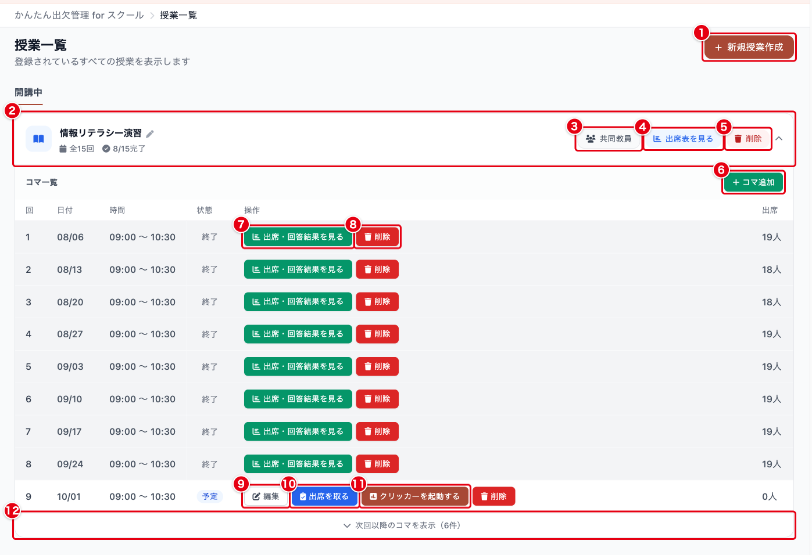

| 番号 | 項目 | 説明 |
| --- | --- | --- |
| ① | 新規授業作成 | 授業作成画面に移動します |
| ② | 授業カード | 授業ごとのまとまりです。授業名の横の鉛筆アイコンを押すと、この場で授業名を変更できます |
| ③ | 共同教員 | この授業を他の教員と共有する画面を開きます。授業を作成した教員にだけ表示されます |
| ④ | 出席表を見る | 授業全体の出席表に移動します |
| ⑤ | 削除（授業） | この授業を、すべてのコマと出席記録とともに削除します。授業を作成した教員にだけ表示されます。手順は「12. 授業やコマを削除する」にあります |
| ⑥ | コマ追加 | 16回目以降など、コマを追加します |
| ⑦ | 出席・回答結果を見る | 終了したコマと実施中のコマの出席結果を開きます |
| ⑧ | 削除（コマ） | そのコマを、出席記録とともに削除します。授業を作成した教員にだけ、すべてのコマの行に表示されます |
| ⑨ | 編集 | これから行うコマの設定を変更します |
| ⑩ | 出席を取る | 掲示用のQRコード画面を開きます |
| ⑪ | クリッカーを起動する | そのコマのリアルタイム投票を開きます |
| ⑫ | 次回以降のコマを表示 | 折りたたまれている今後のコマを展開します |

右端の数字は、そのコマに登録された出席記録の件数です。

コマの状態は「終了」「実施中」「予定」で表示されます。
終了したコマには結果を見るボタンが、次に行う1コマには出席を取るボタンが並びます。
それより先のコマには編集ボタンが並びます。

### コマだけを一覧する

サイドバーの「コマ一覧」を開くと、その授業のコマだけが並びます。
回数が多い授業で、特定の回を探すときに使います。
この画面では、コマの状態を「開始前」「受付中」「終了」で表示します。

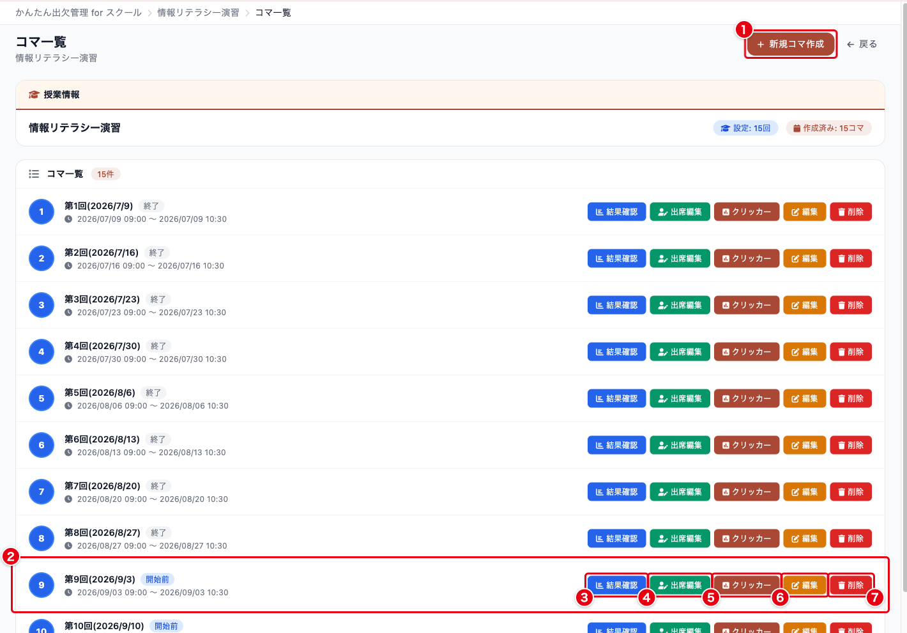

| 番号 | 項目 | 説明 |
| --- | --- | --- |
| ① | 新規コマ作成 | この授業にコマを追加します |
| ② | コマの行 | 回数、日付、時間、状態が並びます |
| ③ | 結果確認 | その回の出席結果を開きます |
| ④ | 出席編集 | その回の出欠を手で修正します |
| ⑤ | クリッカー | その回のリアルタイム投票を開きます |
| ⑥ | 編集 | その回の設定を変更します |
| ⑦ | 削除 | その回を、出席記録とともに削除します。授業を作成した教員にだけ表示されます。手順は「12. 授業やコマを削除する」にあります |

## 3. 受講者名簿を登録する

受講者名簿は、学籍番号から受講者を特定するための一覧です。
出席表に氏名を並べたい場合と、名簿にない受講者の出席を拒否したい場合に登録します。
この一覧は画面上では「履修者一覧」と表示されます。
組織全体の受講者を管理する「受講者名簿」（ダッシュボードでは「受講者アカウント管理」）とは別のものです。

出席表の右上にある「履修者を管理する」から開きます。
このボタンは、授業を作成した教員と、出欠管理の権限を持つ組織管理者に表示されます。
共同教員として招待されただけの教員には表示されません。

登録のしかたは次の3つです。

- グループで登録する：組織の受講者名簿で作ったグループを授業に登録します。グループの学生が増えたり減ったりすると、履修者も合わせて変わります
- CSVで一括登録する：学籍番号を並べたCSVファイルを取り込みます
- 1件ずつ登録する：学籍番号を1件ずつ入力します

履修者一覧の右上には、この3つに対応する「グループで登録」「CSV一括登録」「個別登録」のボタンが並びます。
履修者がまだ1人もいない授業では、一覧の欄にも同じボタンが表示されます。

組織で受講者名簿を使っている場合は、グループで登録する方法をおすすめします。
組織の受講者名簿は、ダッシュボードでは「受講者アカウント管理」と表示されます。
グループの作り方は [受講者名簿](roster/roster-v2.md) をご覧ください。

### グループで登録する

履修者一覧の上にある「受講者名簿のグループ」の欄で、グループを選んで登録します。
画面右上の「グループで登録」を押すと、この欄に移ります。
図は、2つのグループを登録したところです。

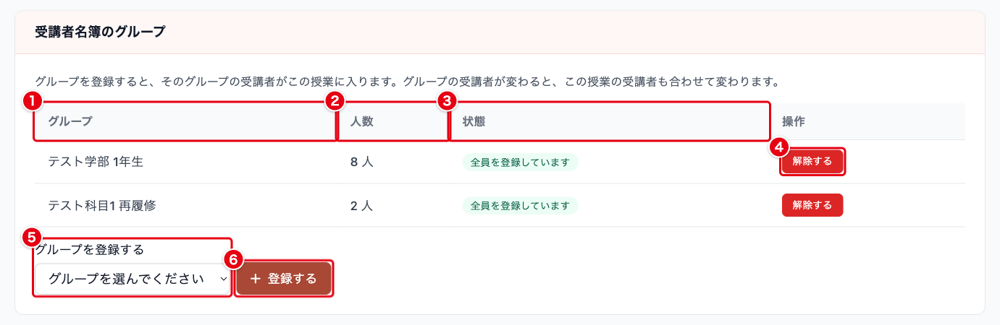

| 番号 | 項目 | 説明 |
| --- | --- | --- |
| ① | グループ | 授業に登録しているグループの名前です |
| ② | 人数 | グループに入っている学生の人数です |
| ③ | 状態 | グループの学生が全員この授業の履修者になっていれば「全員を登録しています」と表示されます。なっていない学生がいるときは「授業に登録できていない学生が◯人います」と表示されます |
| ④ | 解除する | グループの登録を解除します。グループで入った履修者は無効になり、出欠の記録は残ります。登録しているほかのグループにも入っている学生は、有効のままです |
| ⑤ | グループを登録する | 登録するグループを選びます。すでに登録したグループは選択肢に出ません |
| ⑥ | 登録する | 選んだグループを登録します。グループの学生が履修者一覧に入ります |

**選べるグループは、操作する人によって変わります。**
出欠管理の権限を持つ組織管理者は、組織のすべてのグループを選べます。
授業を作成した教員が選べるのは、組織管理者が受講者名簿で「教員が自分の授業に使えるようにする」にしたグループだけです。
グループを1つも登録していない授業で選べるグループが無いときは、「登録できるグループがありません。」と表示されます。

登録すると、「グループ「◯◯」を登録しました。受講者◯人が授業に入りました。」と表示されます。
そのあとグループの学生が増えたり減ったりすると、履修者も合わせて変わります。
グループから外れた学生は、状態が「グループから外れた」になり、出席の照合の対象から外れます。
出欠の記録は残ります。
登録しているほかのグループにも入っている学生は、有効のままです。

グループで入った履修者は、この画面では有効と無効の切り替えも削除もできません。
変えるときは、組織の受講者名簿でグループの学生を変えてください。

CSVや個別登録ですでに登録している学籍番号の学生は、グループを登録してもその行のまま残ります。
登録元も「CSV」や「手動」のまま変わりません。
その行が無効になっている場合は、無効のまま残ります。
履修者一覧で有効に切り替えてください。

組織管理者が登録したグループのうち、教員に公開していないグループを教員が解除すると、教員はそのグループを登録し直せません。
解除する前の確認にも、そのことが表示されます。

組織に属していない授業では、受講者名簿のグループを使えません。
「グループで登録」のボタンは表示されず、この欄には「この授業は組織に属していないため、受講者名簿のグループを使えません。」と表示されます。

### CSVで一括登録する

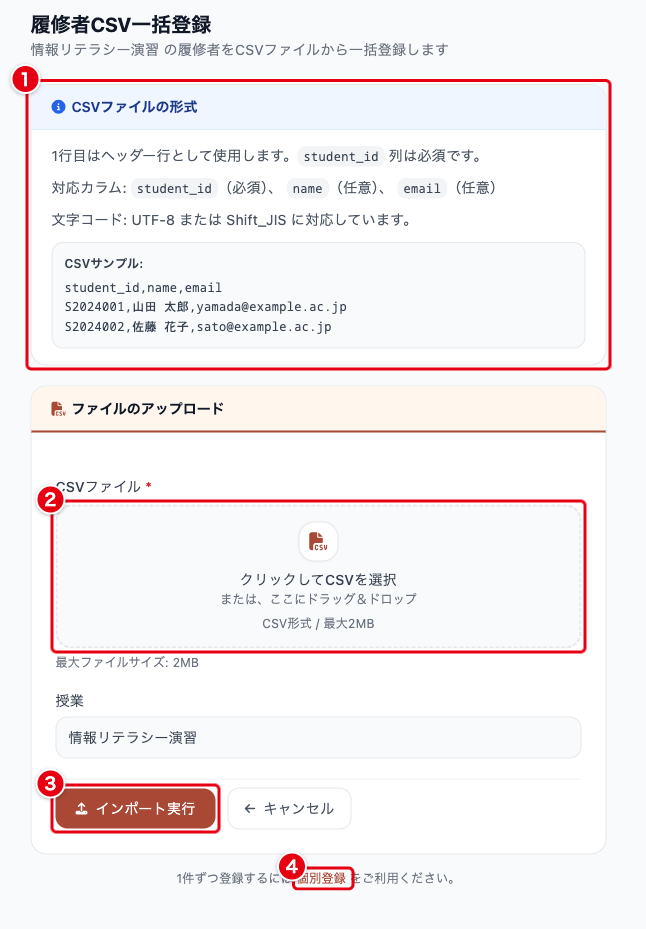

| 番号 | 項目 | 説明 |
| --- | --- | --- |
| ① | CSVファイルの形式 | 受け付けるファイルの仕様です。1行目をヘッダー行として扱い、`student_id` 列が必須です。`name` と `email` は任意です |
| ② | CSVファイル | ここをクリックしてファイルを選ぶか、ファイルをドラッグして置きます。上限は2MBです |
| ③ | インポート実行 | 選んだファイルを取り込みます |
| ④ | 個別登録 | 1件ずつ登録する画面に移動します |

文字コードは UTF-8 と Shift_JIS のどちらでもかまいません。
Excel で「CSV UTF-8」として保存したファイルもそのまま取り込めます。

**すでに登録されている学籍番号は上書きされず、スキップされます。**
氏名やメールアドレスを直したい場合は、その履修者を削除してから登録し直してください。
取り込みが終わると、「CSVインポート完了: ◯件登録、◯件スキップ」と表示されます。

### 1件ずつ登録する

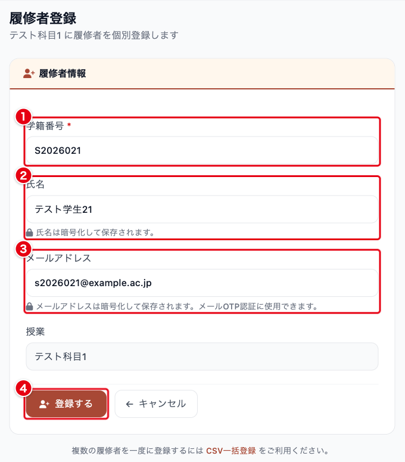

| 番号 | 入力項目 | 必須 | 説明 |
| --- | --- | :---: | --- |
| ① | 学籍番号 | ✓ | 出席時に照合する学籍番号です。あとから変更できません |
| ② | 氏名 | | 出席表と出席結果に表示されます |
| ③ | メールアドレス | | 受講者アカウントのログインIDと突き合わせるときに使います |
| ④ | 登録する | 履修者を1件追加します |

### 登録した履修者を確認する

図は、グループを2つ登録し、ほかにCSVで2人を登録した授業の履修者一覧です。

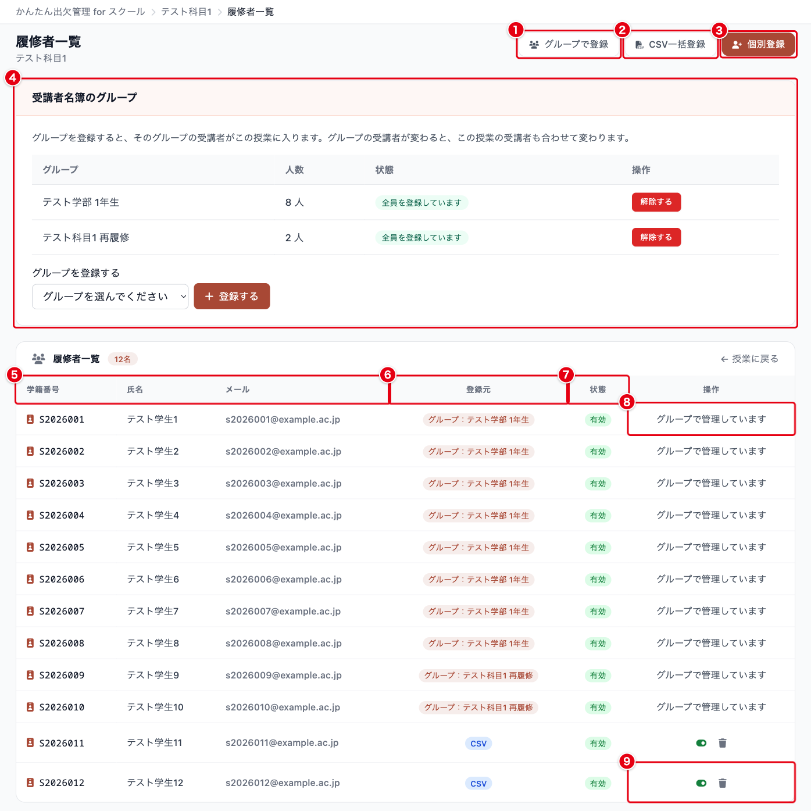

| 番号 | 項目 | 説明 |
| --- | --- | --- |
| ① | グループで登録 | 同じ画面の④「受講者名簿のグループ」の欄に移ります。組織に属していない授業では表示されません |
| ② | CSV一括登録 | CSVから一括で登録する画面に移動します |
| ③ | 個別登録 | 1件ずつ登録する画面に移動します |
| ④ | 受講者名簿のグループ | 授業に登録しているグループと、グループを登録する欄です。使い方は「グループで登録する」にあります |
| ⑤ | 学籍番号、氏名、メール | 履修者の学籍番号、氏名、メールアドレスです |
| ⑥ | 登録元 | その履修者をどこから登録したかを表します（手動 / CSV / LTI / 名簿 / グループ）。グループで登録した履修者には、グループの名前も表示されます |
| ⑦ | 状態 | 「有効」の履修者だけが出席の照合対象になります。グループから外れた履修者には「グループから外れた」と表示されます |
| ⑧ | 操作（グループで登録した履修者） | 「グループで管理しています」と表示され、この画面では変更できません |
| ⑨ | 操作（それ以外の履修者） | 左のボタンで有効と無効を切り替え、右のボタンで削除します |

## 4. コマを調整する

自動で作られたコマは、日程や受け付け方をコマごとに変更できます。
授業一覧またはコマ一覧の「編集」から開きます。

そのコマに出席が1件でも登録されると、編集画面は読み取り専用になり「この出席フォームは既に出席が提出されているため、編集できません」と表示されます。

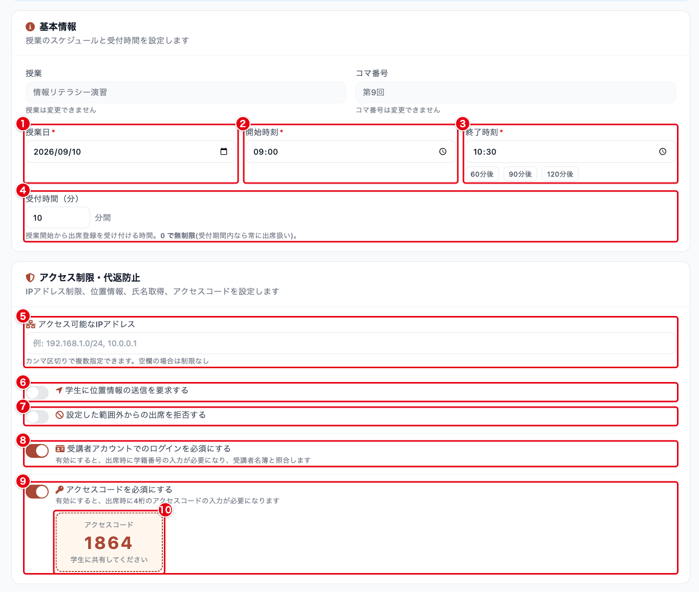

| 番号 | 入力項目 | 説明 |
| --- | --- | --- |
| ① | 授業日 | この回の開催日です |
| ② | 開始時刻 | この回の開始時刻です |
| ③ | 終了時刻 | この回の終了時刻です |
| ④ | 受付時間（分） | 授業開始から何分まで出席として受け付けるかを指定します。0を入力すると、授業終了まで常に出席として扱います |
| ⑤ | IPアドレスによるアクセス制限を有効にする | この回でIPアドレスの制限を使うかどうかを切り替えます。無効にすると、⑥にIPアドレスが入っていても制限はかかりません |
| ⑥ | アクセス可能なIPアドレス | この回で出席を許可するIPアドレスです。最初は授業で設定したIPアドレスが入っています。複数指定するときはカンマで区切ります。空欄にして保存すると、この回は制限しません |
| ⑦ | 学生に位置情報の送信を要求する | この回だけ位置情報を求める場合に有効にします |
| ⑧ | 設定した範囲外からの出席を拒否する | ⑦を有効にしたときだけ設定できます |
| ⑨ | 受講者アカウントでのログインを必須にする | 学生の認証を切り替えます。この項目だけは授業全体の設定のため、変更すると同じ授業のすべてのコマに反映されます |
| ⑩ | アクセスコードを必須にする | この回だけアクセスコードの要否を切り替えます |
| ⑪ | アクセスコード | 自動生成された4桁のコードです。学生に見せる番号がここに表示されます |

アクセスコードは4桁の数字で自動生成されます。
セキュリティ上の理由から、任意の番号を指定することはできません。

### 確認問題とクリッカー

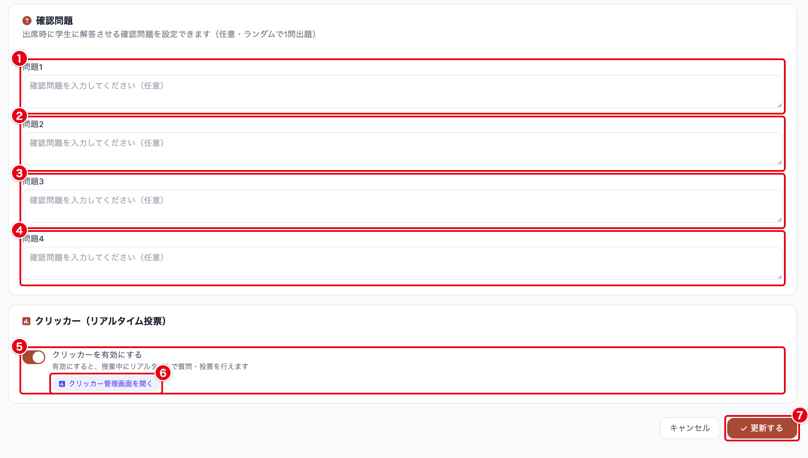

| 番号 | 入力項目 | 説明 |
| --- | --- | --- |
| ①〜④ | 問題1〜問題4 | 出席登録時に学生へ表示する確認問題です。最大4問まで登録できます |
| ⑤ | クリッカーを有効にする | この回でリアルタイム投票を使えるようにします |
| ⑥ | クリッカー管理画面を開く | 設問の作成と結果表示を行う画面に移動します |
| ⑦ | 更新する | 変更を保存します |

操作手順は [かんたんクリッカー](attendance/attendance-clicker.md) をご覧ください。

確認問題を登録すると、**4問のうち1問がランダムに選ばれて学生に表示されます。**
授業に出ていなければ答えられない内容にしておくと、代返の抑止に役立ちます。
確認問題の登録は任意です。

### コマを追加する

授業一覧の「コマ追加」、コマ一覧の「新規コマ作成」、またはサイドバーの「コマ作成」から、コマを1件ずつ追加できます。
コマ作成画面の入力欄には、最初から授業の設定が入っています。
対象は、開始時刻と終了時刻、受付時間、アクセスコード、氏名の取得、位置情報、IPアドレス制限、クリッカーです。
この回だけ変えたい項目は、作成する前にこの画面で変更してください。
授業に受付時間を設定していない場合、受付時間の初期値は設定画面の「デフォルト遅刻判定時間」です。

コマを削除して総コマ数に足りなくなった授業では、コマ一覧に「◯個のコマが不足しています」と表示されます。
「不足分を一括作成」を押すと、足りない回数分のコマを、授業の設定を引き継いでまとめて作成できます。

## 5. 授業当日に出席を取る

ホームまたは授業一覧の「出席を取る」を押すと、「フォーム情報」が開きます。
QRコードの見せ方をここで選びます。

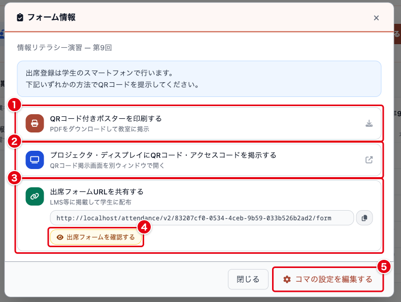

| 番号 | 項目 | 説明 |
| --- | --- | --- |
| ① | QRコード付きポスターを印刷する | QRコードとアクセスコードを載せたPDFをダウンロードします。印刷して教室に掲示します |
| ② | プロジェクタ・ディスプレイにQRコード・アクセスコードを掲示する | 掲示用の画面を別ウィンドウで開きます |
| ③ | 出席フォームURLを共有する | 出席フォームのURLをコピーします。LMSなどに掲載して配る場合に使います |
| ④ | 出席フォームを確認する | 学生に見える画面を教員が確認します。この画面から送信しても出席は記録されません |
| ⑤ | コマの設定を編集する | この回のコマ編集画面に移動します |

②を選ぶと、掲示用の画面が別ウィンドウで開きます。
この画面をプロジェクターやディスプレイに映して、学生に読み取ってもらいます。

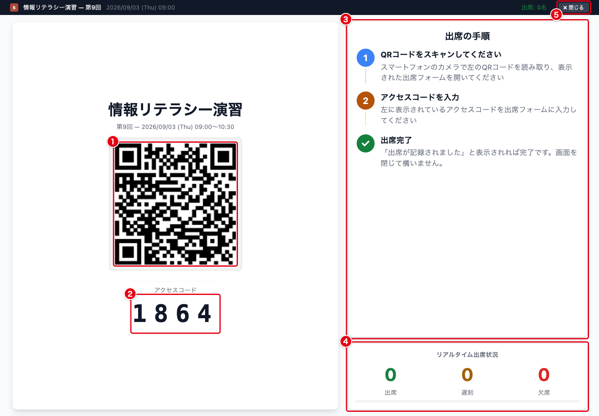

| 番号 | 項目 | 説明 |
| --- | --- | --- |
| ① | QRコード | 学生がスマートフォンのカメラで読み取ります |
| ② | アクセスコード | アクセスコードを有効にしている場合に表示される4桁の数字です |
| ③ | 出席の手順 | 学生向けの案内です。そのまま読み上げても使えます |
| ④ | リアルタイム出席状況 | 出席、遅刻、欠席の人数が登録に応じて更新されます |
| ⑤ | 閉じる | 掲示用画面を閉じて元の画面に戻ります |

紙に印刷して教室に貼り出す場合は、「フォーム情報」の①「QRコード付きポスターを印刷する」からPDFを出力してください。

## 6. 学生が出席を登録する

学生の出席のしかたは、授業作成で「受講者アカウントでのログインを必須にする」を有効にしたかどうかで変わります。
有効にした授業では、QRコードを読み取るとまずログイン画面が表示されます。
無効のままの授業では、ログイン画面は出ず、学生が自分で学籍番号を入力して出席します。

ここでは、受講者アカウントでのログインを必須にした場合の流れを説明します。
QRコードを読み取ると、まずログイン画面が表示されます。

| 番号 | 入力項目 | 説明 |
| --- | --- | --- |
| ① | メールアドレス | 受講者アカウントのログインIDです |
| ② | 次へ | パスキーまたはパスワードによる認証に進みます |

アクセスコードを有効にしている場合は、ログインのあとにコードの入力を求めます。

| 番号 | 入力項目 | 説明 |
| --- | --- | --- |
| ① | アクセスコード | 教室に掲示されている4桁の数字を入力します |
| ② | 送信 | 出席フォームに進みます |

出席フォームには、受講者名簿の氏名とメールアドレスが自動的に表示されます。
**学生が学籍番号を打ち込む欄が無いため、他人の学籍番号で出席することはできません。**
受講者アカウントでのログインを必須にしていない授業では学籍番号が自己申告になるため、他人の学籍番号を入力できます。

| 番号 | 項目 | 説明 |
| --- | --- | --- |
| ① | 学生情報 | 受講者名簿から取得した氏名とメールアドレスです。学生は変更できません |
| ② | 出席を登録する | 出席を記録します。確認問題を設定している場合は、ここで1問が表示されます |

### 出席、遅刻、欠席の判定

判定は、学生がフォームを送信した時刻で決まります。

| 送信した時刻 | 判定 |
| --- | --- |
| 授業開始から受付時間までのあいだ | 出席 |
| 受付時間を過ぎてから授業終了までのあいだ | 遅刻 |
| 授業開始前（フォームが開いてから開始時刻まで） | 出席 |
| 授業終了後、または一度も送信しなかった場合 | 欠席 |

授業開始前に送信した場合は、授業開始時刻に送信したものとして扱い、出席になります。

受付時間に0を指定したコマでは、授業開始から終了までのあいだに送信すればすべて出席になります。

出席フォームを開ける時刻は、設定画面の「デフォルトフォーム事前公開時間」で決まります。
初期値では、授業開始の5分前から開きます。
それより前に開くと「出席登録期間外です」と表示され、授業開始の何分前から開けるかが案内されます。

## 7. 出欠を確認する

### 授業全体の出席表

授業一覧の「出席表を見る」、またはホームの「出席表」から開きます。

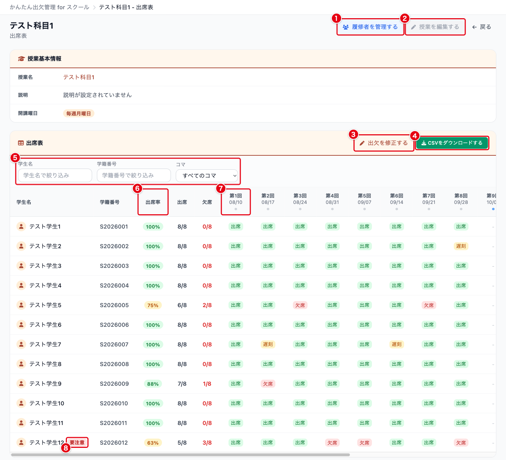

| 番号 | 項目 | 説明 |
| --- | --- | --- |
| ① | 履修者を管理する | 履修者一覧の画面に移動します。授業を作成した教員と、出欠管理の権限を持つ組織管理者に表示されます |
| ② | 授業を編集する | コマが1つでもあるとグレーで表示され、押せません |
| ③ | 出欠を修正する | 各学生の出欠を手で修正する画面に移動します |
| ④ | CSVをダウンロードする | この授業の出席データをCSVで書き出します |
| ⑤ | 絞り込み | 学生名、学籍番号、コマで表示を絞ります |
| ⑥ | 出席率 | 実施済みのコマに対する割合です。遅刻と早退も出席として数えます。右隣に出席とみなした回数と欠席回数が並びます |
| ⑦ | 各回の判定 | 回ごとに「出席」「遅刻」「欠席」を表示します。未実施の回は「-」です。代返の疑いがある記録には「要確認」が付きます |
| ⑧ | 要注意 | 欠席が設定したしきい値に達した学生に付きます。しきい値は設定画面で変更します |

氏名を含むCSVをダウンロードするときは、ワンタイムコードによる追加認証を求められます。
ログインしているメールアドレス宛に10桁のコードが届くので、それを入力してください。

### 回ごとの出席結果

コマ一覧または授業一覧の「出席・回答結果を見る」から開きます。

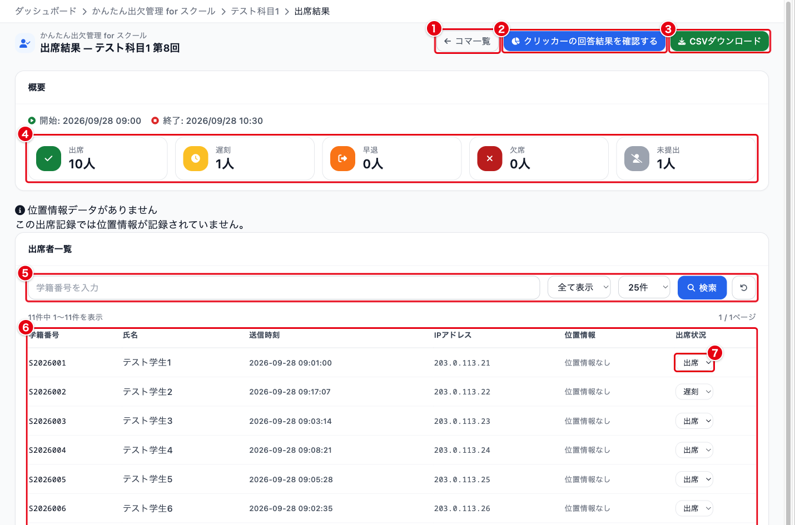

| 番号 | 項目 | 説明 |
| --- | --- | --- |
| ① | コマ一覧 | コマの一覧に戻ります |
| ② | クリッカーの回答結果を確認する | その回のリアルタイム投票の結果を開きます |
| ③ | CSVダウンロード | この回の出席データを書き出します |
| ④ | 概要 | 出席、遅刻、早退、欠席、未提出の人数です |
| ⑤ | 絞り込み | 学籍番号での検索、判定での絞り込み、表示件数の変更を行います |
| ⑥ | 出席者一覧 | 学籍番号、氏名、送信時刻、IPアドレス、位置情報、出席状況を並べます |
| ⑦ | 出席状況 | この場で判定を変更できます。遅刻を出席に直すといった修正に使います |

位置情報を求めるように設定した回では、学生が送信した位置が地図に表示されます。

### 組織全体の出席統計

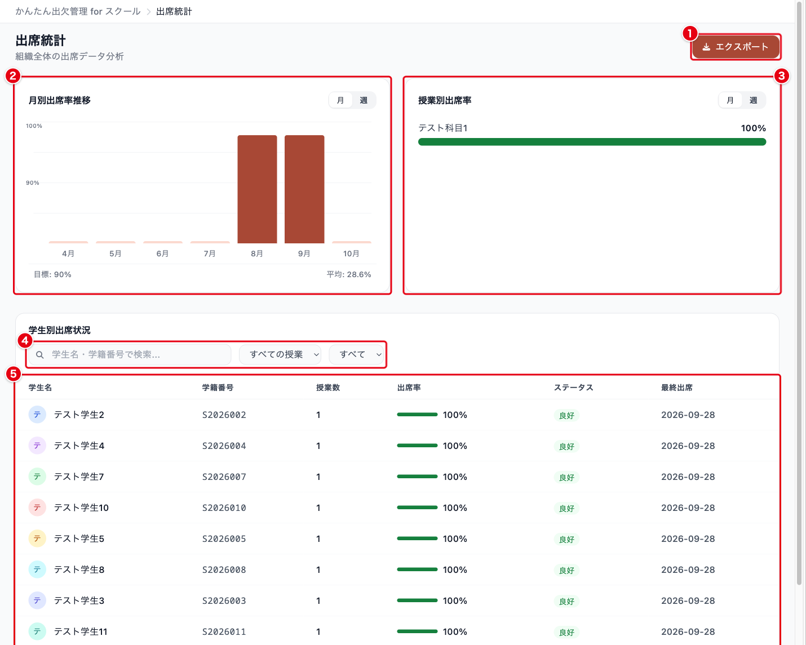

| 番号 | 項目 | 説明 |
| --- | --- | --- |
| ① | エクスポート | 学生別集計のファイルを書き出します。押すと、ファイル形式を選ぶ画面が開きます |
| ② | 月別出席率推移 | 直近7か月の推移です。「月」と「週」で表示を切り替えます |
| ③ | 授業別出席率 | 授業ごとの出席率を高い順に並べます |
| ④ | 絞り込み | 学生名や学籍番号での検索、授業と出席状況での絞り込みを行います |
| ⑤ | 学生別出席状況 | 学生ごとの出席率、ステータス、最終出席日を並べます |

統計画面の出席率は、**提出された出席記録のうち、出席、遅刻、早退が占める割合**です。
フォームを一度も提出しなかった学生は分母に入りません。
個々の学生が何回欠席したかは、出席表で確認してください。

①の「エクスポート」を押すと、ファイル形式（CSV (UTF-8)、CSV (Shift_JIS)、Excel (.xlsx)）を選ぶ画面が開きます。
「ダウンロード」を押すと、すべての授業の出席を学生ごとにまとめたファイル（学籍番号、氏名、出席回数、遅刻回数、欠席回数、早退回数、出席率など）を書き出します。
氏名を含むため、ワンタイムコードの入力を求められます。
授業や期間を絞って書き出すときは、「8. 出欠を書き出す」の画面を使ってください。

## 8. 出欠を書き出す

サイドバーの「エクスポート」から、条件を指定して書き出します。

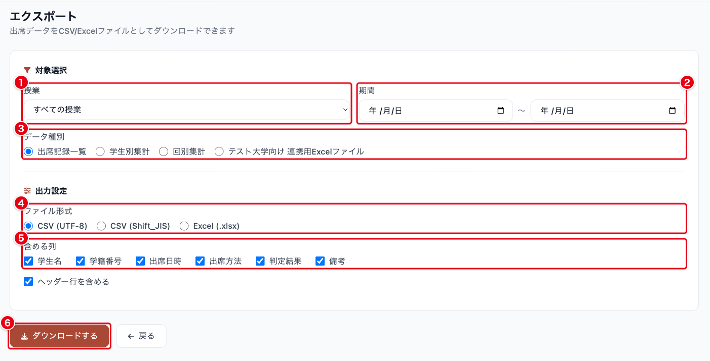

| 番号 | 入力項目 | 説明 |
| --- | --- | --- |
| ① | 授業 | 対象の授業を選びます。「すべての授業」も選べます |
| ② | 期間 | 開始日と終了日で対象を絞ります |
| ③ | データ種別 | 出席記録一覧、学生別集計、回別集計から選びます。組織に連携用の Excel ファイルが登録されていると、出欠管理の権限を持つ組織管理者の画面には、その名前の選択肢も並びます（図では「テスト大学向け 連携用Excelファイル」）。使い方は「9. 他のシステムとの連携に使う Excel ファイルを書き出す」にあります |
| ④ | ファイル形式 | CSV (UTF-8)、CSV (Shift_JIS)、Excel (.xlsx) から選びます |
| ⑤ | 含める列 | 学生名、学籍番号、出席日時、出席方法、判定結果、備考の要否と、ヘッダー行の要否を指定します |
| ⑥ | ダウンロードする | 指定した条件でファイルを生成します |

Excel でそのまま開く場合は CSV (Shift_JIS) か Excel (.xlsx) を、他のシステムに取り込む場合は CSV (UTF-8) を選んでください。

学生名を含めて書き出すときは、ワンタイムコードによる追加認証を求められます。
ログインしているメールアドレス宛に10桁のコードが届くので、それを入力してください。

## 9. 他のシステムとの連携に使う Excel ファイルを書き出す

教務システムなど、他のシステムとの連携に使う Excel ファイル（.xls）で出欠を書き出せます。
ファイルは授業ごとに作られ、学生ごとの各回の出欠と回数が決まった形で並びます。
書き出すのは「エクスポート」の画面で、データ種別に並ぶ連携用の Excel ファイルの選択肢を選びます。

この選択肢が表示されるのは、出欠管理の権限を持つ組織管理者の画面だけです。
連携用の Excel ファイルは、システム管理者（Shinonome Education Cloud の運営者）が組織ごとに登録します。
登録されていない組織では、選択肢は並びません。

ファイルの上部にある「年度・曜日・時限」「時間割所属」「時間割」の欄には、時間割一覧の値がそのまま入ります。
そのため、書き出す前に時間割一覧を取り込んでおきます。
作業の順序は次のとおりです。

1. 組織管理の「授業管理」で、時間割一覧を取り込む
2. 必要に応じて、授業ごとの「出力用の情報」で担当教員の値を確かめる
3. かんたん出欠管理の「エクスポート」で書き出す

### 時間割一覧を取り込む

時間割一覧のファイル（Excel または CSV）を取り込むと、授業コードが一致する授業に、時間割一覧の値が「出力用の情報」として保存されます。
取り込みは組織管理の画面で行います。
画面右上の名前のアイコンを押して「組織管理者向け設定」を選び、左のメニューの「授業管理」を開きます。

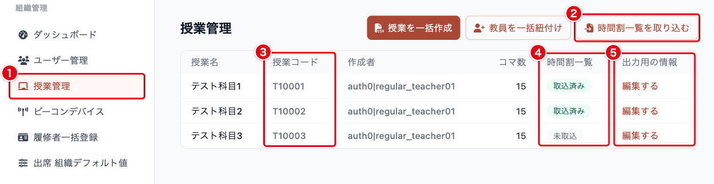

| 番号 | 項目 | 説明 |
| --- | --- | --- |
| ① | 授業管理 | 組織の授業の一覧を開きます |
| ② | 時間割一覧を取り込む | 時間割一覧の取込の画面に移動します |
| ③ | 授業コード | 時間割一覧の行と授業を結び付けるコードです。授業コードが無い授業には「—」と表示されます |
| ④ | 時間割一覧 | 時間割一覧の値がそろっている授業には「取込済み」、そろっていない授業には「未取込」と表示されます |
| ⑤ | 出力用の情報 | 「編集する」で、その授業の出力用の情報の画面を開きます。使い方は「授業ごとの出力用の情報を確かめる、直す」にあります |

時間割一覧の行と授業は、「時間割」の値の最初の「：」より前の部分（時間割コード）と、授業コードが一致するかで結び付けます。
たとえば「T10001：テスト科目1」の行は、授業コードが「T10001」の授業に取り込まれます。
大文字と小文字、全角と半角が違うコードは一致しません。
授業コードは、授業の「出力用の情報」の画面か、授業管理の「授業を一括作成」で使う CSV の「授業コード」の列で付けます。

「時間割一覧を取り込む」を押すと、次の画面が開きます。
図は、ファイルを取り込んだ直後の画面です。

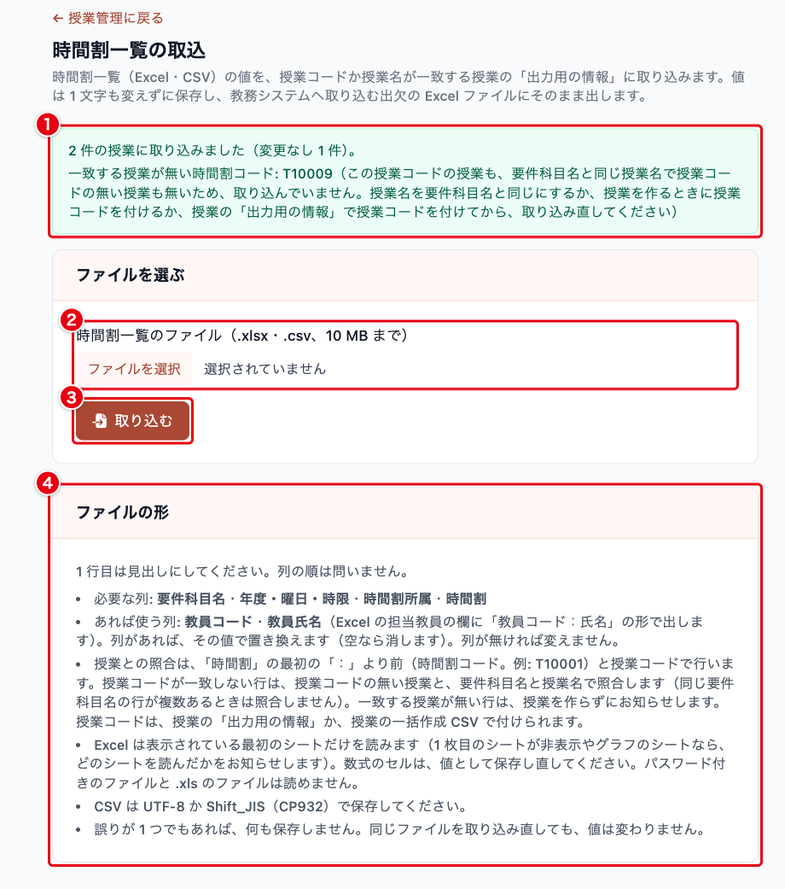

| 番号 | 項目 | 説明 |
| --- | --- | --- |
| ① | 取り込みの結果 | 値を取り込んだ授業の数と、そのうち値が前と変わらなかった授業の数です。一致する授業が無かった時間割コードがあると、そのコードと直し方が続けて表示されます |
| ② | 時間割一覧のファイル | 取り込むファイルを選びます。Excel（.xlsx）か CSV のファイルで、10MBまでです |
| ③ | 取り込む | 選んだファイルを取り込みます |
| ④ | ファイルの形 | 取り込めるファイルの決まりです |

ファイルは1行目を見出しにします。
列の順は問いません。

- 必ず入れる列：「要件科目名」「年度・曜日・時限」「時間割所属」「時間割」
- あれば使う列：「教員コード」「教員氏名」

教員コードと教員氏名は、Excel の担当教員の欄に「教員コード：氏名」の形で出ます。
これらの列があるファイルでは、その値で置き換え、値が空ならその授業の値を消します。
列が無いファイルでは、今の値を変えません。

Excel のファイルは、表示されている最初のシートだけを読みます。
数式のセルは、値として保存し直してください。
パスワードを付けたファイルと .xls のファイルは読めません。
CSV のファイルは、UTF-8 か Shift_JIS で保存してください。
1つのファイルに入れられるのは、見出しを除いて5,000行、50列までです。

**誤りが1つでもあると、何も保存されません。**
「取り込めませんでした。何も保存していません。」に続けて、誤りが行番号つきで並びます。
表示されるのは先頭の200件までです。
ファイルを直してから、もう一度取り込んでください。

値は1文字も変えずに保存され、Excel にもそのまま出ます。
同じファイルを取り込み直しても、値は変わりません。
ファイルに無い授業の値は、そのまま残ります。

一致する授業が無い時間割コードがあっても、授業は作られません。
そのコードは①に「一致する授業が無い時間割コード」として表示されるので、授業コードを付けてから取り込み直してください。
削除した授業が使っていた授業コードや、表記だけが違う授業コードのときも、その理由が表示されます。

### 授業ごとの出力用の情報を確かめる、直す

出力用の情報は、授業ごとに Excel へ出す値です。
授業管理の一覧で、授業の「出力用の情報」の「編集する」を押すと開きます。
図は、時間割一覧を取り込んだ授業の画面です。

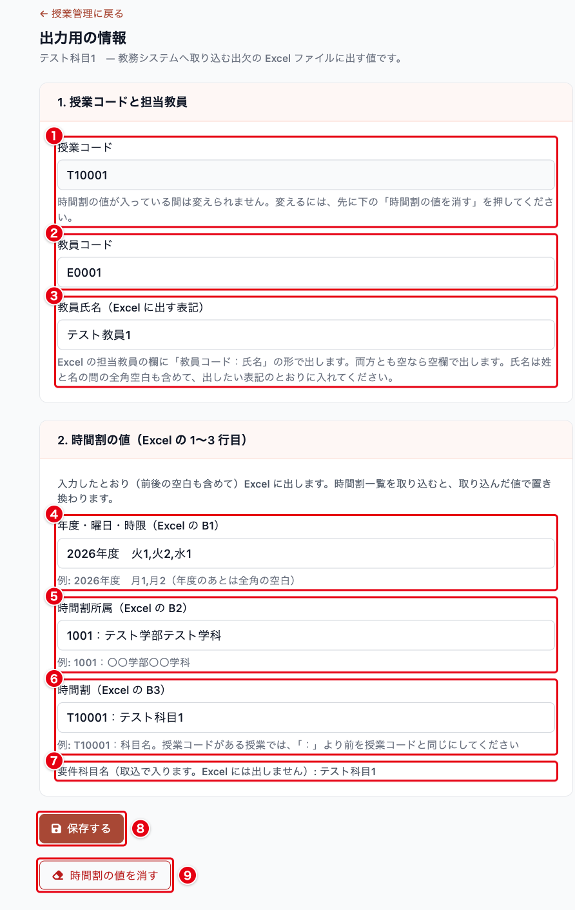

| 番号 | 入力項目 | 説明 |
| --- | --- | --- |
| ① | 授業コード | 時間割一覧の行と授業を結び付けるコードです。時間割一覧の値が入っているあいだは変えられません |
| ② | 教員コード | Excel の担当教員の欄に出すコードです |
| ③ | 教員氏名（Excel に出す表記） | Excel の担当教員の欄に出す氏名です。姓と名のあいだの空白も含めて、出したい表記のとおりに入力します |
| ④ | 保存する | ①〜③の変更を保存します |
| ⑤ | 時間割一覧の値 | 取り込んだ「年度・曜日・時限」「時間割所属」「時間割」「要件科目名」の値です。この画面では変えられません |
| ⑥ | 時間割の値を消す | ⑤の値を消します。押すと確認が表示されます。担当教員の値は消えません |

担当教員の欄は、②と③が両方とも空なら空欄で出ます。

授業コードを変えるときは、先に⑥で時間割一覧の値を消します。
消すと①に入力できるようになるので、授業コードを直して保存し、時間割一覧を取り込み直してください。
授業コードは64文字までで、空白と「：」は使えません。
組織のほかの授業と同じ授業コードは付けられません。
削除した授業が使っていた授業コードも使えません。

### 連携用の Excel ファイルを書き出す

サイドバーの「エクスポート」を開き、データ種別で連携用の Excel ファイルの選択肢を選びます。
選ぶと「ファイル形式」と「含める列」の欄が消え、期間の下に「その時までに行った全ての回をダウンロードする」が表示されます。
図は、連携用の Excel ファイルを選んだところです。

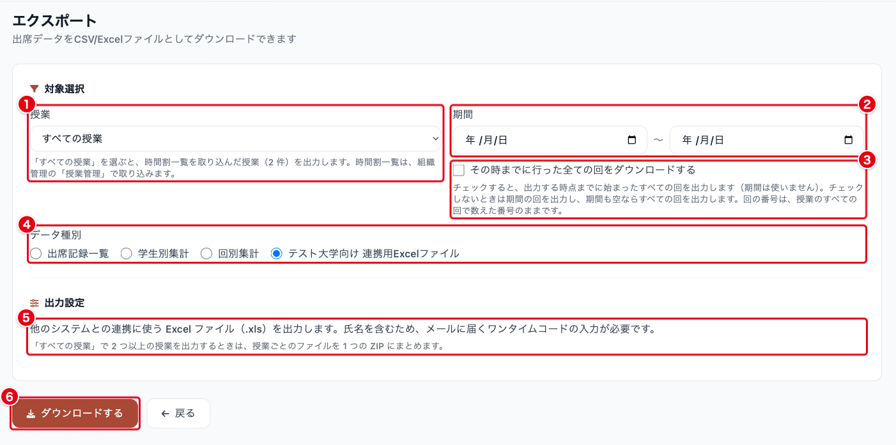

| 番号 | 入力項目 | 説明 |
| --- | --- | --- |
| ① | 授業 | 「すべての授業」を選ぶと、時間割一覧を取り込んだ授業をすべて書き出します。その件数が欄の下に表示されます。授業を1つ選ぶこともできます |
| ② | 期間 | 開始日から終了日までに始まる回を書き出します。片方だけ入れてもかまいません。どちらも空なら、すべての回を書き出します |
| ③ | その時までに行った全ての回をダウンロードする | チェックすると、書き出す時点までに始まったすべての回を書き出します。②の期間は使いません |
| ④ | データ種別 | 連携用の Excel ファイルの選択肢を選びます。名前は組織ごとに登録されたものです |
| ⑤ | 出力設定 | 書き出すファイルの種類（.xls）と、ワンタイムコードの入力が必要なことが表示されます。ファイル形式と含める列は選べません |
| ⑥ | ダウンロードする | ワンタイムコードの入力に進みます |

データ種別で連携用の Excel ファイルを選んだときだけ、「すべての授業」は時間割一覧を取り込んだ授業を指します。
時間割一覧を取り込んでいない授業は、授業を1つ選んでも書き出せません。
担当教員の値（教員コードと教員氏名）が無い授業は、担当教員の欄を空欄にして書き出します。
期間で絞っても、回の番号は授業のすべての回で数えた番号のままです。

ファイルは授業ごとに1つ作られます。
「すべての授業」で2つ以上の授業を書き出すときは、1つの ZIP ファイルにまとめてダウンロードされます。

「ダウンロードする」を押すと、ワンタイムコードを入力する画面が開きます。
ログインしているメールアドレス宛に10桁のコードが届くので、入力して「ダウンロード」を押してください。
コードを使えるのは1回だけで、有効期限は発行から24時間です。

書き出しに必要な値が欠けている授業や学生があると、ファイルは1つも作られず、「エクスポート」の画面に戻ります。
画面の右上に「出力に必要な値が足りないため、出力できませんでした。」に続けて、欠けている授業や学生と直し方が表示されます。
たとえば時間割一覧を取り込んでいない授業を選ぶと、「時間割一覧が取り込まれていない科目」として授業の名前が表示されます。
選んだデータ種別、授業、期間はそのまま残るので、表示に沿って直してから、もう一度書き出してください。

受講者も出欠の記録も無い授業のファイルは作られません。
選んだ授業のどれもそうだったときは、「出力対象の授業がありません。」で始まるお知らせが表示されます。

## 10. 既定値を変更する

サイドバーの「設定」で、出欠管理全体の既定値を変更します。

for スクールでは、この設定は組織で共通です。
変更できるのは「出欠管理」の権限を持つ組織管理者だけで、ほかの教員には読み取り専用で表示されます。

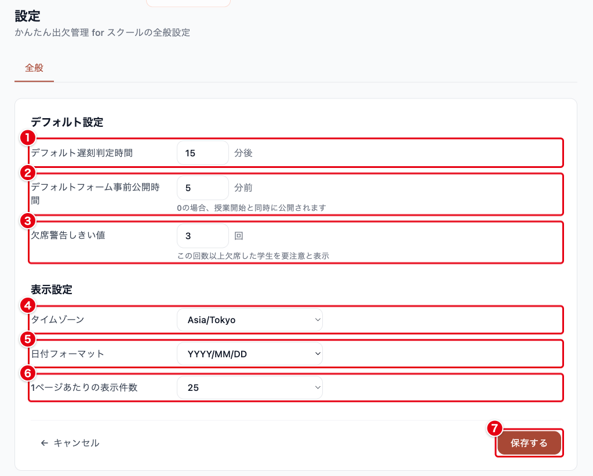

| 番号 | 入力項目 | 初期値 | 説明 |
| --- | --- | --- | --- |
| ① | デフォルト遅刻判定時間 | 15分後 | 授業に受付時間を設定していないとき、コマ作成画面の「受付時間（分）」に入る初期値です。1〜120分の範囲で指定します |
| ② | デフォルトフォーム事前公開時間 | 5分前 | 出席フォームを授業開始の何分前から開くかです。0〜60分の範囲で指定し、0にすると授業開始時刻から開きます |
| ③ | 欠席警告しきい値 | 3回 | 出席表で「要注意」を付ける欠席回数です。1〜30回の範囲で指定します |
| ④ | タイムゾーン | Asia/Tokyo | 日時の表示に使うタイムゾーンです |
| ⑤ | 日付フォーマット | YYYY/MM/DD | 日付の表示形式です |
| ⑥ | 1ページあたりの表示件数 | 25 | 回ごとの出席結果の画面で、1ページに表示する件数です |
| ⑦ | 保存する | | 変更を保存します |

## 11. 授業を複数の教員で担当する

授業一覧の「共同教員」から、ひとつの授業を他の教員と共有します。

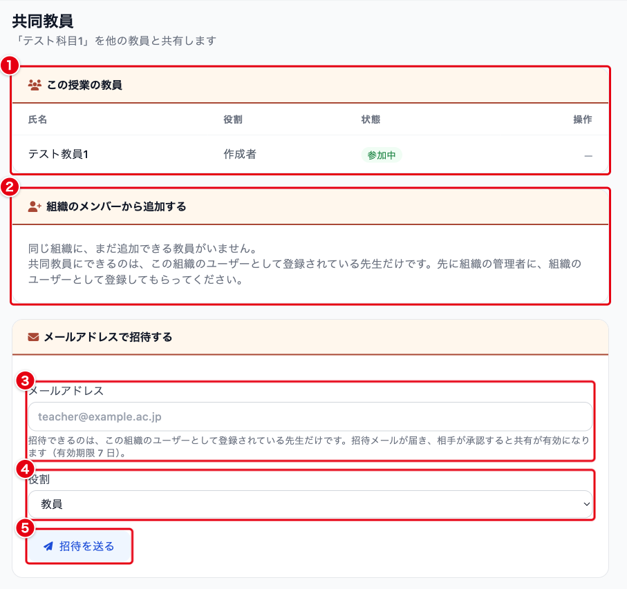

| 番号 | 項目 | 説明 |
| --- | --- | --- |
| ① | この授業の教員 | 現在この授業を担当している教員の一覧です。作成者は削除できません |
| ② | 組織のメンバーから追加する | 同じ組織に所属していて、まだ追加していない教員から選びます |
| ③ | メールアドレス | 招待する相手のメールアドレスです |
| ④ | 役割 | 招待する相手の役割を選びます |
| ⑤ | 招待を送る | 招待メールを送ります |

招待された教員がメールのリンクから承認すると、共有が有効になります。
招待の有効期限は7日間です。

共同教員にできるのは、組織のユーザーとして登録されている教員だけです。
登録されていない相手は、組織のメンバーの一覧に表示されず、メールアドレスで招待することもできません。
先に組織の管理者に、組織のユーザーとして登録してもらってください。

共同教員は授業の出席表とコマを扱えますが、**履修者一覧の画面には入れません。**
名簿の登録と修正は、授業の作成者または出欠管理の権限を持つ組織管理者が行ってください。
授業とコマの削除も、授業を作成した教員だけが行えます。

## 12. 授業やコマを削除する

授業やコマを削除できるのは、その授業を作成した教員だけです。
授業を作成していない共同教員と組織管理者には「削除」ボタンが表示されません。

授業を削除するときは、授業一覧の授業カードにある「削除」を押します。
次の確認画面が開きます。

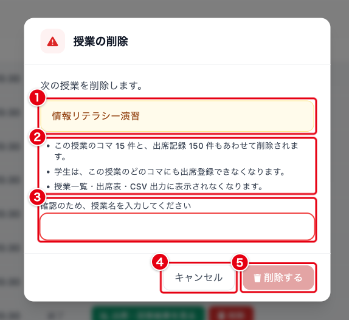

| 番号 | 項目 | 説明 |
| --- | --- | --- |
| ① | 削除する授業 | 削除する授業の名前です |
| ② | 一緒に削除されるもの | 一緒に削除されるコマと出席記録の件数と、削除したあとに起きることが並びます |
| ③ | 授業名の入力欄 | 確認のため、①と同じ授業名を入力します。一致するまで⑤は押せません |
| ④ | キャンセル | 削除せずに確認画面を閉じます |
| ⑤ | 削除する | 授業を削除します |

授業を削除すると、その授業のコマと出席記録、確認問題も一緒に削除されます。
授業一覧、出席表、エクスポートの画面には表示されなくなり、学生はその授業のどのコマにも出席を登録できなくなります。

コマを削除するときは、授業一覧またはコマ一覧のコマの行にある「削除」を押します。
確認画面で、一緒に削除される出席記録の件数を確かめてから「削除する」を押します。
コマの削除では、授業名の入力はいりません。
削除すると、残りのコマの番号は開始日時の順に振り直されます。

削除した授業とコマは、画面から元に戻すことができません。
必要なデータは、削除する前にCSVで書き出しておいてください。

## よくある質問

### Q. for スクールと for パーソナルはどう違いますか

for スクールは組織でご契約いただいた場合の動作で、受講者名簿、受講者アカウントによる認証、共同教員、組織全体の統計が使えます。
氏名の記録に追加のオプション契約は要りません。
for パーソナルは個人でご契約いただいた場合の動作で、学生は学籍番号を自分で入力して出席します。
どちらで動くかはご契約と所属組織で決まります。
個人アカウントもお持ちの場合にかぎり、画面右上の「利用モード」から切り替えられます。

### Q. 授業を作ると、各回のコマはどうやって作られますか

授業開始日から毎週1回ずつ、総コマ数の分だけ自動で作られます。
「祝日は除外する」を有効にしていると、祝日にあたる日は作成の対象から外れます。
できあがったコマの日程は、コマごとに個別に変更できます。

### Q. 授業の設定を変更できません

コマが1つでも存在する授業は、設定を変更できません。
出席表の「授業を編集する」もグレーで表示されます。
授業名だけは、授業一覧の授業名の横にある鉛筆アイコンから変更できます。
アクセス制限や学生識別の設定を変えたい場合は、コマごとの編集画面から個別に変更してください。

### Q. 代返は防げますか

同じ端末から複数人が代理で出席する行為は、端末の特徴を照合して自動的に検知します。
検知しても出席の登録は止まりません。
疑いのある記録には出席表と出席結果に「要確認」が付くので、担当の教員が確認してください。
あわせて、受講者アカウントによるログイン、アクセスコード、確認問題、IPアドレス制限、位置情報制限を組み合わせると精度が上がります。
それぞれの設定は「1. 授業を作成する」の代返防止と制限設定にあります。

### Q. 受講者名簿に登録していない学生が出席するとどうなりますか

「名簿に登録された学生のみ出席を許可する」を有効にしている場合は、出席が拒否されます。
無効にしている場合は、名簿にない学籍番号でも出席として記録されます。

### Q. グループで登録した学生を1人だけ外したい

授業の画面では外せません。
組織の受講者名簿で、その学生をグループから外してください。
手動のグループや、自動で反映しないグループなら、グループの詳細の画面の「外す」で外せます。
自動で反映するグループは条件で学生が決まるため、手では外せません。
条件を変えるか、その学生を含まないグループを作って登録し直してください。
受講者名簿を操作できるのは、「受講者アカウント管理」の権限を持つ組織管理者です。
手順は [受講者名簿](roster/roster-v2.md) にあります。

### Q. 「授業に登録できていない学生が◯人います」と表示されます

グループに入っているのに、この授業の有効な履修者になっていない学生の人数です。
表示には、考えられる理由として「学籍番号が無い・他の行と重なっている・同期を待っているなど」が添えられます。
組織の受講者名簿で、その学生の学籍番号が登録されているかを確かめてください。
CSVや個別登録で登録した同じ学籍番号の行が無効になっている場合も、この人数に数えられます。
その場合は、履修者一覧でその行を有効に切り替えてください。
グループを変更した直後は、授業への反映を待っていることがあります。
しばらくしてから画面を開き直してください。

### Q. アクセスコードは変更できますか

任意の番号を指定することはできません。
コマごとに自動生成された4桁の数字を、コマ編集画面で確認してください。

### Q. IPアドレス制限はどのように設定しますか

学校のネットワークがインターネットに接続するときのIPアドレス（グローバルIPアドレス）を指定します。
学内LANで使う 192.168. や 10. で始まるアドレスを登録しても一致しません。

- 単一のIPアドレス：`198.51.100.10`
- 範囲：`203.0.113.0/24`（203.0.113.0 から 203.0.113.255 まで）

複数指定する場合は、授業作成画面では改行またはカンマで、コマ編集画面ではカンマで区切ってください。
学校のグローバルIPアドレスは、学内のネットワーク管理者にお問い合わせください。

「受講者アカウントでのログインを必須にする」を有効にした授業では、学生の出席フォームがIPv6でも通信します。
学校のネットワークがIPv6にも対応している場合は、IPv6のアドレス（範囲）もあわせて登録してください。
IPv4のアドレスだけを登録すると、学内Wi-Fiに接続していても出席を登録できないことがあります。

### Q. 位置情報の制限はどのくらい正確ですか

屋外でおよそ10〜50メートル、屋内ではそれ以上の誤差が出ます。
許可範囲の目安は「1. 授業を作成する」の代返防止と制限設定に書いています。

### Q. 学生が出席を登録できないと言っています

次の順に確認してください。

1. 出席フォームは、設定画面の「デフォルトフォーム事前公開時間」（初期値は5分）だけ授業開始より前から開きます。それより前は開けません
2. アクセスコードを有効にしている場合、教室に掲示している4桁の数字と一致しているか
3. IPアドレス制限を有効にしている場合、学生が学内Wi-Fiに接続しているか。
   モバイルデータ通信やVPNを使っていると、許可したIPアドレスになりません。
   受講者アカウントでのログインを必須にした授業では、学校のIPv6のアドレスを登録しているかも確かめてください
4. 「名簿に登録された学生のみ出席を許可する」を有効にしている場合、その学籍番号が受講者名簿にあるか
5. 位置情報を求めている場合、ブラウザの位置情報の許可が有効になっているか

### Q. 連携用の Excel ファイルを書き出すと「時間割一覧が取り込まれていない科目」と表示されます

その授業に、時間割一覧の値が入っていません。
組織管理の「授業管理」で、その授業の「時間割一覧」が「未取込」になっていないかを確かめてください。
未取込なら、授業コードが時間割一覧の時間割コードと一致しているかを確かめてから、時間割一覧を取り込み直してください。
手順は「9. 他のシステムとの連携に使う Excel ファイルを書き出す」の「時間割一覧を取り込む」に書いています。

### Q. 授業を削除するとどうなりますか

その授業のすべてのコマと出席記録が一緒に削除され、授業一覧、出席表、エクスポートの画面に表示されなくなります。
削除できるのは授業を作成した教員だけで、確認画面で授業名を入力する必要があります。
手順と注意は「12. 授業やコマを削除する」に書いています。
