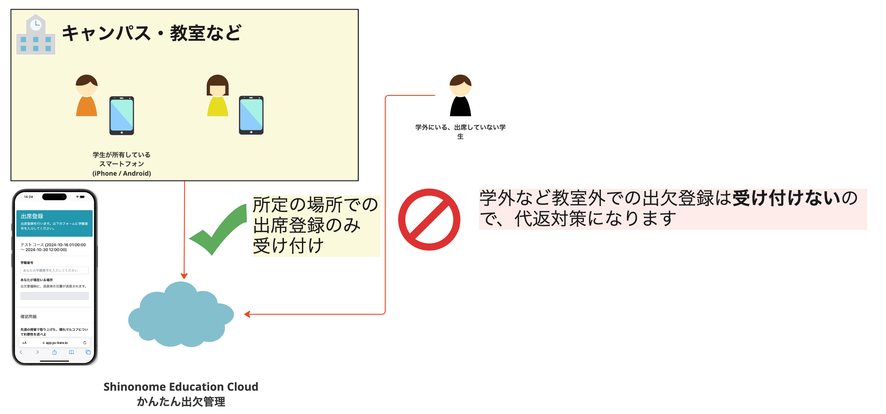
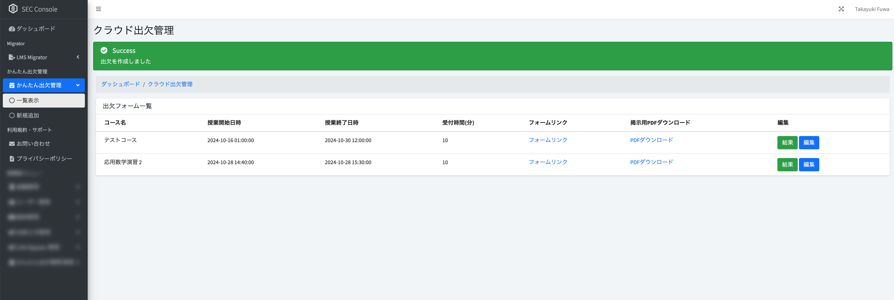
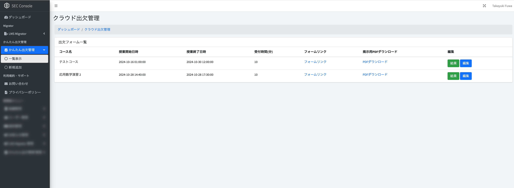
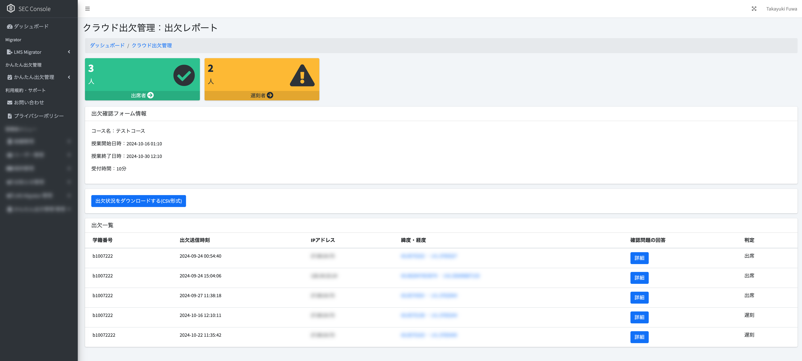

# かんたん出欠管理

## 概要

「かんたん出欠管理」は、授業における出欠を簡単に管理するためのサービスです。
本サービスは、最小限の設定および情報で、授業の出欠をとることが出来るサービスです。

## 使い方

### 授業の登録

まず、出欠を取りたい授業を登録します。
ユーザーコンソール画面の左メニューの「かんたん出欠管理」をクリックし、「新規追加」をクリックします。

出欠フォーム登録画面が表示されます。

#### 設定項目

| 入力項目 |　説明 |
| --- | --- |
| 授業名 | 出欠を取りたい授業名を入力します。 |
| 授業開始日時 | 授業が始まる時間を入力します。 |
| 授業終了日時 | 授業が終わる時間を入力します。 |
| 受付時間(分) | 出欠を、「授業開始日時」から何分間受け付けるかを設定します |
| フォームへアクセス出来るIPアドレス | 出欠フォームに対して、IPアドレス制限を設定する場合はIPアドレスを入力してください。(学内Wi-Fiからのみアクセスを許可したい場合に使用します) |
| 出席登録を行う際、学生に位置情報の送信を強制する | 出席登録時に、学生に位置情報の送信を強制する場合はチェックを入れてください。 |
| 確認問題 | 出席登録時に学生に表示する確認問題を入力します。最大4問登録することが出来、学生画面では4問中1問がランダムに表示されます。 |

##### 遅刻について

「受付時間(分)」を過ぎた後に出席登録を行う場合、遅刻として登録されます。

##### 欠席について

「授業終了日時」を過ぎた後はフォームにアクセスできなくなります。そのため、システム上では「欠席」という状態は存在しません。

入力後、「登録する」ボタンをクリックします。
登録が完了すると、出欠フォーム一覧画面に戻ります。

## 授業時に出欠を取る

作成した出欠フォームを使用して、授業時に出欠を取ります。
出欠フォームのURLは、出欠フォーム一覧画面の「フォームリンク」から確認できます。

また、出欠フォームへのQRコード等が記載された、印刷用の資料(掲示用PDF)を作成することも可能です。掲示用PDFを印刷し、教室に掲示することで、学生が簡単に出欠フォームにアクセスできます。

### 学生から見た出欠フォーム

## 出欠の確認

ユーザーコンソール画面の左メニューの「かんたん出欠管理」をクリックし、「一覧表示」をクリックすると、出欠フォーム一覧画面が表示されます。
確認したいコースの「結果」ボタンをクリックすると、出欠結果画面が表示されます。

### 出欠結果画面

出欠結果画面では、出欠フォームに対する出欠結果を確認することができます。

