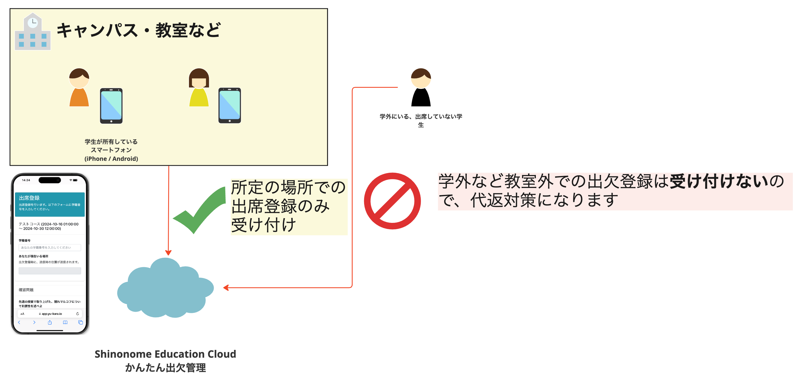
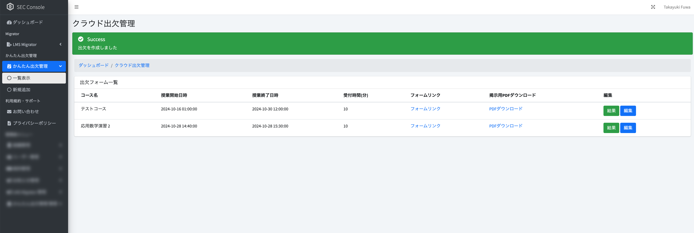
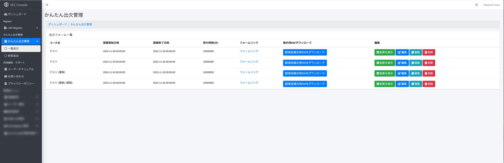
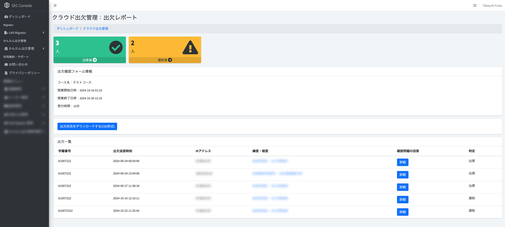

# かんたん出欠管理

## 概要

「かんたん出欠管理」は、授業における出欠を簡単に管理するためのサービスです。
QRコードやアクセスコードを使用して、学生がスマートフォンから簡単に出席登録できます。

本サービスでは、まず授業を登録し、その後各回の授業コマ（出席フォーム）を作成していく流れとなります。

## 基本的な使い方

### 1. 授業の登録

まず、出欠を取りたい授業を登録します。

1. ユーザーコンソール画面の左メニューから「かんたん出欠管理」をクリック
2. 「新規授業作成」ボタンをクリック
3. 授業情報を入力して保存

#### 授業の設定項目

| 入力項目 | 必須 | 説明 |
| --- | --- | --- |
| 授業名 | ✓ | 出欠を取りたい授業名を入力します（例：プログラミング基礎I） |
| 授業の説明 |  | 授業の詳細説明を入力できます |
| 学生の氏名を取得する |  | チェックすると、出席時に学生に氏名入力を求めます |
| 出席登録を行う際、学生に位置情報の送信を強制する |  | チェックすると、出席時に位置情報の送信を求めます |
| 設定した範囲外からの出席を拒否する |  | チェックすると、指定範囲外からの出席を拒否します（教室内のみ出席可能） |
| フォームへアクセス出来るIPアドレス |  | 学内Wi-Fiからのみアクセスを許可したい場合にIPアドレスを設定します。複数指定する場合はカンマ区切りで入力してください |
| デフォルトの授業時間 |  | 各回の授業コマ作成時のデフォルト値として使用されます |
| この設定をデフォルト値として保存する |  | チェックすると、次回の授業作成時にこの設定が初期値として使用されます |

### 2. 授業コマ（出席フォーム）の作成

登録した授業に対して、各回の授業コマを作成します。

1. 授業一覧から該当する授業の「詳細」ボタンをクリック
2. 授業詳細画面で「出席フォームを作成」ボタンをクリック
3. 授業コマの情報を入力して保存

#### 授業コマの設定項目

##### 基本情報

| 入力項目 | 必須 | 説明 |
| --- | --- | --- |
| セッション番号（何回目か） | ✓ | 第何回の授業かを入力します（自動的に次の回数が表示されます） |
| 授業日 | ✓ | 授業を行う日付を選択します |
| 開始時刻 | ✓ | 授業が始まる時刻を入力します。「60分後」「90分後」「120分後」ボタンで終了時刻を自動設定できます |
| 終了時刻 | ✓ | 授業が終わる時刻を入力します |
| 受付時間(分) | ✓ | 授業開始時刻から何分間出席を受け付けるかを設定します。推奨値は10分です |

##### アクセス制限

| 入力項目 | 必須 | 説明 |
| --- | --- | --- |
| IPアドレスによるアクセス制限を有効にする |  | チェックすると、指定したIPアドレスからのみアクセスを許可します |
| アクセス可能なIPアドレス |  | 学内Wi-Fiからのみアクセス可能にする場合に設定します。CIDR形式（例：192.168.1.0/24）で複数指定可能。「現在接続しているネットワークのIPアドレスを設定する」ボタンで自動設定できます |
| 出席登録を行う際、学生に位置情報の送信を強制する |  | チェックすると、出席時に学生に位置情報の送信を求めます |
| 設定した範囲外からの出席を拒否する |  | チェックすると、指定した位置情報の範囲内からのみ出席を許可します。**※この機能を有効にするには、「位置情報の送信を強制する」も有効にする必要があります** |
| 学生の氏名を取得する |  | チェックすると、出席時に学生に氏名入力を求めます。**※有料オプション契約が必要です。また、個人情報を含むため、ダウンロード時にワンタイムコード認証が必要になります** |
| アクセスコードを要求する |  | チェックすると、出席時に4桁のアクセスコードの入力を求めます（デフォルトで有効）。アクセスコードは自動生成されます |

##### 位置情報の範囲設定

位置情報制限を有効にした場合、以下の設定が可能です：

- **基準点の設定**: 地図上をクリックするか、「現在位置を基準点に設定」ボタンで基準点を設定します
- **許容範囲**: 基準点から何メートル以内を許可するかを設定します（10〜1000m）

##### 確認問題

| 入力項目 | 必須 | 説明 |
| --- | --- | --- |
| 問題1〜4 |  | 出席登録時に学生に表示する確認問題を登録できます。最大4問登録可能で、学生画面では4問中1問がランダムに表示されます |

##### 遅刻について

「受付時間(分)」を過ぎた後に出席登録を行う場合、遅刻として登録されます。

##### 欠席について

「授業終了日時」を過ぎた後はフォームにアクセスできなくなります。そのため、システム上では「欠席」という状態は明示的には存在しません。

### 3. 授業時に出欠を取る

作成した出席フォームを使用して、授業時に出欠を取ります。

授業詳細画面の授業コマ一覧から、以下のボタンを使用できます：

- **フォームリンク**: 出席フォームのURLを新しいタブで開きます
- **掲示用PDF**: QRコードとアクセスコードが記載されたPDFを生成します（教室に掲示して使用）
- **結果**: その回の出席結果を確認できます
- **編集**: 授業コマの設定を変更できます
- **削除**: 授業コマを削除できます

#### 学生から見た出欠フォーム

学生は以下の方法で出席登録できます：

1. QRコードをスマートフォンで読み取る
2. 直接URLにアクセスする
3. アクセスコードが設定されている場合は入力する
4. 確認問題が設定されている場合は回答する
5. 位置情報が必要な場合は送信を許可する

### 4. 出欠の確認

#### 授業コマごとの出席確認

1. 授業詳細画面から該当する授業コマの「結果」ボタンをクリック
2. 出欠結果画面で以下の情報を確認できます：
   - 出席者一覧
   - 遅刻者一覧
   - 出席率
   - 学生が送信した位置情報（位置情報取得を有効にしている場合）
   - 確認問題の回答状況

#### 授業全体の出席状況確認

授業詳細画面では、その授業の全コマの出席状況を一覧で確認できます。

## よくある質問

### Q. 授業を削除するとどうなりますか？

授業を削除すると、その授業に紐づく全ての授業コマと出席データも削除されます。削除前に確認画面が表示されます。

### Q. IPアドレス制限と位置情報制限は併用できますか？

はい、両方を同時に設定することができます。その場合、両方の条件を満たした場合のみ出席が可能になります。

### Q. 確認問題は必須ですか？

いいえ、任意です。代返防止のために設定することを推奨しますが、設定しなくても出席フォームは動作します。

### Q. デフォルト設定は後から変更できますか？

はい、授業の編集画面でいつでも変更できます。ただし、既に作成済みの授業コマには影響しません。

### Q. 氏名取得オプションとは何ですか？

「学生の氏名を取得する」機能を利用するには、有料オプション契約が必要です。この機能を有効にすると、出席時に学生に氏名入力を求め、出席データと紐づけて記録できます。個人情報を含むため、出席データをダウンロードする際にはワンタイムコード認証が必要になります。

### Q. アクセスコードは変更できますか？

アクセスコードは授業コマ作成時に自動的に4桁の数字が生成されます。セキュリティ上の理由から、ユーザーによる任意のコード設定はできません。

### Q. 位置情報制限はどのくらい正確ですか？

GPS の精度は環境によって異なりますが、屋外で約10〜50m程度の誤差があります。屋内ではさらに誤差が大きくなる場合があります。そのため、許容範囲は余裕を持って設定することを推奨します（推奨値：100m以上）。

### Q. IPアドレス制限はどのように設定すればよいですか？

学内ネットワークのIPアドレス範囲を CIDR 形式で指定します。例：
- 単一のIPアドレス: `192.168.1.10/32`
- クラスCネットワーク: `192.168.1.0/24`（192.168.1.0〜192.168.1.255）
- 複数のネットワーク: 改行区切りで複数指定できます

「現在接続しているネットワークのIPアドレスを設定する」ボタンを使用すると、自動的に現在のネットワークが設定されます。

### Q. システム管理者アカウントの特権は？

システム管理者アカウントでログインしている場合：
- 氏名取得オプションの契約が不要
- すべてのサービス機能を無制限で利用可能

## トラブルシューティング

### 位置情報が取得できない

**原因**: ブラウザの位置情報許可がオフになっている

**対処法**: ブラウザの設定から位置情報のアクセスを許可してください

1. **Chrome/Edge**: 設定 → プライバシーとセキュリティ → サイトの設定 → 位置情報
2. **Safari**: 環境設定 → Webサイト → 位置情報サービス
3. **Firefox**: 設定 → プライバシーとセキュリティ → 許可設定 → 位置情報

### IPアドレス制限でアクセスできない

**原因**: 学内Wi-Fiに接続していない、またはIPアドレス設定が誤っている

**対処法**:
1. 学内Wi-Fiに接続しているか確認
2. 教員に設定されているIPアドレスを確認してもらう
3. 「現在接続しているネットワークのIPアドレスを設定する」ボタンで再設定

### アクセスコードが間違っていると表示される

**原因**: アクセスコードの入力ミス

**対処法**: 掲示されているQRコードまたは4桁の数字を正確に入力してください

### 二重登録のエラーが表示される

**原因**: すでに出席登録を完了している（ブラウザのCookieに記録が保存されている）

**対処法**:
- 出席登録は1回のみ可能です
- どうしても再登録が必要な場合は、教員に連絡してください

## 推奨設定

### 受付時間の設定

- **推奨値**: 10分
- **理由**: 授業開始後、学生が着席してスマートフォンを取り出す時間を考慮

### 位置情報範囲の設定

- **推奨値**: 100m以上
- **理由**: GPSの誤差（特に屋内）を考慮した余裕のある範囲設定
- **注意**: 屋外で約10〜50m、屋内ではさらに大きな誤差が発生する可能性があります

### IPアドレス制限の設定

- **推奨**: 学内ネットワーク全体をCIDR形式で指定
- **例**: `192.168.0.0/16`（より広い範囲をカバー）

## データの取り扱いについて

### 収集される情報

- **必須**: 学籍番号、出席日時、IPアドレス
- **任意**: 氏名（有料オプション契約時）、位置情報（設定時）、確認問題の回答

### データの保存期間

授業終了後もデータは保持されます。削除が必要な場合は授業全体を削除してください。

### プライバシー保護

- 位置情報は範囲判定に使用され、正確な座標として保存されます
- 氏名データはダウンロード時にワンタイムコード認証が必要です
- IPアドレスは出席記録と紐付けて保存されます

### セキュリティ機能

#### 二重登録防止

一度出席登録を行うと、ブラウザに記録が保存され、同じフォームへの再登録を防止します。

#### IPアドレス検出

Cloudflareやnginxなどのプロキシ経由でも正しくIPアドレスを検出します。