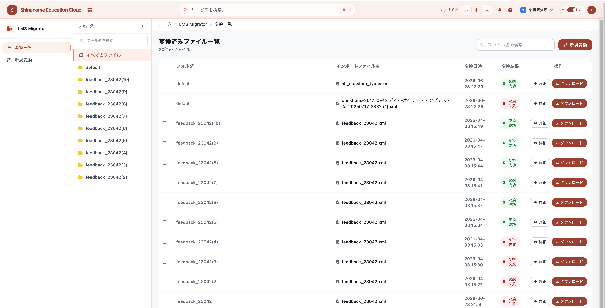
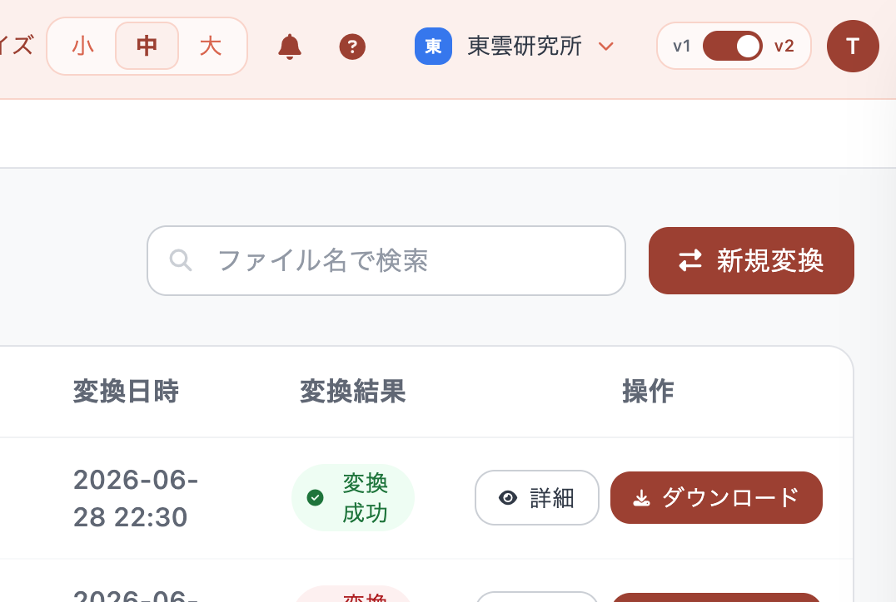
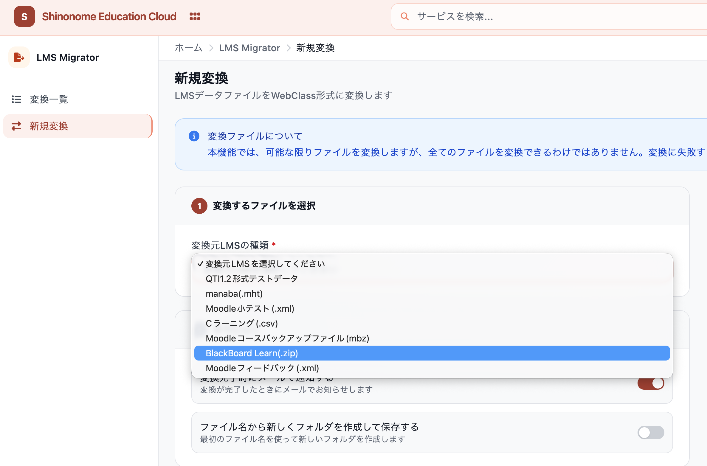
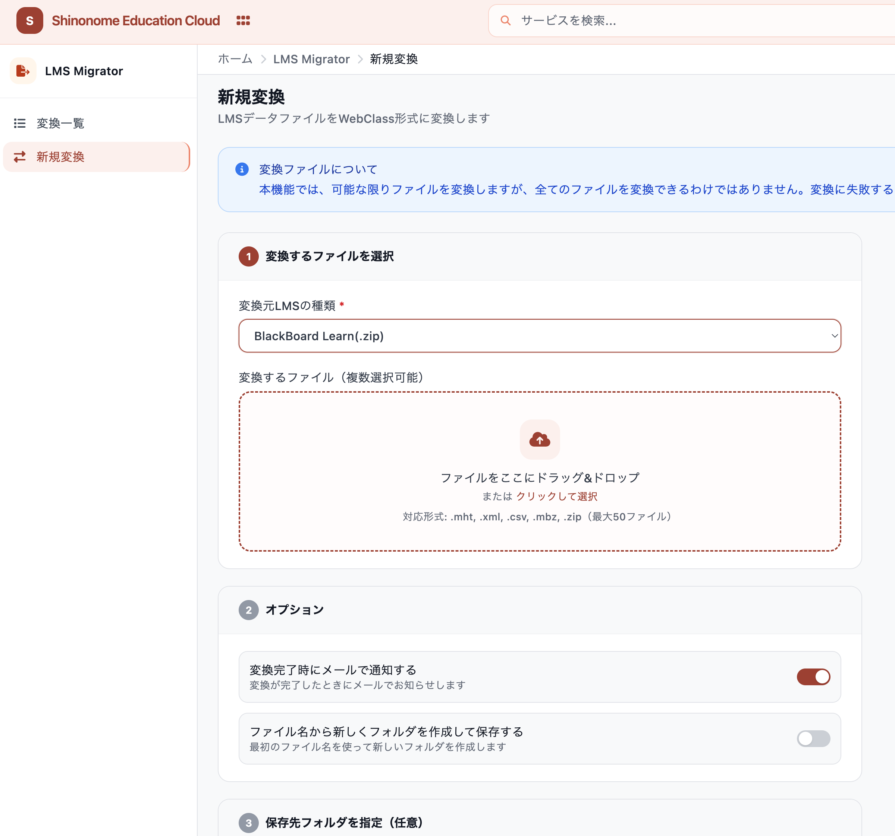
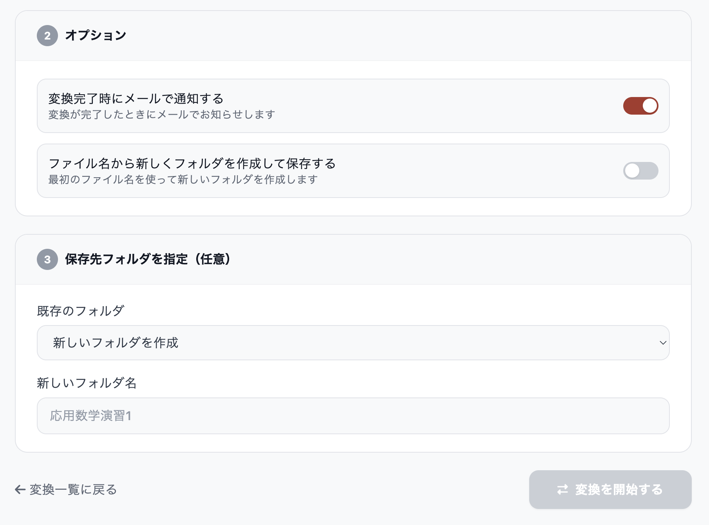
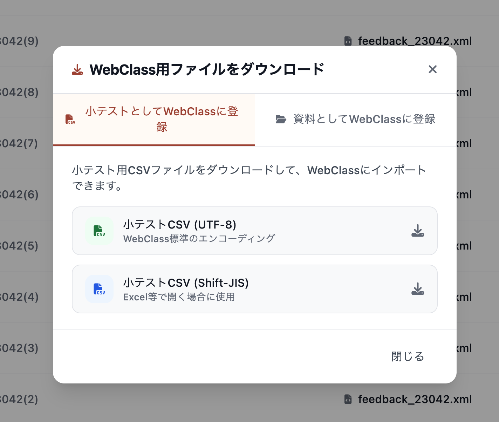
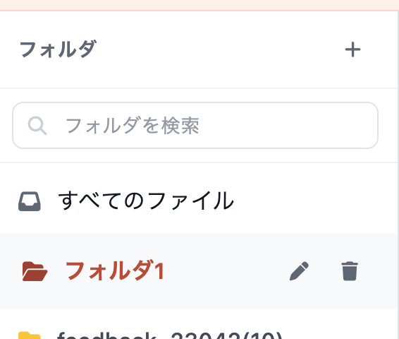
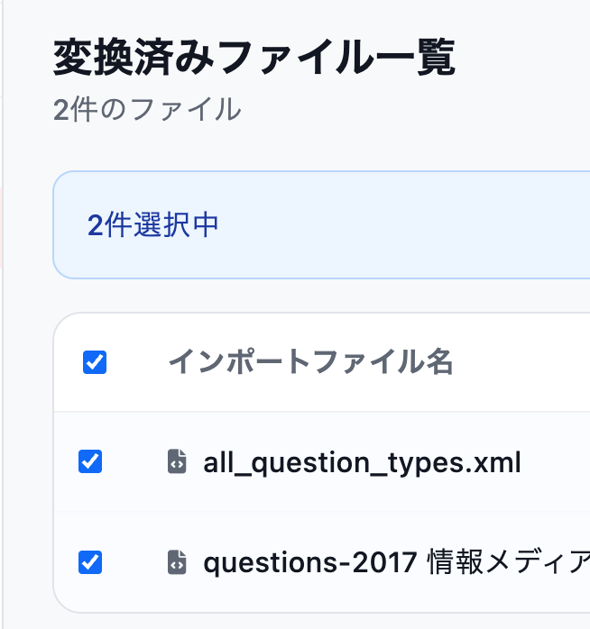
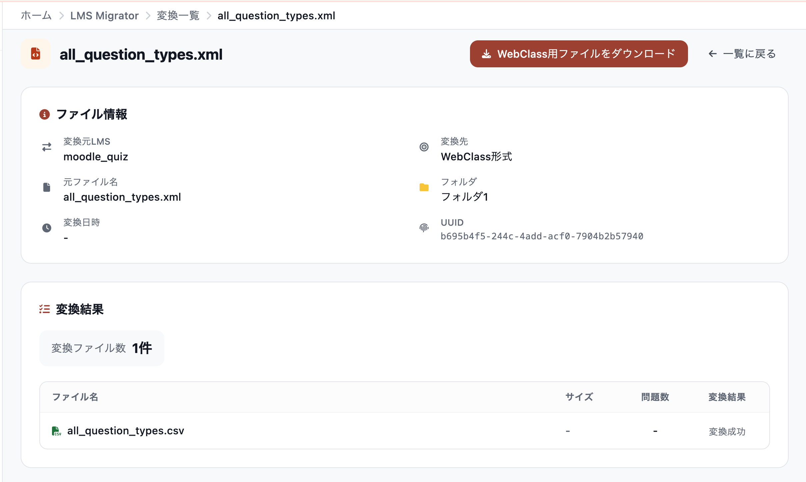

# LMS Migrator

> 本ページは、**新しい画面（v2）** の操作手順を説明しています。
> 画面右上に「v1 / v2」の切り替えスイッチがあり、**v1（旧画面）** をお使いの場合は [LMS Migrator（v1・旧画面）](migrator/migrator.md) をご覧ください。

## 概要

「LMS Migrator」は、異なるLMS間でのデータ移行を支援するツールです。manaba や Moodle などからエクスポートしたテスト問題・資料・コースコンテンツを、**WebClass** にインポートできる形式へ変換します。

## ご利用にあたって

* 本ツールは **組織アカウント専用** です。個人アカウントではご利用いただけません。組織で契約されている場合、その組織に所属する方はどなたでもご利用いただけます。
* 変換したファイルは **ご自身が変換したものだけ** が表示されます。同じ組織の他の方が変換したファイルは表示されません。
* 本ツールによるデータ移行では、データの一部が正しく移行されない場合があります。データ移行後には、必ずデータの確認を行ってください。
* 本ツールは、データの移行を支援するためのツールであり、データの完全な移行を保証するものではありません。
* 変換に失敗するファイルがある場合は、[お問い合わせフォーム](https://form.run/@shinonome-dxFyHrQfuKX98iw6sjf0) よりご連絡ください。

## 対応済みLMS

### インポート元LMS（変換元）

| LMS名 | ファイル形式 | 説明 |
| --- | --- | --- |
| QTI1.2形式テストデータ | .xml | Sakai等で使用される標準的なテストデータ形式 |
| manaba | .mht | 株式会社朝日ネットが提供する学習管理システム |
| Moodle小テスト | .xml | Moodleの小テストをエクスポートしたXMLファイル |
| Cラーニング | .csv | Cラーニング形式のCSVファイル |
| Moodleコースバックアップファイル | .mbz | Moodleのコースバックアップファイル |
| BlackBoard Learn | .zip | BlackBoardからエクスポートしたZIPファイル |
| Moodleフィードバック | .xml | Moodleのフィードバック（アンケート）活動 |

> **「Moodleフィードバック(.xml)」は v2 画面から追加された変換元です。** v1（旧画面）では選択できません。

manaba のファイルは、拡張子が **`.mht`** のもののみ対応しています。`.mhtml` はご利用いただけません。

### インポート先LMS（変換先）

* **WebClass** - 日本データパシフィック株式会社が提供する学習管理システム

### Moodleで対応済みの問題形式

Moodle小テスト・コースバックアップファイルから変換する場合、以下の問題形式に対応しています。

* multichoice（単一・複数選択）
* truefalse（正誤問題）
* shortanswer（短答入力）
* numerical（数値入力）
* essay（記述・レポート）
* matching（組み合わせ）

> 上記以外のプラグインで追加された問題形式などは、記述式問題として変換されるか、変換されない場合があります。変換後に必ずご確認ください。

## 画面の構成

LMS Migrator には、次の3つの画面があります。

| 画面 | 役割 |
| --- | --- |
| 変換一覧 | 変換したファイルの確認・ダウンロード・フォルダ管理を行う、LMS Migrator のホーム画面 |
| 新規変換 | ファイルをアップロードして変換を開始する画面 |
| 詳細 | 1つの変換結果の内訳（問題数・資料など）を確認する画面 |

画面左側のサイドバーから「**変換一覧**」「**新規変換**」を行き来できます。サイドバー最下部の「**コンソールに戻る**」で、SECのダッシュボードに戻ります。

> サイドバーは、画面の横幅が狭い場合（スマートフォン等）には表示されません。パソコンでのご利用を推奨します。

## ファイル変換手順

### ステップ1: LMS Migratorを開く

ユーザーコンソールのダッシュボード、または画面上部のサービスメニュー（「データ変換」カテゴリ）から「**LMS Migrator**」をクリックします。

「**変換一覧**」画面が開きます。左メニューの「**新規変換**」、または画面右上の「**新規変換**」ボタンをクリックします。

### ステップ2: 変換元LMSを選択

「**変換元LMSの種類**」から、変換したいファイルの形式を選択します。ここを選ぶまで、ファイルのアップロード欄は表示されません。

<!-- SCREENSHOT: v2/image-04.png
     画面: 新規変換 (/converter)
     撮る範囲: 「1 変換するファイルを選択」カード。「変換元LMSの種類」のプルダウンを開いて、7つの選択肢がすべて見えている状態
     状態: プルダウン展開中 -->

「Moodle小テスト(.xml)」または「Moodleコースバックアップファイル(mbz)」を選ぶと、**自動変換に対応済みの問題形式**が画面に表示されます。

### ステップ3: ファイルをアップロード

変換元LMSを選択すると、ファイルアップロードエリアが表示されます。ファイルは以下の2つの方法でアップロードできます。

1. **ドラッグ＆ドロップ**: ファイルをアップロードエリアにドラッグ＆ドロップ
2. **クリック選択**: アップロードエリアをクリックしてファイルを選択

ファイルは選択した時点で**その場でアップロードが始まります**。アップロード中はファイル名の左に回転マーク、完了すると緑のチェックマークが表示されます。「×」ボタンでアップロード済みファイルを取り消せます。

> **一度に最大50ファイルまで変換できます。** 1ファイルあたりのサイズは 100MB 程度までを目安としてください。
>
> ファイル名の左に**赤いマーク**が表示された場合は、アップロードに失敗しています。選択した「変換元LMSの種類」とファイルの拡張子が合っているかご確認ください（例: manaba を選んで `.xml` ファイルをアップロードした場合など）。

### ステップ4: オプションを設定

| オプション | 説明 |
| --- | --- |
| 変換完了時にメールで通知する | 変換が完了したときにメールでお知らせします（**初期状態でオン**） |
| ファイル名から新しくフォルダを作成して保存する | 最初のファイル名を使って新しいフォルダを自動作成し、そこへ保存します |
| LaTeX形式の数式を含むファイルを変換する | 変換後のファイルに MathJax の読み込みスクリプトが自動的に追加されます |

> 「LaTeX形式の数式を含むファイルを変換する」は、**「QTI1.2形式テストデータ」または「Moodle小テスト(.xml)」を選んだときだけ**表示されます。

### ステップ5: 保存先フォルダを指定（任意）

複数のエクスポートファイルを管理するため、「フォルダ」機能があります。コースごとにフォルダを作成することで、同一コースからエクスポートしたファイルをまとめて管理できます。

* **既存のフォルダ**: すでに作成済みのフォルダを選びます。
* **新しいフォルダ名**: 「新しいフォルダを作成」を選んだ場合、ここに入力した名前でフォルダが作られます。
* どちらも指定しない場合は、既定のフォルダに保存されます。

> ステップ4で「ファイル名から新しくフォルダを作成して保存する」をオンにすると、このセクションは非表示になります（フォルダ名が自動で決まるため）。

### ステップ6: 変換を開始

「**変換を開始する**」ボタンをクリックすると、変換処理が開始されます。

変換はサーバー側で実行されるため、開始後は自動的に「**変換一覧**」画面へ移動し、「**変換を開始しました。この画面を閉じても変換は継続されます。**」と表示されます。ブラウザを閉じても変換は続きます。

### ステップ7: 変換結果を確認

「変換一覧」画面で、各ファイルの状態を確認できます。

「変換結果」欄には次のいずれかが表示されます。

| 表示 | 意味 |
| --- | --- |
| 待機中 | 変換の順番待ちです |
| 変換中 | 変換処理を実行中です |
| 変換成功 | 変換が完了しました。ダウンロードできます |
| 変換失敗 | 変換できませんでした |
| キャンセル | 変換が中止されました |

> **「変換中」の表示は自動では更新されません。** しばらく待ってから、ブラウザを再読み込み（F5）してください。
>
> 変換の開始から60分を過ぎても終わらない場合、その変換は自動的に「変換失敗」となります。

### ステップ8: ファイルをダウンロード

各行の「**ダウンロード**」ボタンをクリックすると、ダウンロード画面が開きます。用途に応じて2つのタブから選択します。

| タブ | ダウンロードされるもの |
| --- | --- |
| 小テストとしてWebClassに登録 | WebClass に小テストとしてインポートするCSVファイル |
| 資料としてWebClassに登録 | WebClass に資料として登録するZIPファイル（画像やHTMLなどのコースコンテンツ） |

> 変換結果に小テストや資料が含まれていない場合、対応するタブの内容は空になります。

## 変換一覧の便利な機能

### フォルダの管理

画面左のフォルダ一覧から、フォルダの作成・名前の変更・削除ができます。

* **作成**: 「フォルダ」見出しの右にある「＋」ボタン
* **名前の変更 / 削除**: フォルダ名にマウスを乗せると右側に表示される鉛筆アイコン・ゴミ箱アイコン

フォルダを削除するときは、中のファイルをどうするかを選べます。

* **ファイルを別のフォルダに移動**: フォルダだけを削除し、ファイルは指定した移動先フォルダに残します。
* **フォルダとファイルをすべて削除**: フォルダと中のファイルをすべて削除します。**この操作は取り消せません。**

### 検索

* **フォルダを検索**: 左のフォルダペイン上部の検索ボックスで、フォルダ名を絞り込めます。
* **ファイル名で検索**: 画面右上の検索ボックスで、インポートファイル名を絞り込めます。

### まとめて操作する（一括操作）

一覧の左端のチェックボックスでファイルを複数選択すると、一括操作バーが表示されます。

| ボタン | 動作 |
| --- | --- |
| WebClass形式でダウンロード | 選択したファイルの小テストCSVを、ZIPにまとめてダウンロードします |
| フォルダ移動 | 選択したファイルを、指定したフォルダへ移動します |
| 削除 | 選択したファイルを削除します（**取り消せません**） |

> 一括ダウンロードでダウンロードできるのは**小テストCSVのみ**です。資料ファイル（ZIP）は、ファイルごとに個別にダウンロードしてください。

<!-- SCREENSHOT: v2/image-18.png
     画面: 一括操作バーの「フォルダ移動」を押した後のモーダル
     撮る範囲: 「フォルダ移動」モーダル全体（「◯件のファイルを移動します。」＋「移動先のフォルダ」プルダウン）
     状態: 移動先フォルダのプルダウンを開いた状態 -->

### 詳細画面

一覧の「**詳細**」ボタンをクリックすると、その変換結果の内訳を確認できます。

* **ファイル情報**: 変換元LMS、変換先、元ファイル名、フォルダなどを表示します。
* **変換結果**: 変換されたファイルの一覧と、**それぞれに含まれる問題数**を表示します。
* Moodleコースバックアップファイル（.mbz）を変換した場合は、「**テストCSV一覧**」と「**資料**」の2つのタブが表示されます。

画面右上の「**WebClass用ファイルをダウンロード**」ボタンから、一覧画面と同じダウンロード画面を開けます。

## v1（旧画面）からの主な変更点

| | v1（旧画面） | v2（新しい画面） |
| --- | --- | --- |
| 変換中の待ち時間 | 変換が終わるまで画面を開いたまま待つ必要があった | **変換開始後すぐに一覧画面に戻れます。**ブラウザを閉じても変換は継続します |
| ファイルのアップロード | 「変換を開始する」を押したときに、すべてのファイルをまとめて送信 | **ファイルを選んだ時点で1つずつアップロード。**大きなファイルでも失敗しにくくなりました |
| 変換元LMS | 6種類 | **「Moodleフィードバック(.xml)」を追加**（7種類） |
| LaTeX（数式）オプション | 画面に表示されなかった | **選択できるようになりました**（QTI1.2 / Moodle小テストの場合） |
| フォルダ | フォルダ一覧を切り替えて表示 | **常時表示されるフォルダペイン。**フォルダの作成・名前変更・削除、フォルダ名検索に対応 |
| 検索 | なし | **フォルダ名・ファイル名で検索**できます |
| 一括操作 | ダウンロードのみ | **ダウンロード・フォルダ移動・削除**に対応 |

## v1（旧画面）に戻すには

画面右上の「**v1 / v2**」スイッチで、いつでも旧画面に切り替えられます。

<!-- SCREENSHOT: v2/image-21.png
     画面: 任意のv2画面（変換一覧など）
     撮る範囲: 画面右上のヘッダー部分。「v1 / v2」のトグルスイッチをズームして撮影
     状態: v2側がオンになっている状態 -->

> * このスイッチは、画面の横幅が狭い場合（スマートフォン等）には表示されません。
> * **v1（旧画面）は廃止予定です。** 今後は v2（新しい画面）をご利用ください。

## よくある質問

### Q: 変換を開始したあと、ブラウザを閉じても大丈夫ですか？

A: はい。変換はサーバー側で実行されるため、ブラウザを閉じても変換は続きます。「変換完了時にメールで通知する」をオンにしておくと、完了時にメールでお知らせします。

### Q: 「変換中」のまま画面が変わりません。

A: 一覧画面は自動的には更新されません。しばらく待ってから、ブラウザを再読み込み（F5）してください。

### Q: 複数のファイルを1つのテストにまとめることはできますか？

A: はい。同じフォルダに複数のファイルを変換したうえで、一覧画面でそれらをチェックし、「WebClass形式でダウンロード」をクリックしてください。選択したファイルの小テストCSVがまとめてダウンロードされます。

### Q: LaTeX形式の数式は変換できますか？

A: はい。変換元LMSに「QTI1.2形式テストデータ」または「Moodle小テスト(.xml)」を選ぶと「LaTeX形式の数式を含むファイルを変換する」オプションが表示されます。オンにすると、変換後のファイルに MathJax の読み込みスクリプトが自動的に追加されます。

### Q: 変換したファイルはいつまで保存されますか？

A: 自動的に削除されることはありません。不要になったファイルは、一覧画面から削除してください。

### Q: 変換に失敗した場合はどうすればよいですか？

A: [お問い合わせフォーム](https://form.run/@shinonome-dxFyHrQfuKX98iw6sjf0) よりご連絡ください。報告内容をもとに、不具合の修正や改善を行います。
