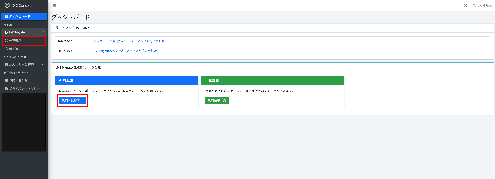
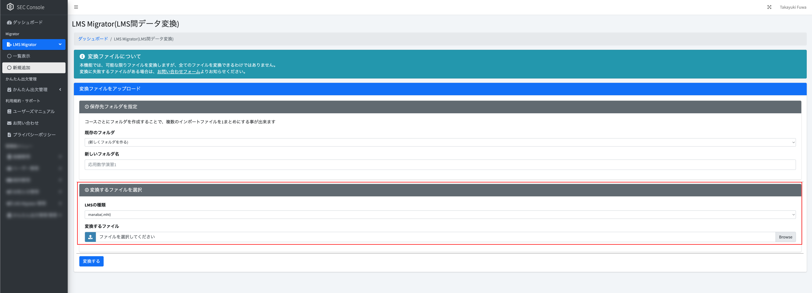
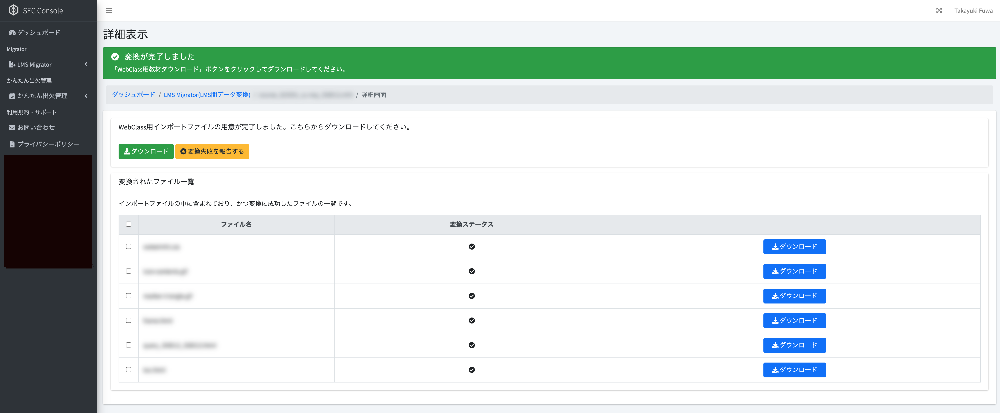
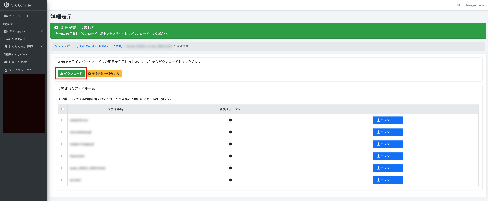
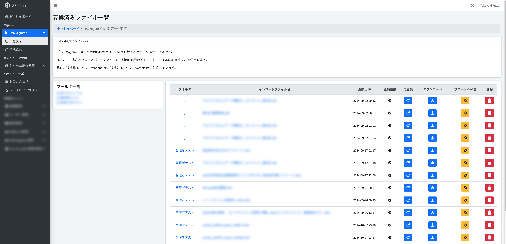

# LMS Migrator

## 概要

「LMS Migrator」は、LMS同士のデータ移行を行うためのツールです。

## 注意事項

* 本ツールによるデータ移行は、データの一部が正しく移行されない場合があります。データ移行後には、必ずデータの確認を行ってください。
* 本ツールは、データの移行を支援するためのツールであり、データの完全な移行を保証するものではありません。

### 対応済みLMS

#### インポート元LMS

* manaba
* Sakai (QTI1.2形式)

※ 「manaba」は株式会社朝日ネットが提供する学習管理システムです。

#### インポート先LMS

* WebClass

※ 「WebClass」は日本データパシフィック株式会社が提供する学習管理システムです。

## manaba・SakaiからWebClassへの移行手順

!> manabaおよびSakai上でエクスポートファイルを作成する手順は、各学校の管理者にお問い合わせください。

!> Sakaiからテストデータをエクスポートする場合、QTI1.2形式でエクスポートしてください。

### ファイル変換手順

#### (1) mht・xmlファイルをアップロード

manaba・Sakaiからエクスポートしたファイル(.mhtもしくは.xml)をLMS Migratorにアップロードします。
ユーザーコンソール画面の左メニューから「LMS Migrator」をクリックし、「新規追加」をクリックします。
もしくは、ダッシュボードの「変換を開始する」ボタンをクリックします。

#### (2) 「フォルダ」を作成もしくは選択

複数のエクスポートファイルを管理するため、「フォルダ」という機能があります。この機能を使用すると、同一コースからエクスポートしたファイルをまとめて管理することができます。
なお、コースごとにフォルダを作成することを推奨いたします。

#### (3) mht・xmlファイルを選択

「変換するファイルを選択」でmanaba・Sakaiでエクスポートしたファイル(.mht)を選択します。

最後に、「変換する」ボタンをクリックします。

#### (4) 変換結果の確認

#### (5) 変換したファイルをダウンロード

WebClass向けに変換されたファイルをダウンロードします。「ダウンロード」ボタンをクリックします。

「ダウンロード」ボタンをクリックすると、ファイルをダウンロードする画面が表示されます。

画面上の、「ダウンロード」ボタンをクリックすると、ZIPファイルがダウンロードされます。
「資料」「テスト(このmhtファイルに含まれているデータのみ)」「テスト(フォルダ内の全てのテストが含まれたデータ)」の3つが表示されますが、それぞれのファイルは以下のようになります。

| 種別 | 説明 |
| --- | --- |
| 資料 | WebClassにおける、「資料」になります。画像やHTMLなどコースコンテンツのインポートに使用します |
| テスト(このmhtファイルに含まれているデータのみ) | WebClassにおける、「テスト」になります。 |
| テスト(フォルダ内の全てのテストが含まれたデータ) | WebClassにおける、「テスト」になりますが、「フォルダ」内に含まれるエクスポートファイル全てのテストデータが含まれています。複数のmhtファイルから1つのテスト用CSVデータを生成する際にご利用ください。 |

### 変換したファイル一覧

変換したファイルは、「一覧表示」から確認することができます。

本画面では、以下の操作が可能です。

#### 再変換

一度アップロードしたインポートファイル(.mht)を、再度変換することが出来ます。LMS Migratorのバージョンアップや、変換処理の不具合が修正された場合にご利用ください。

#### ダウンロード

変換したファイルをダウンロードすることができます。

#### サポートへ報告

変換処理に不具合が発生した場合や、想定した形で変換出来なかった場合、サポートへ報告することができます。ご報告内容をもとに、不具合の修正や改善を行います。

#### 削除

不要になった変換ファイルを削除することができます。