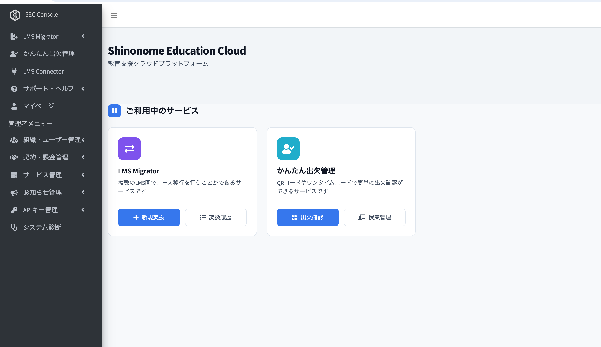
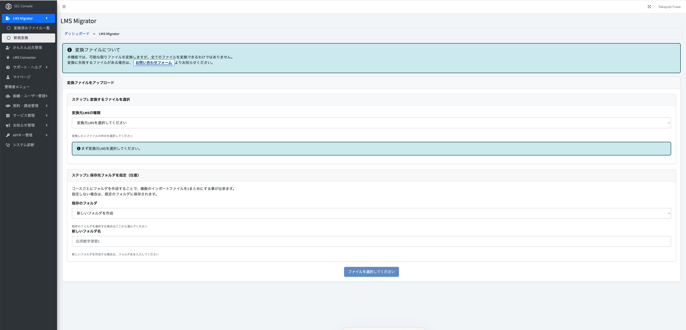
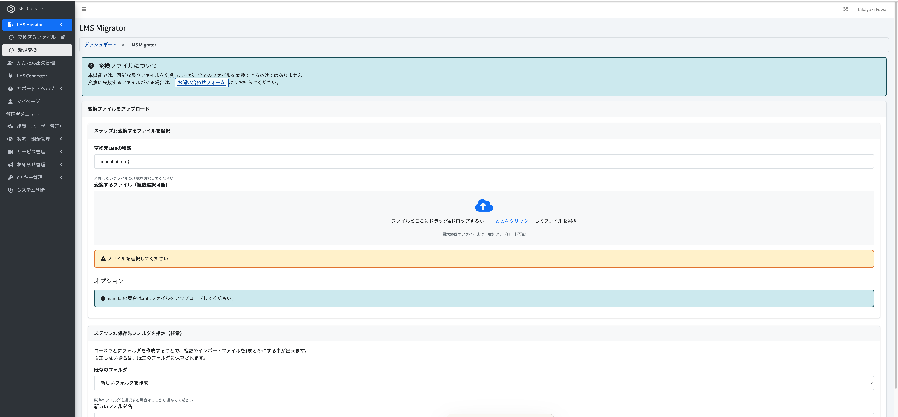
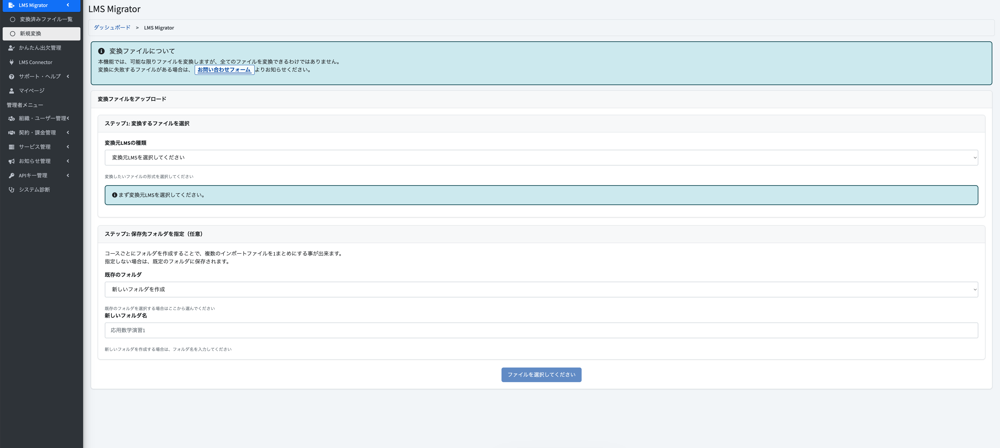
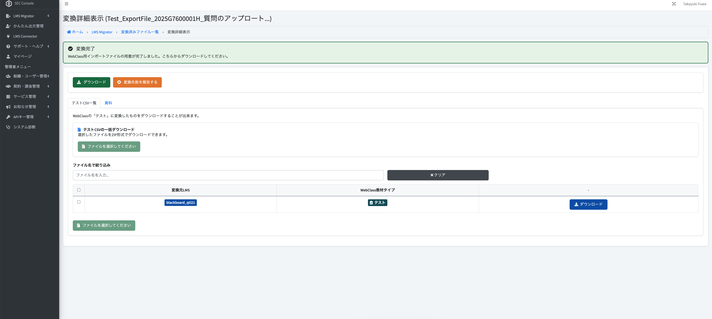
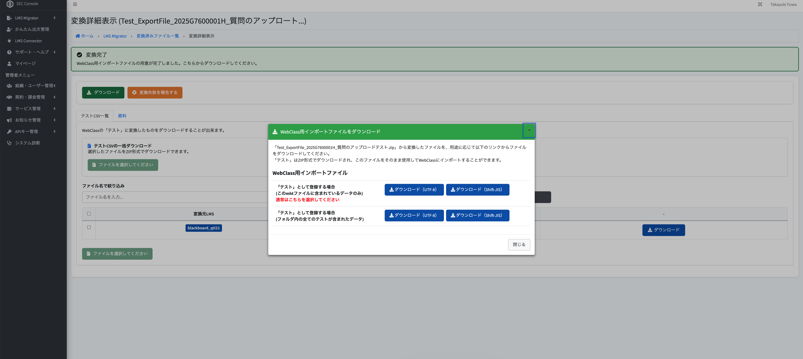
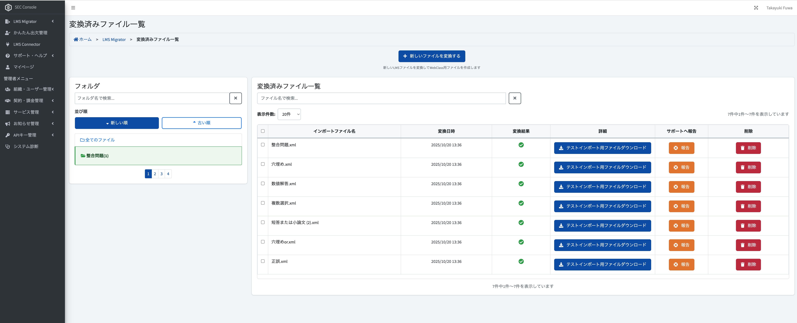

# LMS Migrator

## 概要

「LMS Migrator」は、異なるLMS間でのデータ移行を支援するツールです。テスト問題、資料、コースコンテンツなどを別のLMS形式に変換できます。

## 注意事項

* 本ツールによるデータ移行では、データの一部が正しく移行されない場合があります。データ移行後には、必ずデータの確認を行ってください。
* 本ツールは、データの移行を支援するためのツールであり、データの完全な移行を保証するものではありません。
* 変換に失敗するファイルがある場合は、お問い合わせフォームよりご連絡ください。

## 対応済みLMS

### インポート元LMS（変換元）

| LMS名 | ファイル形式 | 説明 |
| --- | --- | --- |
| manaba | .mht | 株式会社朝日ネットが提供する学習管理システム |
| QTI1.2形式 | .xml | Sakai等で使用される標準的なテストデータ形式 |
| Moodle小テスト | .xml | Moodleの小テストをエクスポートしたXMLファイル |
| Moodleコースバックアップ | .mbz | Moodleのコースバックアップファイル |
| Cラーニング | .csv | Cラーニング形式のCSVファイル |
| BlackBoard Learn | .zip | BlackBoardからエクスポートしたZIPファイル |

### インポート先LMS（変換先）

* **WebClass** - 日本データパシフィック株式会社が提供する学習管理システム

### Moodleで対応済みの問題形式

Moodle小テスト・コースバックアップファイルから変換する場合、以下の問題形式に対応しています：

* multichoice（単一・複数選択）
* truefalse（正誤問題）
* shortanswer（短答入力）
* numerical（数値入力）
* essay（記述・レポート）
* matching（組み合わせ）

> 上記以外のプラグインで追加された問題形式などは現在非対応です。

## ファイル変換手順

### ステップ1: LMS Migratorにアクセス

ユーザーコンソール画面の左メニューから「LMS Migrator」をクリックし、「新規追加」をクリックします。
もしくは、ダッシュボードの「変換を開始する」ボタンをクリックします。

### ステップ2: 変換元LMSを選択

「変換元LMSの種類」から、変換したいファイルの形式を選択します。

選択可能なLMS形式：
- QTI1.2形式テストデータ（.xmlファイル）
- manaba（.mhtファイル）
- Moodle小テスト（.xmlファイル）
- Cラーニング（.csvファイル）
- Moodleコースバックアップファイル（.mbzファイル）
- BlackBoard Learn（.zipファイル）

### ステップ3: ファイルをアップロード

変換元LMSを選択すると、ファイルアップロードエリアが表示されます。
ファイルは以下の2つの方法でアップロードできます：

1. **ドラッグ＆ドロップ**: ファイルをアップロードエリアにドラッグ＆ドロップ
2. **クリック選択**: 「ここをクリック」をクリックしてファイルを選択

> 一度に最大50個のファイルまでアップロード可能です。

### ステップ4: 保存先フォルダを指定（任意）

複数のエクスポートファイルを管理するため、「フォルダ」機能があります。
コースごとにフォルダを作成することで、同一コースからエクスポートしたファイルをまとめて管理できます。

**オプション機能:**
- **新しいフォルダを作成して保存**: チェックを入れると、最初のファイル名から自動でフォルダを作成します
- **変換完了時にメールで通知**: 変換が完了したときにメールでお知らせします

### ステップ5: 変換を開始

「変換を開始する」ボタンをクリックすると、変換処理が開始されます。
処理中は「変換一覧」画面で進捗状況を確認できます。

### ステップ6: 変換結果の確認とダウンロード

変換が完了すると、ダウンロードボタンが表示されます。

「ダウンロード」ボタンをクリックすると、WebClass向けに変換されたファイルをダウンロードできます。

ダウンロード可能なファイル：

| 種別 | 説明 |
| --- | --- |
| 資料 | WebClassにおける「資料」。画像やHTMLなどコースコンテンツのインポートに使用 |
| テスト（このファイルのみ） | このファイルに含まれているテストデータのみ |
| テスト（フォルダ内すべて） | フォルダ内のすべてのエクスポートファイルのテストデータを含む結合ファイル |

## 変換ファイル一覧

変換したファイルは、「一覧表示」から確認・管理できます。

## よくある質問

### Q: 変換に失敗した場合はどうすればよいですか？

A: 「サポートへ報告」機能をご利用ください。報告内容をもとに、不具合の修正や改善を行います。

### Q: 複数のmhtファイルを1つのテストにまとめることはできますか？

A: はい、同じフォルダに複数のファイルをアップロードし、「テスト（フォルダ内すべて）」をダウンロードすることで、すべてのテストデータを1つのCSVファイルにまとめることができます。

### Q: LaTeX形式の数式は変換できますか？

A: はい、変換オプションで「LaTeX形式の数式を含むファイルを変換する」にチェックを入れると、変換後のファイルにMathJaxの読み込みスクリプトが自動的に追加されます。
