# 受講者名簿

このページは、組織の受講者名簿を管理する方に向けて、入力項目とグループの操作手順を説明します。
受講者名簿は、Shinonome Education Cloud のダッシュボードでは「受講者アカウント管理」という名前で表示されます。
グループをかんたん出欠管理の授業に登録する手順は、[かんたん出欠管理 for スクール](attendance/attendance-school-v2.md) の「3. 受講者名簿を登録する」にあります。

> 画面図の赤い枠と丸数字は、そのすぐ下にある表の番号に対応しています。
> 番号の順に読むと、その画面で何を入力し、どのボタンを押すのかが分かります。

## 受講者名簿とは

受講者名簿は、組織の受講者を学籍番号で管理する一覧です。
受講者の登録から、グループへのまとめ、ログインの招待の送信までを、この画面で行います。

このページで説明するのは、次の3つの機能です。

- 入力項目：学部やゼミなど、受講者ごとに記録したい項目を組織で追加する
- グループ：受講者を、学籍番号の指定や、学年、在籍状態、入力項目の条件でまとめる
- 授業への登録：グループを、かんたん出欠管理の授業の受講者としてまとめて登録する

グループを授業に登録すると、グループの受講者がその授業の受講者になります。
グループの受講者が増えたり減ったりすると、授業の受講者も合わせて変わります。

## ご利用の前に

受講者名簿を使えるのは、組織管理者として「受講者アカウント管理」の権限を与えられている方だけです。
組織から外れた管理者は、権限が残っていても開けません。

ダッシュボードの「受講者アカウント管理」から受講者名簿を開くと、追加の認証を求められます。
「メールを確認してください」と表示され、ログインしているメールアドレスに認証用のURLが届きます。
メールのリンクを開くと、受講者名簿の画面に進みます。
認証してから30分たつと、もう一度認証を求められます。

設定画面の「名簿を開けるネットワーク」でIPアドレスによる制限を有効にしている場合は、登録したネットワークからしか開けません。

## 画面の構成

左側のメニューから各機能に移動します。

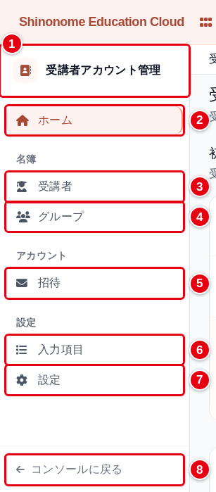

| 番号 | 項目 | 説明 |
| --- | --- | --- |
| ① | サービス名 | 「受講者アカウント管理」と表示されます。画面の見出しは「受講者名簿」です |
| ② | ホーム | 準備の進み具合と、よく使う操作をまとめて表示します |
| ③ | 受講者 | 登録した受講者を一覧し、検索、登録、編集を行います |
| ④ | グループ | 受講者のグループを一覧し、作成、編集、削除を行います |
| ⑤ | 招待 | 受講者にログイン用のメールを送ります。メールアドレスが登録されていない受講者には送れません |
| ⑥ | 入力項目 | 受講者ごとに記録する項目を、組織で追加します |
| ⑦ | 設定 | 受講者のログインや、名簿を開けるネットワークなど、組織の名簿の扱いを決めます |
| ⑧ | コンソールに戻る | Shinonome Education Cloud のダッシュボードに戻ります |

## ホーム画面

サイドバーの「ホーム」を開くと、準備の進み具合とよく使う操作がまとまって表示されます。

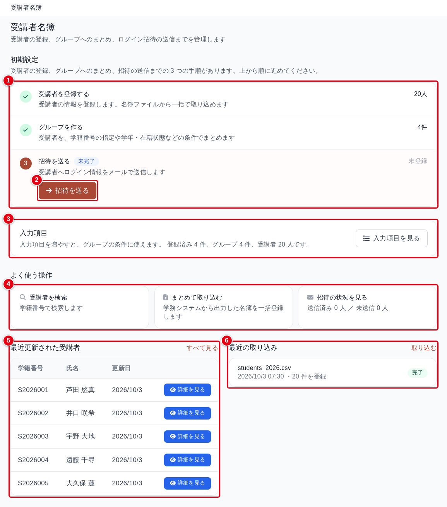

| 番号 | 項目 | 説明 |
| --- | --- | --- |
| ① | 初期設定 | 「受講者を登録する」「グループを作る」「招待を送る」の3つの手順と、それぞれの件数です。済んだ手順にはチェックが付きます。3つとも済むと、この欄は表示されなくなります |
| ② | 次の手順のボタン | まだ済んでいない手順のうち、最初の1つにだけ表示されます。図では「招待を送る」です |
| ③ | 入力項目 | 登録済みの入力項目、グループ、受講者の件数です。「入力項目を見る」で入力項目の画面に移動します |
| ④ | よく使う操作 | 「受講者を検索」「まとめて取り込む」「招待の状況を見る」の各画面に移動します |
| ⑤ | 最近更新された受講者 | 更新日の新しい順に5人を表示します。「すべて見る」で受講者の一覧に移動します |
| ⑥ | 最近の取り込み | 名簿ファイルの取り込みを、新しい順に3件表示します |

入力項目は任意の機能のため、初期設定の手順には含まれません。

## 1. 入力項目を追加する

入力項目は、学部やゼミのように、受講者ごとに記録しておきたい項目です。
組織ごとに50個まで追加できます。
追加した項目は受講者の登録と編集の画面に並び、グループの条件にも使えます。

サイドバーの「入力項目」を開くと、追加した項目が一覧で表示されます。

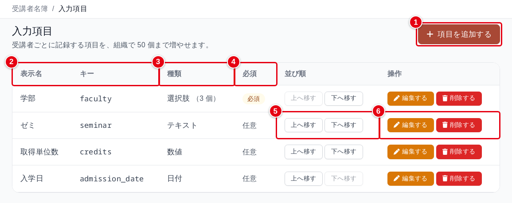

| 番号 | 項目 | 説明 |
| --- | --- | --- |
| ① | 項目を追加する | 入力項目を追加する画面に移動します。50個に達すると表示されません |
| ② | 表示名、キー | 画面に表示する名前と、項目を見分けるための英字の名前です |
| ③ | 種類 | テキスト、数値、日付、選択肢のいずれかです。選択肢の項目には、選択肢の数が並びます |
| ④ | 必須 | 「必須」の項目は、受講者の登録と編集で入力しないと保存できません |
| ⑤ | 並び順 | 「上へ移す」「下へ移す」で順番を入れ替えます。受講者の登録、編集、詳細の画面に、この順番で項目が並びます |
| ⑥ | 操作 | 「編集する」で表示名、選択肢、必須を変更します。「削除する」で項目を削除します |

「項目を追加する」を押すと、次の画面が開きます。

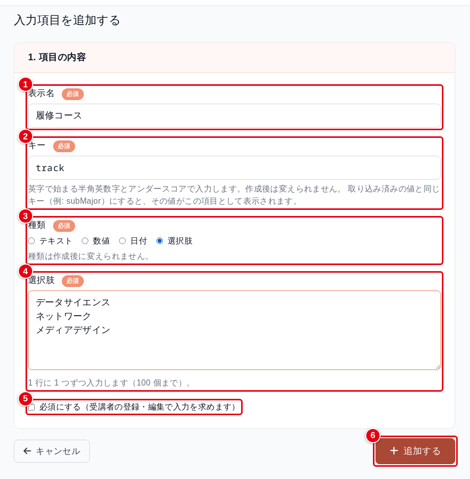

| 番号 | 入力項目 | 必須 | 説明 |
| --- | --- | :---: | --- |
| ① | 表示名 | ✓ | 画面に表示する名前です（例：学部）。50文字まで入力できます |
| ② | キー | ✓ | 項目を見分けるための名前です（例：faculty）。英字で始まる半角英数字とアンダースコアで、64文字まで入力します。作成後は変更できません |
| ③ | 種類 | ✓ | テキスト、数値、日付、選択肢から選びます。作成後は変更できません |
| ④ | 選択肢 | ✓ | 種類に「選択肢」を選んだときだけ表示されます。1行に1つずつ、100個まで入力します |
| ⑤ | 必須にする | | チェックすると、受講者の登録と編集で、この項目の入力を求めます |
| ⑥ | 追加する | | 入力項目を追加して、一覧に戻ります |

表示名とキーは、組織のほかの項目と同じものにできません。
名簿の取り込みで使う見出し（student_id_number、email、学年、在籍状態など）と同じ名前も、表示名とキーのどちらにも使えません。

すでに名簿の取り込みで入っている値と同じキー（例：subMajor）にすると、その値がこの項目の値として表示されます。

### 入力項目を変更、削除する

一覧の「編集する」から、表示名、選択肢、必須を変更できます。
キーと種類は変更できません。

選択肢を減らすとき、その選択肢をグループの条件に使っていると保存できません。
「選択肢「◯◯」はグループ「◯◯」の条件に使われているため消せません。」と表示されたら、先にグループの条件を変えてください。

一覧の「削除する」を押すと、「この入力項目を削除します。受講者に入力済みの値は残ります。削除しますか？」と確認が表示されます。
項目を削除しても、受講者に入力した値は消えません。
同じキーで項目を作り直すと、残っていた値がふたたび表示されます。

グループの条件に使っている項目は削除できません。
「この項目はグループ「◯◯」の条件に使われているため削除できません。先にグループの条件を変えてください。」と表示されます。
表示されたグループの条件から、その項目を外してから削除してください。

## 2. 受講者に入力項目の値を入れる

入力項目を追加すると、受講者の登録と編集の画面の下に「入力項目」の欄が表示されます。
受講者の一覧の「編集する」から開きます。

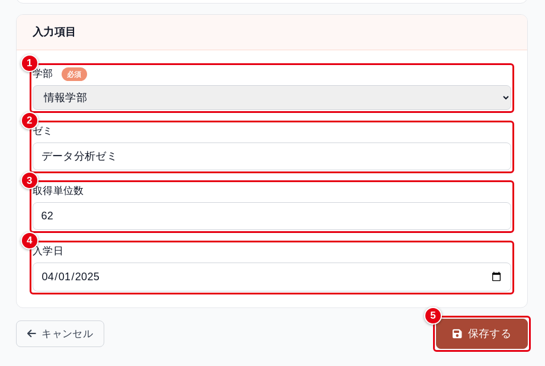

| 番号 | 入力項目 | 説明 |
| --- | --- | --- |
| ① | 選択肢の項目 | 選択肢から選びます。図の「学部」は必須にした項目のため、「必須」が付いています |
| ② | テキストの項目 | 文字を入力します。255文字まで入力できます |
| ③ | 数値の項目 | 数値を入力します |
| ④ | 日付の項目 | 日付を選びます。日付の表示形式は、お使いのブラウザの設定によって変わります |
| ⑤ | 保存する | 入力した値を保存します。受講者を新しく登録する画面では「登録する」です |

必須の項目が空のときや、数値や日付として読めない値、選択肢にない値を入れたときは保存できません。
項目の下に「取得単位数は数値で入力してください。」のように理由が表示されます。

### 詳細の画面で確かめる

受講者の一覧の「詳細を見る」を押すと、受講者の詳細の画面が開きます。
画面の下のほうに、所属グループと入力項目の値が並びます。

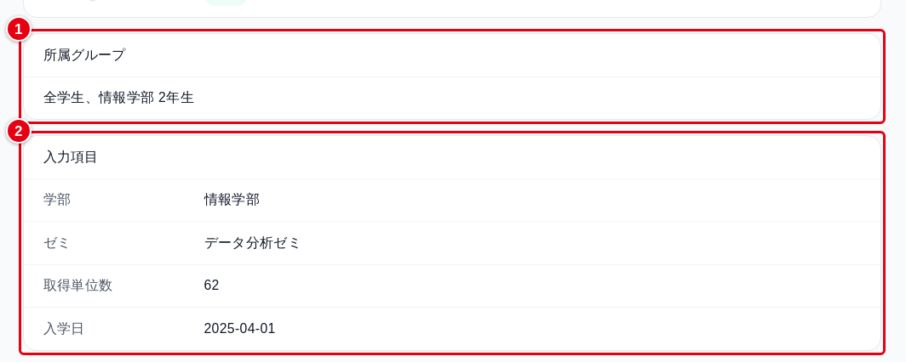

| 番号 | 項目 | 説明 |
| --- | --- | --- |
| ① | 所属グループ | この受講者が入っているグループです。どのグループにも入っていなければ「なし」と表示されます |
| ② | 入力項目 | 入力項目の値です。値が無い項目は「未入力」と表示されます |

### 名簿のファイルで値を入れる

受講者の一覧の「まとめて取り込む」から名簿のファイルを取り込むときも、入力項目の値を入れられます。
見出しに入力項目の表示名かキーを使うと、その列を読み込みます。

```
student_id_number,last_name_kanji,first_name_kanji,学年,学部,ゼミ
S2026001,芦田,悠真,2,情報学部,データ分析ゼミ
```

見出しにしなかった項目は、登録済みの値を変えません。
組織で追加した入力項目の一覧は、取り込みの画面の「使える見出しをすべて見る」で確認できます。

**読めない値が1つでもあると、ファイル全体が取り込まれません。**
数値や日付として読めない値や選択肢にない値があるとき、または新しく登録する受講者の必須の項目が空のときは、行番号と理由が表示されます。
ファイルを直してから、もう一度取り込んでください。

## 3. グループを作る

グループは、受講者をまとめたものです。
グループを作っておくと、かんたん出欠管理の授業に、グループの受講者をまとめて登録できます。

作り方は次の3つです。

- 手動：学籍番号を指定して、受講者を1人ずつ追加します
- 全学生：組織のすべての受講者を入れます
- 条件：学年、在籍状態、入力項目の条件に合う受講者を入れます

**作り方は、グループを作成したあとで変えられません。**

サイドバーの「グループ」を開き、「グループを作成する」を押します。
図は、作り方に「条件」を選び、経済学部の1年生を選ぶ条件を組み立てたところです。

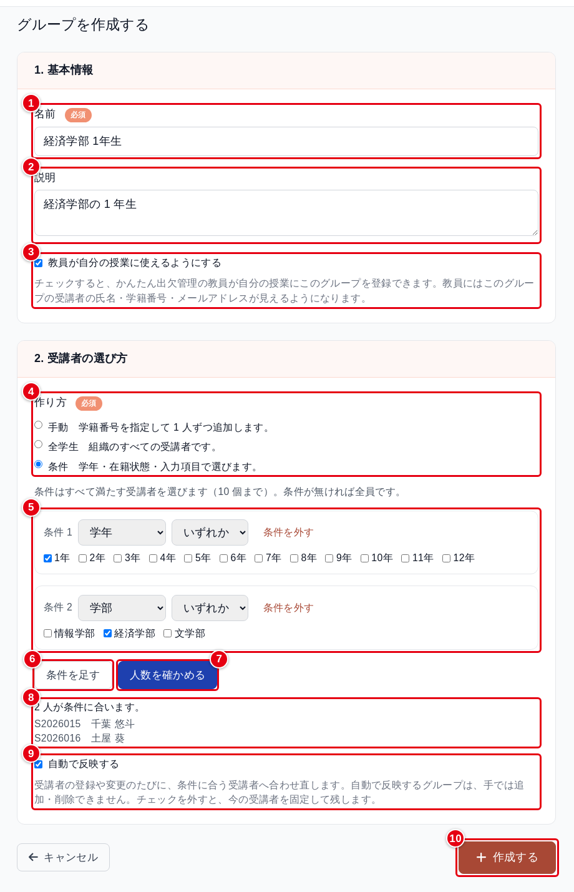

| 番号 | 入力項目 | 必須 | 説明 |
| --- | --- | :---: | --- |
| ① | 名前 | ✓ | グループの名前です（例：2026年度 2年生）。100文字まで入力できます。組織の中で同じ名前は使えません |
| ② | 説明 | | グループの説明です。1000文字まで入力できます |
| ③ | 教員が自分の授業に使えるようにする | | チェックすると、かんたん出欠管理で授業を作成した教員が、自分の授業にこのグループを登録できるようになります。教員には、このグループの受講者の氏名、学籍番号、メールアドレスが見えるようになります。初期状態ではチェックが外れています |
| ④ | 作り方 | ✓ | 手動、全学生、条件から選びます |
| ⑤ | 条件 | | 作り方に「条件」を選ぶと表示されます。項目と比べ方を選び、値を指定します。「条件を外す」で行を消します。条件を1つも足さずに作成すると、全学生のグループになります |
| ⑥ | 条件を足す | | 条件の行を追加します。10個まで足せます |
| ⑦ | 人数を確かめる | | 今の条件に合う受講者の人数を、保存する前に確かめます |
| ⑧ | 確かめた結果 | | 条件に合う人数と、先頭の10人の学籍番号と氏名が表示されます |
| ⑨ | 自動で反映する | | 作り方が全学生か条件のときに表示されます。初期状態でチェックが入っています。働きは下の「自動で反映する」をご覧ください |
| ⑩ | 作成する | | グループを作成し、グループの詳細の画面に移動します |

### 条件の組み立て方

条件を複数並べると、すべての条件を満たす受講者が選ばれます。
項目ごとに、使える比べ方が決まっています。

| 項目 | 比べ方 | 値の指定のしかた |
| --- | --- | --- |
| 学年 | いずれか | 1年から12年までをチェックします。チェックした学年のどれかに当たる受講者を選びます |
| 在籍状態 | いずれか | 在籍、休止、卒業、停止をチェックします |
| 選択肢の入力項目 | いずれか | 選択肢をチェックします |
| テキストの入力項目 | 一致、含む | 「一致」は値がまったく同じ受講者を、「含む」は入力した文字を値に含む受講者を選びます。「含む」では英字の大文字と小文字を区別しません |
| 数値、日付の入力項目 | 範囲 | 下限と上限を入れます。下限と上限の値ちょうどの受講者も含みます。どちらか一方は空でもかまいません |

入力項目の値が入っていない受講者は、その項目の条件には当てはまりません。

### 自動で反映する

「自動で反映する」にしたグループは、受講者の登録、変更、削除のたびに、条件に合う受講者へ合わせ直します。
反映まで少し時間がかかることがあります。
すぐに合わせ直したいときは、グループの詳細の画面の「今すぐ判定し直す」を押します。
自動で反映するグループには、手で受講者を追加したり外したりできません。

チェックを外すと、チェックを外した時点の受講者でグループが固定されます。
固定したグループには、手で受講者を追加したり外したりできます。

「全学生」のグループも、自動で反映するかどうかを選べます。
自動で反映にしておくと、あとから登録した受講者も入ります。

## 4. グループの受講者を確かめる、変える

サイドバーの「グループ」を開くと、作成したグループが名前の順に並びます。

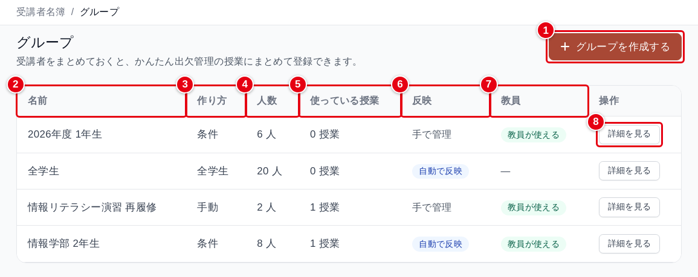

| 番号 | 項目 | 説明 |
| --- | --- | --- |
| ① | グループを作成する | グループを作成する画面に移動します |
| ② | 名前 | グループの名前です |
| ③ | 作り方 | 手動、全学生、条件のいずれかです |
| ④ | 人数 | グループに入っている受講者の人数です |
| ⑤ | 使っている授業 | このグループを登録しているかんたん出欠管理の授業の数です |
| ⑥ | 反映 | 自動で反映するグループには「自動で反映」、それ以外のグループには「手で管理」と表示されます |
| ⑦ | 教員 | 「教員が自分の授業に使えるようにする」にしたグループに「教員が使える」と表示されます |
| ⑧ | 詳細を見る | グループの詳細の画面を開きます |

### 手で管理するグループ

手動のグループと、自動で反映しない全学生と条件のグループでは、詳細の画面から受講者を追加したり外したりできます。
図は手動のグループです。

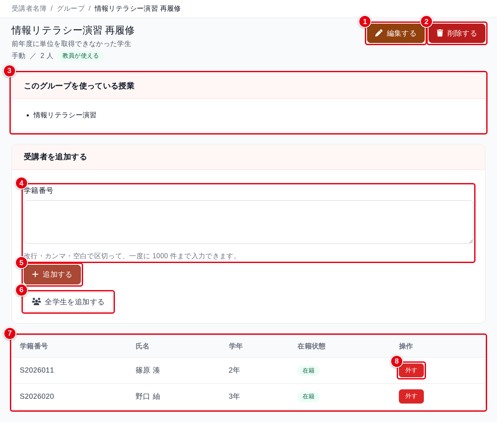

| 番号 | 項目 | 説明 |
| --- | --- | --- |
| ① | 編集する | 名前、説明、教員が使えるかどうかを変更します。全学生と条件のグループでは自動で反映するかどうかを、条件のグループでは条件も変更できます。作り方は変えられません |
| ② | 削除する | グループを削除します。手順は「7. グループを削除する」にあります |
| ③ | このグループを使っている授業 | このグループを登録しているかんたん出欠管理の授業の名前です。どの授業にも登録されていなければ表示されません |
| ④ | 学籍番号 | 追加する受講者の学籍番号を入力します。改行、カンマ、空白で区切って、一度に1000件まで入力できます |
| ⑤ | 追加する | 入力した学籍番号の受講者をグループに追加します。名簿に見つからなかった学籍番号は、画面の上に表示されます |
| ⑥ | 全学生を追加する | 押した時点で名簿にいるすべての受講者を、グループに追加します。あとから登録した受講者は入りません |
| ⑦ | 受講者の一覧 | グループに入っている受講者の学籍番号、氏名、学年、在籍状態です。20人ごとにページが分かれます |
| ⑧ | 外す | その受講者をグループから外します |

自動で反映しない全学生と条件のグループでは、「削除する」の左に「今の条件で選び直す」が表示されます。
押すと、手で追加したり外したりした受講者も含めて、今の条件に合う受講者に入れ替わります。

### 自動で反映するグループ

自動で反映するグループの受講者は、条件で決まります。
詳細の画面には、受講者を追加する欄と「外す」ボタンがありません。

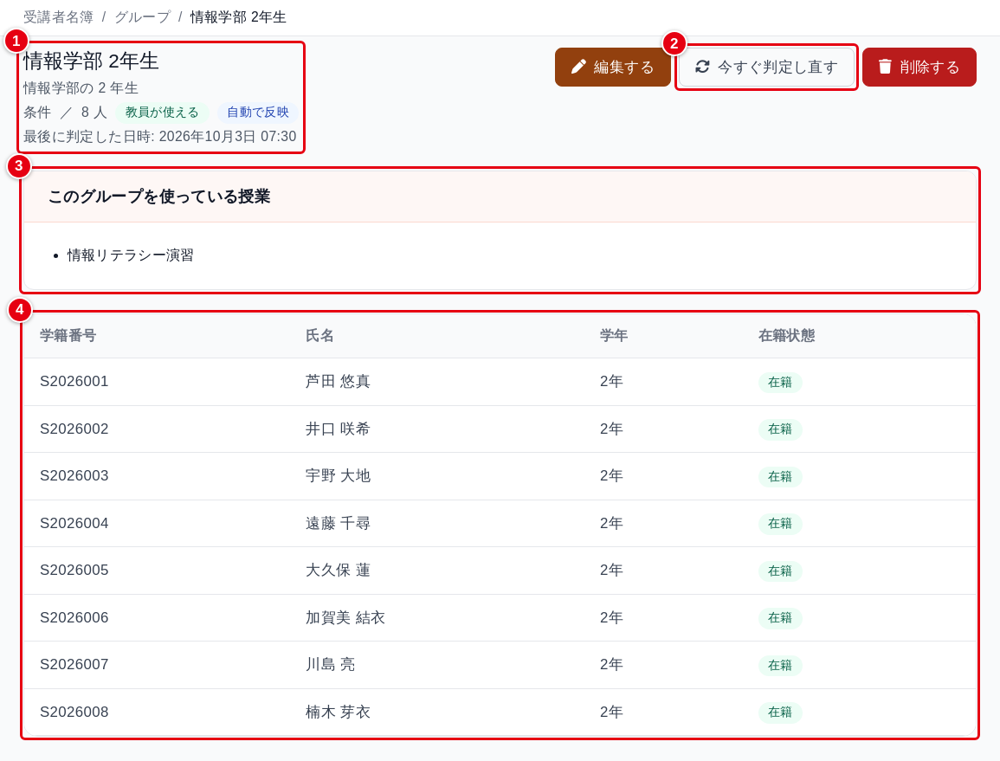

| 番号 | 項目 | 説明 |
| --- | --- | --- |
| ① | グループの情報 | 作り方、人数、「教員が使える」「自動で反映」の表示と、最後に条件で判定した日時です |
| ② | 今すぐ判定し直す | 今の条件に合う受講者に、すぐに合わせ直します |
| ③ | このグループを使っている授業 | このグループを登録しているかんたん出欠管理の授業の名前です |
| ④ | 受講者の一覧 | 条件に合う受講者です |

### 条件を変える

条件のグループは、「編集する」から条件を変えられます。
条件を変えて保存すると、その場で新しい条件に合う受講者が選び直されます。
自動で反映しない条件のグループでも同じです。

編集では、条件のグループの条件をすべて外して保存することはできません。
すべての受講者を入れたいときは、作り方を「全学生」にしたグループを新しく作成してください。

## 5. 受講者の一覧をグループで絞り込む

サイドバーの「受講者」を開き、「グループ」でグループを選んで「検索する」を押すと、そのグループの受講者だけが表示されます。

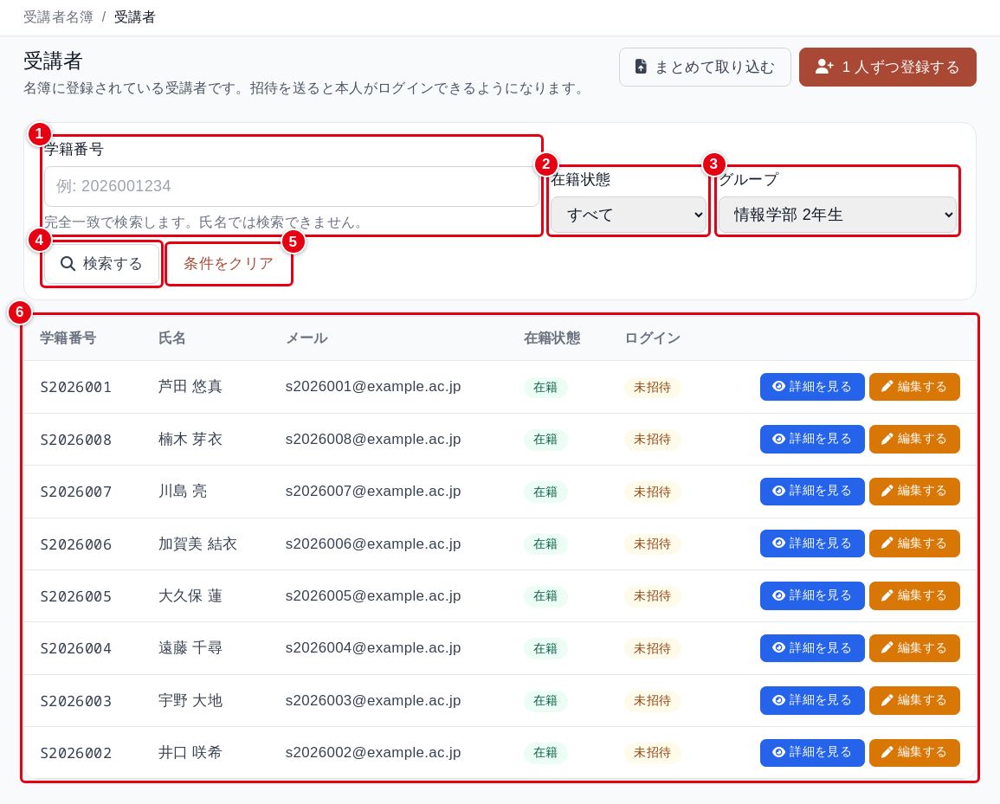

| 番号 | 入力項目 | 説明 |
| --- | --- | --- |
| ① | 学籍番号 | 学籍番号で検索します。完全に一致する受講者だけが表示されます。氏名では検索できません |
| ② | 在籍状態 | 在籍、休止、卒業、停止で絞り込みます |
| ③ | グループ | 選んだグループに入っている受講者だけを表示します |
| ④ | 検索する | 指定した条件で一覧を絞り込みます |
| ⑤ | 条件をクリア | 絞り込みを解除します。条件を指定しているときだけ表示されます |
| ⑥ | 受講者の一覧 | 絞り込んだ結果です。「詳細を見る」で受講者の詳細の画面、「編集する」で受講者の編集の画面を開きます |

## 6. グループを授業で使う

グループは、かんたん出欠管理の授業の「履修者を管理する」から授業に登録します。
手順は [かんたん出欠管理 for スクール](attendance/attendance-school-v2.md) の「3. 受講者名簿を登録する」にあります。

授業に登録できるグループは、操作する人によって変わります。

- 出欠管理の権限を持つ組織管理者：組織のすべてのグループ
- 授業を作成した教員：「教員が自分の授業に使えるようにする」にしたグループだけ

グループの受講者が変わると、そのグループを登録している授業の受講者も合わせて変わります。
グループから外れた受講者は授業でも無効になり、出欠の記録は残ります。
同じ授業に登録している別のグループにも入っている受講者は、有効のままです。
授業の画面では、グループで入った受講者を変更できません。
変えるときは、この受講者名簿でグループの受講者を変えてください。

## 7. グループを削除する

グループの詳細の画面で「削除する」を押すと、確認が表示されます。
授業に登録しているグループでは、確認の文に授業の名前が並びます。

**グループを削除すると、そのグループを登録していた授業では、グループで入った受講者が無効になります。**
出欠の記録は残ります。
同じ授業に登録している別のグループにも入っている受講者は、無効になりません。

グループを削除しても、受講者名簿の受講者は削除されません。
削除したグループは元に戻せません。
同じまとまりが必要になったときは、グループを作り直し、授業に登録し直してください。

## よくある質問

### Q. 「自動で反映する」とは何ですか

受講者の登録や変更に合わせて、グループの受講者を条件どおりに保つ設定です。
自動で反映するグループを授業に登録しておくと、新しく条件に当てはまった受講者も授業に入ります。
詳しくは「3. グループを作る」の「自動で反映する」に書いています。

### Q. 「全学生」のグループに、卒業した受講者も入っています

「全学生」のグループには、在籍状態に関係なく、名簿のすべての受講者が入ります。
在籍中の受講者だけをまとめたいときは、作り方を「条件」にし、在籍状態で「在籍」をチェックしたグループを作成してください。

### Q. 入力項目を削除できません

その項目をグループの条件に使っていると、削除できません。
確認のしかたと対処は「1. 入力項目を追加する」の「入力項目を変更、削除する」に書いています。

### Q. グループに追加しようとした学籍番号が「見つからなかった学籍番号」と表示されます

その学籍番号の受講者が、受講者名簿に登録されていません。
学籍番号に誤りがないかを確かめ、必要なら先に受講者として登録してから追加してください。
